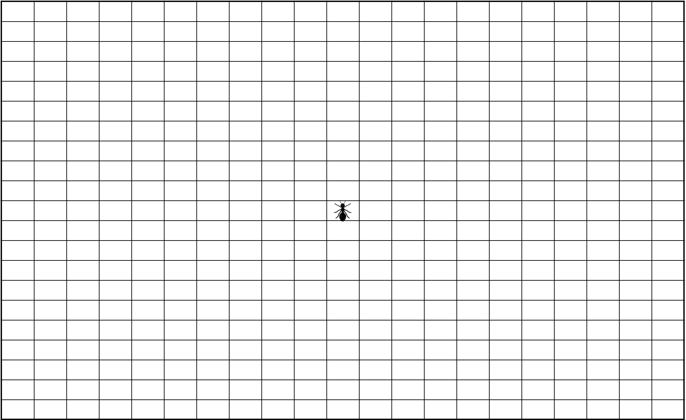
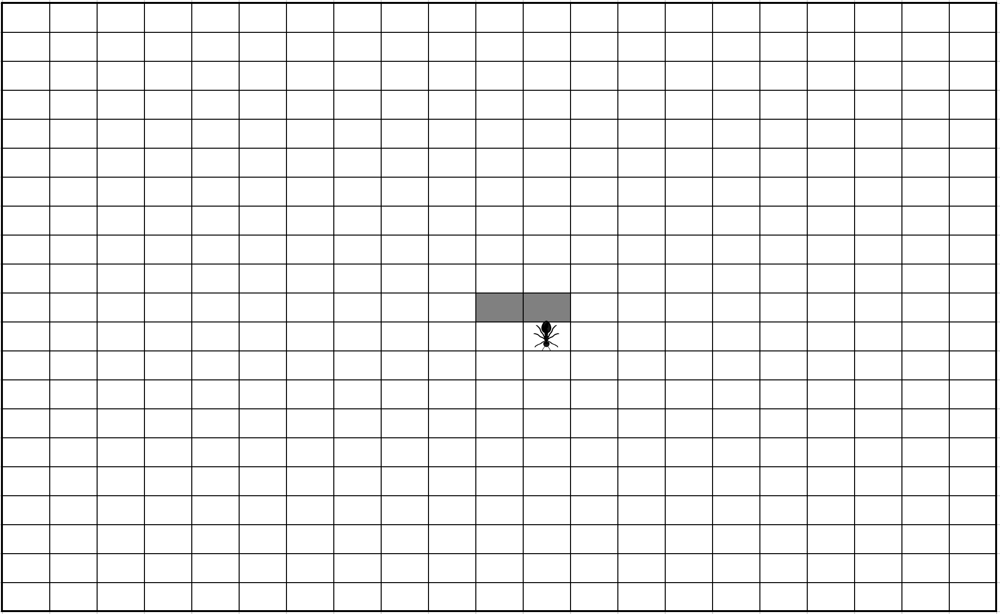
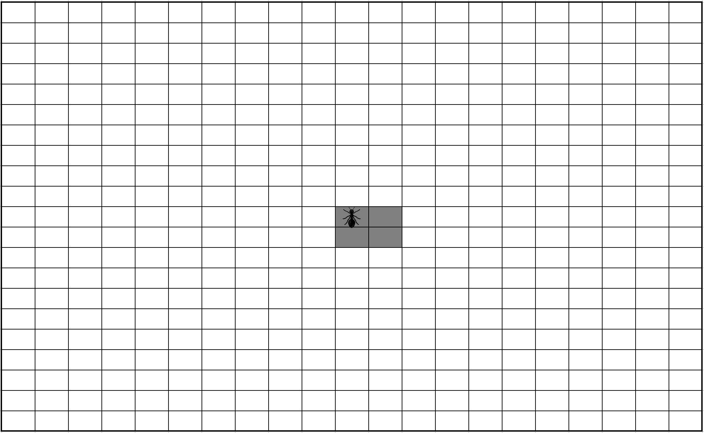
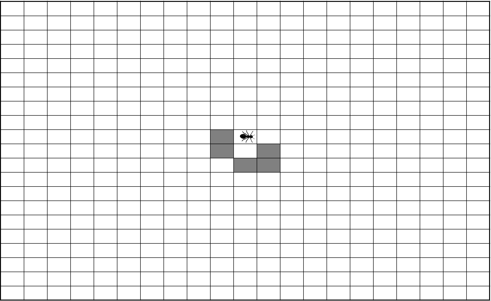
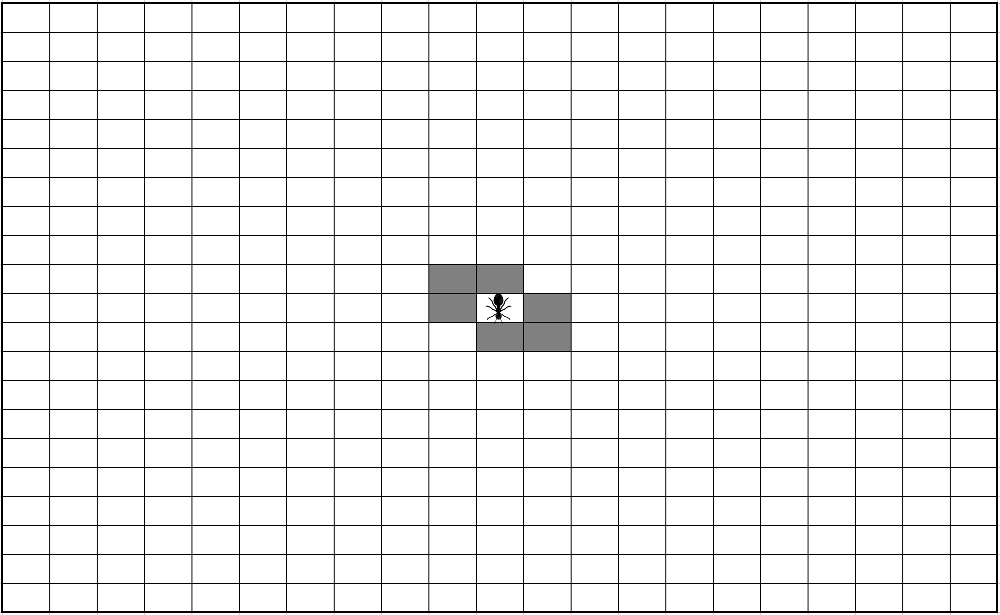
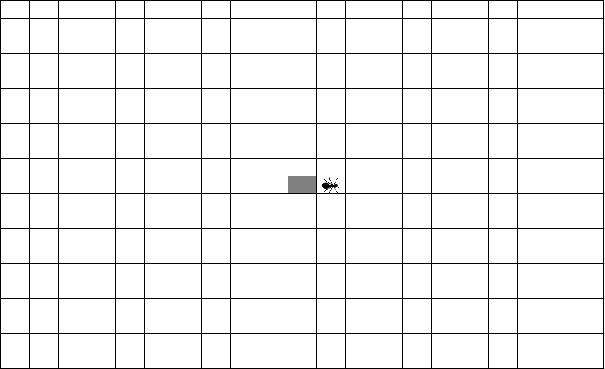
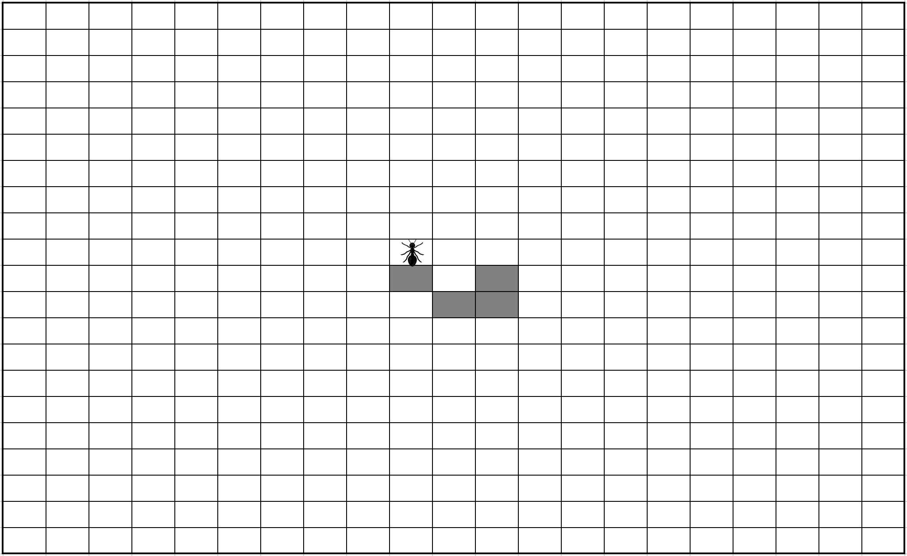
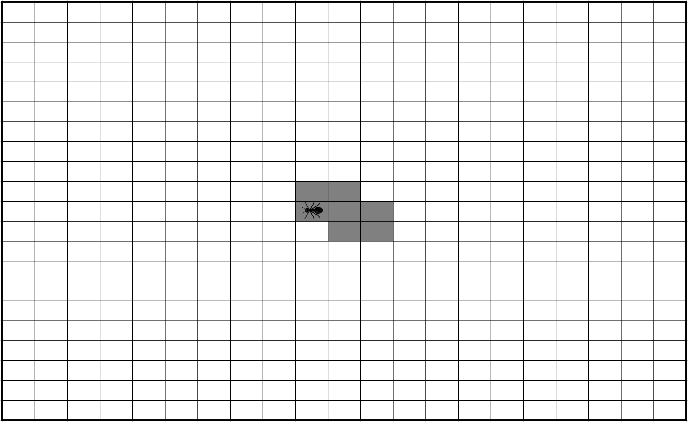
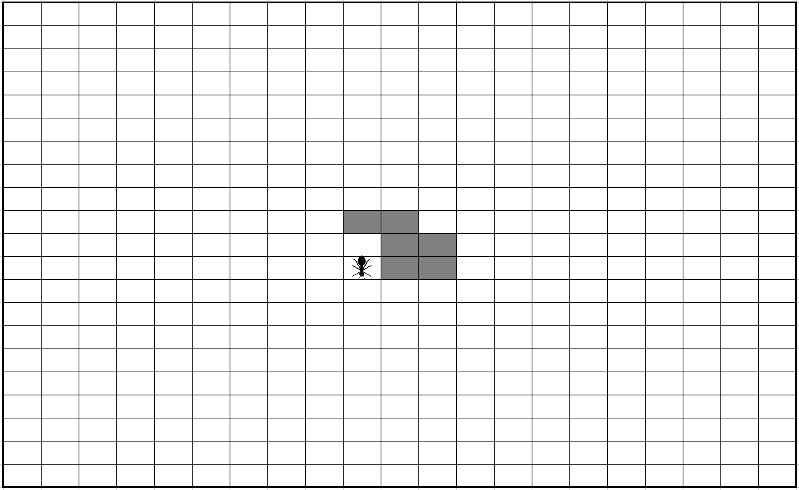
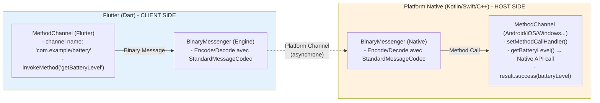

# Flutter: BDD & Clean

# 0. La Fourmi de Langton

## Qu'est-ce que la Fourmi de Langton ?

- **Histoire et Contexte :**

  La fourmi de Langton est un automate cellulaire bidimensionnel créé en 1986 par Christopher Langton, un chercheur
  américain pionnier dans le domaine de l’intelligence artificielle. Langton s’intéressait à la manière dont des règles
  simples pouvaient engendrer des comportements complexes, un concept central dans l’étude des systèmes dynamiques et de
  l’émergence.

  En concevant la fourmi de Langton, Langton cherchait à illustrer comment des interactions locales simples pouvaient
  conduire à des structures globales imprévisibles. L’automate suit des règles élémentaires : se déplaçant sur une
  grille de cases blanches et noires, la fourmi tourne à droite sur une case blanche, à gauche sur une case noire,
  change la couleur de la case, puis avance d’une case. Malgré cette simplicité, la fourmi adopte un comportement
  étonnamment complexe, passant d’une phase chaotique à la construction d’une “autoroute” régulière après environ 10 000
  étapes.

  Cette création visait à démontrer que des systèmes aux règles de base rudimentaires pouvaient générer des
  comportements émergents sophistiqués, offrant ainsi un modèle pour comprendre des phénomènes similaires dans la nature
  et les systèmes artificiels. La fourmi de Langton est devenue un exemple emblématique de l’étude des automates
  cellulaires et de la vie artificielle, illustrant la manière dont la complexité peut émerger de la simplicité.

- **Les Règles de la Fourmi de Langton :**
    - La fourmi se déplace sur une grille de cellules blanches et noires.
    - Règle 1 : Si la fourmi est sur une cellule blanche, elle tourne à droite, change la cellule en noire et avance
      d'une case.
    - Règle 2 : Si la fourmi est sur une cellule noire, elle tourne à gauche, change la cellule en blanche et avance
      d'une case.

Pour plus d’infos, je vous conseille
l’excellente [vidéo de Science Etonnante](https://youtu.be/qZRYGxF6D3w?si=QpOdWIQfKzY9Ioal).

- **Impact :**

  Ce modèle est souvent utilisé pour étudier comment des systèmes simples peuvent générer des comportements émergents,
  offrant des insights précieux dans des domaines tels que la biologie, la sociologie et l’informatique. Il démontre que
  la complexité peut surgir de la simplicité, un principe fondamental dans l’étude des systèmes dynamiques et de
  l’émergence.

  L’émergence décrit le phénomène par lequel des interactions locales simples entre les composants d’un système
  conduisent à des structures ou des comportements globaux complexes, non prévus par les règles individuelles. La fourmi
  de Langton en est une illustration parfaite : des règles élémentaires de déplacement et de changement de couleur
  aboutissent à des motifs structurés et répétitifs après une phase de désordre apparent.

## Example-mapping

### Qu'est-ce que l'example mapping ?

L'**Example Mapping** est une technique de collaboration entre le Product Owner, le développeur et le testeur, visant à
clarifier les exigences fonctionnelles et à identifier les cas limites. Il s'agit d'une session de travail où l'équipe
crée des exemples concrets de comportements attendus, en utilisant des scénarios concrets et des cas limites.

### Dans notre cas de la Fourmi de Langton

Ici, nous allons présenter directement les résultats attendus de la Fourmi de Langton.
Le tableau qui suit présente la position de la fourmi et l'état de la grille sur les 20 premiers états de la grille.

| Mouvement | État de la grille avant                    | État de la grille après                 |
|-----------|--------------------------------------------|-----------------------------------------|
| 1         |  |    |
| 2         |       |    |
| 3         |       |    |
| 4         |       |    |
| 5         |       |    |
| 6         |       |    |
| 7         |       |    |
| 8         |       |    |
| 9         |       |    |
| 10        |       |  |
| 11        |     |  |
| 12        |     |  |
| 13        |     |  |
| 14        |     |  |
| 15        |     |  |
| 16        |     |  |
| 17        |     |  |
| 18        |     |  |
| 19        |     |  |

# 1. BDD Flutter et socle d’architecture

## 1.1 BDD, Clean & State Management

### 1.1.1 Gherkin en pratique, bdd_widget_test

### Qu'est-ce que le Behavior Driven Development (BDD) ?

### Origine et philosophie

Le **Behavior Driven Development** (BDD) est une approche de développement logiciel introduite par **Dan North en 2006
**, en réponse aux limitations du Test Driven Development (TDD). Alors que le TDD se concentre sur le "comment" (
l'implémentation), le BDD met l'accent sur le "pourquoi" et le "quoi" (le comportement attendu).

Le BDD est né d'un constat simple : les tests unitaires classiques utilisent un langage technique (assertions, mocks,
stubs) difficile d'accès pour les non-développeurs. En adoptant un langage naturel proche du métier, le BDD favorise la
collaboration entre développeurs, testeurs, product owners et parties prenantes métier.

### Description et objectifs

Le BDD poursuit trois objectifs majeurs :

**Alignement métier-technique** : Créer un langage commun compréhensible par tous les membres de l'équipe, réduisant les
malentendus et les erreurs de spécification.

**Documentation vivante** : Les scénarios BDD servent à la fois de spécification fonctionnelle, de tests automatisés et
de documentation toujours à jour.

**Focalisation sur la valeur** : Chaque fonctionnalité est décrite du point de vue de l'utilisateur final, garantissant
que le développement apporte une réelle valeur métier.

Le principe central du BDD repose sur l'expression des comportements attendus sous forme de scénarios concrets,
utilisant la structure **Given-When-Then** :

- **Given** (Étant donné) : Le contexte initial, les préconditions
- **When** (Quand) : L'action ou l'événement déclencheur
- **Then** (Alors) : Le résultat attendu, les postconditions

### Cycle BDD et collaboration

Le BDD encourage la pratique des **"3 Amigos"** (ou **Example Mapping**) : avant le développement, le trio Product
Owner - Développeur - Testeur se réunit pour :

1. Clarifier les règles métier
2. Identifier les cas limites et exceptions
3. Rédiger ensemble les scénarios en langage naturel
4. S'assurer d'une compréhension partagée

Cette approche collaborative réduit drastiquement les allers-retours en phase de développement et les bugs en
production.

---

### Le langage Gherkin

### Qu'est-ce que Gherkin ?

**Gherkin** est le langage de spécification utilisé en BDD. C'est un langage semi-structuré, lisible par les humains et
parsable par les machines. Créé pour le framework Cucumber, Gherkin est devenu le standard de facto pour exprimer des
scénarios BDD.

### Structure d'un fichier `.feature`

Un fichier Gherkin (extension `.feature`) est organisé ainsi :

```gherkin
# Commentaires possibles ici

Feature: Compteur de l'application Flutter

  Background:
    Given l'application est lancée

  Scenario: La valeur initiale du compteur est 0
    Then je vois le texte {'0'}

  Scenario: Le bouton + incrémente le compteur
    When je tape sur l'icône {Icons.add}
    Then je vois le texte {'1'}
```

**Les éléments clés :**

- **Feature** : Décrit la fonctionnalité globale testée. Chaque fichier contient au moins une Feature.
- **Background** (optionnel) : Étapes communes exécutées avant chaque Scenario.
- **Scenario** (ou **Example**) : Un cas de test concret décrivant un comportement spécifique.
- **Given, When, Then, And, But** : Mots-clés structurant les étapes du scénario.

### Scénarios avec paramètres

Gherkin permet de passer des paramètres entre accolades `{}` :

```gherkin
When je tape sur l'icône {Icons.add}
Then je vois le texte {'42'}
```

Les valeurs entre accolades sont du **code Dart valide** qui sera injecté tel quel dans les tests générés.

### Scenario Outline : tests paramétrés

Pour exécuter le même scénario avec différentes valeurs, utilisez **Scenario Outline** avec une table **Examples** :

```gherkin
Scenario Outline: Le bouton + incrémente le compteur
Given l'application est lancée
When je tape <fois> fois sur l'icône {Icons.add}
Then je vois le texte <resultat>

Examples:
| fois | resultat |
| 1    | '1'      |
| 5    | '5'      |
| 42   | '42'     |
```

Chaque ligne de la table Examples génère une exécution du scénario avec les valeurs correspondantes.

### DataTables : données structurées

Pour passer des ensembles de données complexes, utilisez les **DataTables** :

```gherkin
Scenario: Recherche dans une liste de chansons
Given les chansons disponibles
| 'artiste'      | 'titre'                   |
| 'The Doors'    | 'Riders on the storm'     |
| 'Bob Dylan'    | "Knockin' On Heaven's Door" |
When je recherche le texte {'door'}
Then je vois les chansons
| 'artiste'      | 'titre'                   |
| 'The Doors'    | 'Riders on the storm'     |
| 'Bob Dylan'    | "Knockin' On Heaven's Door" |
```

Les DataTables sont accessibles dans le code via un objet `DataTable` avec les méthodes `.asLists()` et `.asMaps()`.

---

### bdd_widget_test : BDD pour Flutter

### Présentation

**bdd_widget_test** est une bibliothèque Flutter qui génère automatiquement des widget tests à partir de fichiers
`.feature` écrits en Gherkin. Elle combine la puissance du BDD avec l'écosystème de tests Flutter natif.

**Pourquoi bdd_widget_test ?**

- 🎯 **Langage naturel** : Les tests sont lisibles par toute l'équipe (PM, designers, développeurs, testeurs)
- 📖 **Documentation vivante** : Les fichiers `.feature` documentent le comportement attendu
- 🔄 **Tests automatisés** : Génération de tests Flutter standards (`testWidgets`)
- 🚀 **Productive** : Réduit le code boilerplate et favorise la réutilisation des steps

### Installation

**1. Ajouter les dépendances**

Dans votre `pubspec.yaml`, ajoutez dans la section `dev_dependencies` :

```yaml
dev_dependencies:
  flutter_test:
    sdk: flutter
  build_runner: ^2.4.0
  bdd_widget_test: ^1.7.4
```

> 💡 Vérifiez la dernière version sur [pub.dev/packages/bdd_widget_test](http://pub.dev/packages/bdd_widget_test)
>

**2. Installer les packages**

```bash
flutter pub get
```

### Utilisation

**Étape 1 : Créer un fichier `.feature`**

Dans le dossier `test/`, créez vos scénarios BDD. Exemple `test/counter.feature` :

```gherkin
Feature: Compteur

  Scenario: Valeur initiale du compteur à 0
    Given l'application est lancée
    Then je vois le texte {'0'}

  Scenario: Le bouton + incrémente le compteur
    Given l'application est lancée
    When je tape sur l'icône {Icons.add}
    Then je vois le texte {'1'}
```

**Étape 2 : Générer les fichiers Dart**

Lancez le générateur de code :

```bash
flutter packages pub run build_runner watch --delete-conflicting-outputs
```

Cette commande :

- Génère un fichier `.dart` pour chaque `.feature` (ex: `counter_test.dart`)
- Crée un dossier `step/` avec les définitions de steps manquantes

> ⚠️ **Important** : Les fichiers `*_test.dart` générés sont **recréés à chaque modification** du `.feature`. Ne les
> modifiez jamais manuellement.
>

**Étape 3 : Implémenter les steps**

Dans le dossier `step/`, vous trouvez les fichiers de steps générés. Exemple `step/l_application_est_lancee.dart` :

```dart
import 'package:flutter_test/flutter_test.dart';

/// Usage: Given l'application est lancée
Future<void> lApplicationEstLancee(WidgetTester tester) async {
  throw UnimplementedError();
}
```

Implémentez la logique de chaque step :

```dart
import 'package:flutter_test/flutter_test.dart';
import 'package:my_app/main.dart';

Future<void> lApplicationEstLancee(WidgetTester tester) async {
  await tester.pumpWidget(const MyApp());
}
```

> 💡 **Les fichiers de steps ne sont PAS régénérés** : vous pouvez les modifier librement.
>

**Étape 4 : Exécuter les tests**

```bash
flutter test
```

Les tests BDD s'exécutent comme des tests Flutter classiques !

### Steps prédéfinis

`bdd_widget_test` fournit des steps réutilisables pour les cas courants :

- `I see {..} text` / `je vois le texte {..}`
- `I don't see {..} text` / `je ne vois pas le texte {..}`
- `I tap {..} icon` / `je tape sur l'icône {..}`
- `I see {..} widget` / `je vois le widget {..}`
- `I enter {..} into {..} input field` / `je saisis {..} dans le champ {..}`
- `The app is running` / `l'application est lancée`
- Et bien d'autres...

**Utiliser les steps externes** : Pour éviter de dupliquer ces steps dans votre projet, créez un fichier `build.yaml` à
la racine :

```yaml
targets:
  $default:
    builders:
      bdd_widget_test|featureBuilder:
        options:
          externalSteps:
            - package:bdd_widget_test/step/i_see_text.dart
            - package:bdd_widget_test/step/i_dont_see_text.dart
            - package:bdd_widget_test/step/i_tap_icon.dart
            - package:bdd_widget_test/step/the_app_is_running.dart
```

### Organisation des steps

Pour les projets de taille moyenne à grande, organisez vos steps par domaine :

```
test/
├── features/
│   ├── authentication.feature
│   └── counter.feature
└── step/
    ├── common/           # Steps partagés
    │   ├── app_steps.dart
    │   └── navigation_steps.dart
    ├── authentication/   # Steps spécifiques authentification
    │   └── login_steps.dart
    └── counter/          # Steps spécifiques compteur
        └── counter_steps.dart
```

Le plugin détecte automatiquement les steps dans les sous-dossiers.

Pour définir un dossier unique pour tous les steps (mutualisés entre features), utilisez `build.yaml` :

```yaml
targets:
  $default:
    builders:
      bdd_widget_test|featureBuilder:
        options:
          stepFolderName: bdd_steps  # Dossier centralisé
```

### Bonnes pratiques

**✅ Rédiger des scénarios centrés utilisateur**

Les scénarios doivent décrire le comportement du point de vue de l'utilisateur, pas l'implémentation technique.

❌ Mauvais :

```gherkin
When j'appelle la méthode incrementCounter()
Then la variable _counter vaut 1
```

✅ Bon :

```gherkin
When je tape sur le bouton plus
Then je vois le nombre 1 affiché
```

**✅ Limiter le nombre d'étapes par scénario**

Un scénario doit rester lisible et concis. Visez **3 à 5 étapes maximum**. Si vous dépassez, c'est peut-être le signe
que vous testez plusieurs comportements à la fois.

**✅ Utiliser Background pour les préconditions communes**

Si plusieurs scénarios partagent les mêmes étapes de setup, utilisez `Background` :

```gherkin
Feature: Panier d'achat

  Background:
    Given l'application est lancée
    And je suis connecté en tant que client

  Scenario: Ajouter un produit
    When j'ajoute un produit au panier
    Then je vois 1 article dans le panier

  Scenario: Supprimer un produit
    Given j'ai 1 produit dans le panier
    When je supprime le produit
    Then mon panier est vide
```

**✅ Créer des steps réutilisables et atomiques**

Privilégiez des steps simples, atomiques et réutilisables plutôt que des steps complexes et spécifiques.

✅ Bon :

```dart
Future<void> jeTapeSurLeBouton(WidgetTester tester, String label) async {
  await tester.tap(find.text(label));
  await tester.pumpAndSettle();
}
```

❌ À éviter :

```dart
Future<void> jeCre
é
UnCompteAvecEmailEtMotDePasse
(...) async {
// 50 lignes de code...
}
```

**✅ Nommer clairement vos features et scénarios**

Les noms doivent être descriptifs et refléter la valeur métier :

```gherkin
Feature: Authentification utilisateur

  Scenario: Connexion réussie avec identifiants valides

  Scenario: Message d'erreur avec mot de passe incorrect

  Scenario: Verrouillage du compte après 3 échecs
```

**✅ Utiliser les tags pour organiser les tests**

Les tags permettent de filtrer l'exécution des tests :

```gherkin
@smoke @critical
Feature: Authentification

  @slow @integration
  Scenario: Connexion avec API externe
    # ...
```

Exécution :

```bash
flutter test --tags smoke           # Uniquement les tests @smoke
flutter test --exclude-tags slow    # Exclure les tests @slow
```

**✅ Versionner les fichiers `.feature` et `step/`**

Les fichiers `.feature` et les implémentations de steps (`step/`) doivent être versionnés dans Git. En revanche, les
fichiers `*_test.dart` générés peuvent être ignorés (optionnel, selon votre stratégie).

**✅ Ajouter des règles de linting**

Pour ignorer les warnings des fichiers générés, ajoutez en début de `.feature` :

```gherkin
// ignore_for_file: avoid_print, prefer_const_constructors

Feature: Mon feature
```

**✅ Combiner BDD et tests Golden (UI)**

Pour tester l'apparence visuelle, combinez `bdd_widget_test` avec `golden_toolkit`. Utilisez le tag `@testMethodName` :

```gherkin
@testMethodName: testGoldens
Scenario: L'écran de connexion s'affiche correctement
Given l'application est lancée
Then je prends un golden test de l'écran de connexion
```

Ou globalement dans `build.yaml` :

```yaml
targets:
  $default:
    builders:
      bdd_widget_test|featureBuilder:
        options:
          testMethodName: testGoldens
```

**✅ Hooks pour before/after**

Pour exécuter du code avant ou après chaque test, activez les hooks dans `build.yaml` :

```yaml
targets:
  $default:
    builders:
      bdd_widget_test|featureBuilder:
        options:
          addHooks: true
```

Cela génère des fichiers de hooks où vous pouvez implémenter `beforeAll`, `afterAll`, `beforeEach`, `afterEach`.

---

### Ressources complémentaires

📚 **Documentation officielle** : [pub.dev/packages/bdd_widget_test](http://pub.dev/packages/bdd_widget_test)

🎥 **Tutoriels vidéo
** : [BDD in Flutter playlist sur YouTube](https://youtube.com/playlist?list=PLB6lc7nQ1n4jCBkrirvVGr5b8rC95VAQ5)

🔗 **Exemple de projet
** : [github.com/olexale/bdd_widget_test/tree/master/example](http://github.com/olexale/bdd_widget_test/tree/master/example)

---

> 💡 **En résumé** : Le BDD avec Gherkin et `bdd_widget_test` transforme vos spécifications en tests automatisés et
> documentation vivante. C'est un investissement qui améliore la collaboration, réduit les malentendus et augmente la
> qualité du code livré.
>

### 1.1.2 Environnements de tests, DI, faux adaptateurs

### Pourquoi isoler l'environnement de test ?

Lorsque vous écrivez des tests BDD (ou n'importe quel type de test), vous devez garantir que **l'environnement de test
est complètement isolé de la production**. Cela signifie :

- **Aucune dépendance externe réelle** : Pas d'appels API vers des serveurs de production, pas de bases de données
  réelles, pas de services tiers.
- **Répétabilité** : Les tests doivent produire les mêmes résultats à chaque exécution, indépendamment de l'état du
  réseau ou des services externes.
- **Rapidité** : Les tests doivent s'exécuter rapidement sans attendre des réponses réseau.
- **Contrôle total** : Vous devez pouvoir simuler n'importe quel scénario (succès, erreurs, timeouts, données
  spécifiques).

Pour atteindre ces objectifs, trois piliers sont essentiels :

1. **L'injection de dépendances (DI)** : Permet de remplacer les dépendances réelles par des faux (mocks, stubs).
2. **Les environnements multiples** : Permettent de configurer différemment l'application selon le contexte (dev, test,
   prod).
3. **Les faux adaptateurs (mocks)** : Simulent le comportement des dépendances externes.

---

## Injection de dépendances avec Injectable

### Qu'est-ce que l'injection de dépendances ?

L'**injection de dépendances (DI)** est un patron de conception qui consiste à fournir à une classe ses dépendances
depuis l'extérieur plutôt que de les créer elle-même. Cela favorise :

- Le **découplage** : Les classes ne dépendent pas d'implémentations concrètes mais d'abstractions.
- La **testabilité** : On peut facilement injecter des faux (mocks) à la place des vraies dépendances.
- La **maintenabilité** : Changer une implémentation n'impacte pas les classes qui l'utilisent.

### Injectable : DI automatisée avec GetIt

**Injectable** est un générateur de code pour **GetIt**, le service locator le plus populaire de Flutter. Injectable
s'inspire d'Angular DI et apporte une approche déclarative avec des annotations.

### Installation

Ajoutez les dépendances dans `pubspec.yaml` :

```yaml
dependencies:
  injectable: ^2.5.0
  get_it: ^8.0.0

dev_dependencies:
  injectable_generator: ^2.6.0
  build_runner: ^2.4.0
```

Puis installez :

```bash
flutter pub get
```

### Configuration initiale

**1. Créer le fichier d'injection**

Créez un fichier `lib/core/di/injection.dart` :

```dart
import 'package:get_it/get_it.dart';
import 'package:injectable/injectable.dart';

import 'injection.config.dart';

final getIt = GetIt.instance;

@InjectableInit(
  initializerName: 'init',
  preferRelativeImports: true,
  asExtension: true,
)
void configureDependencies() => getIt.init();
```

**2. Générer le code**

Lancez le générateur :

```bash
flutter pub run build_runner watch --delete-conflicting-outputs
```

Cela génère le fichier `injection.config.dart` contenant toutes les fonctions d'enregistrement.

**3. Initialiser dans main.dart**

```dart
import 'package:flutter/material.dart';
import 'core/di/injection.dart';

void main() {
  configureDependencies();
  runApp(const MyApp());
}
```

### Annotations principales

### @injectable : Enregistrer une factory

Par défaut, `@injectable` enregistre une **factory** qui crée une nouvelle instance à chaque appel.

```dart
@injectable
class UserRepository {
  final ApiClient apiClient;

  UserRepository(this.apiClient);

  Future<User> getUser(String id) async {
    return apiClient.fetchUser(id);
  }
}
```

### @singleton : Instance unique

`@singleton` crée une **instance unique** lors de la première demande et la réutilise ensuite.

```dart
@singleton
class AuthService {
  String? _token;

  void setToken(String token) => _token = token;

  String? get token => _token;
}
```

### @lazySingleton : Singleton paresseux

`@lazySingleton` est similaire à `@singleton`, mais l'instance n'est créée que lors de la première utilisation.

```dart
@lazySingleton
class DatabaseService {
  DatabaseService() {
    print('DatabaseService initialized');
  }
}
```

### @module : Enregistrer des types tiers

Pour enregistrer des dépendances que vous ne contrôlez pas (packages externes), utilisez un **module** :

```dart
@module
abstract class RegisterModule {
  @lazySingleton
  Dio get dio =>
      Dio(BaseOptions(
        baseURL: '[https://api.example.com](https://api.example.com)',
        connectTimeout: const Duration(seconds: 5),
      ));

  @preResolve
  Future<SharedPreferences> get prefs => SharedPreferences.getInstance();
}
```

> 💡 **@preResolve** : Attend que le `Future` soit résolu avant d'enregistrer la valeur. Cela rend la fonction `init()`
> asynchrone.
>

### Environnements de test avec Injectable

Injectable supporte les **environnements** via l'annotation `@Environment`. Cela permet d'enregistrer différentes
implémentations selon le contexte.

### Définir des environnements personnalisés

```dart

const test = Environment('test');
const dev = Environment('dev');
const prod = Environment('prod');
```

### Enregistrer des implémentations par environnement

```dart
abstract class ApiClient {
  Future<User> fetchUser(String id);
}

@prod
@Injectable(as: ApiClient)
class RealApiClient
    implements ApiClient {
  @override
  Future<User> fetchUser(String id) async {
    // Appel HTTP réel
  }
}

@test
@Injectable(as: ApiClient)
class MockApiClient
    implements ApiClient {
  @override
  Future<User> fetchUser(String id) async {
    // Retourne des données mockées
    return User(id: id, name: 'Test User');
  }
}
```

### Initialiser avec un environnement

**En production :**

```dart
@InjectableInit(
  initializerName: 'init',
  preferRelativeImports: true,
  asExtension: true,
)
void configureDependencies() => getIt.init(environment: [Environment.prod](http: //Environment.prod));
```

**En test :**

```dart
@InjectableInit(
  generateForDir: ['test'],
)
void configureTestDependencies() => getIt.init(environment: Environment.test);
```

> 💡 **generateForDir** : Limite la génération de code à un répertoire spécifique (ici `test/`).
>

### Injection dans les tests BDD

Dans vos steps BDD, récupérez les dépendances via `getIt` :

```dart
Future<void> lApplicationEstLancee(WidgetTester tester) async {
  // Récupérer le repository depuis GetIt
  final userRepository = getIt<UserRepository>();

  await tester.pumpWidget(MyApp(userRepository: userRepository));
}
```

---

## Faux adaptateurs : Mocker les API avec dio_mocked_responses

### Présentation de dio_mocked_responses

**dio_mocked_responses** est un intercepteur Dio qui permet de **mocker les réponses HTTP** en se basant sur des
fichiers JSON. Cela élimine le besoin de serveurs de développement ou de stubs complexes.

**Avantages :**

- 📁 **Fichiers JSON simples** : Définissez vos réponses mockées dans des fichiers lisibles.
- 🎭 **Personas et contextes** : Simulez différents profils utilisateurs ou états applicatifs.
- 🔄 **Réponses dynamiques** : Support de templates pour générer des réponses basées sur les requêtes.
- 🧪 **Isolation totale** : Aucun appel réseau réel.

### Installation

```yaml
dev_dependencies:
  dio_mocked_responses: ^1.0.0
```

### Configuration de base

**1. Créer l'intercepteur**

```dart
import 'package:dio/dio.dart';
import 'package:dio_mocked_responses/dio_mocked_responses.dart';

final dio = Dio();
dio.interceptors.add
(
MockInterceptor
(
basePath
:
'
test/mocks
'
)
);
```

**2. Structure des fichiers mock**

Créez vos fichiers de mock dans le dossier spécifié (ici `test/mocks/`) :

```
test/
└── mocks/
    ├── GET_user_profile.json
    ├── POST_login.json
    └── GET_tasks.json
```

**3. Format des fichiers JSON**

Exemple `test/mocks/GET_user_profile.json` :

```json
{
  "GET": {
    "statusCode": 200,
    "data": {
      "id": "123",
      "name": "John Doe",
      "email": "[john@example.com](mailto:john@example.com)"
    }
  }
}
```

Exemple multi-méthodes `test/mocks/tasks.json` :

```json
{
  "GET": {
    "statusCode": 200,
    "data": [
      {
        "id": 1,
        "title": "Task 1",
        "completed": false
      },
      {
        "id": 2,
        "title": "Task 2",
        "completed": true
      }
    ]
  },
  "POST": {
    "statusCode": 201,
    "data": {
      "id": 3,
      "title": "New task",
      "completed": false
    }
  }
}
```

### Nommage des fichiers

Le nom du fichier détermine la route interceptée :

- `GET_user_profile.json` → `GET /user/profile`
- `POST_login.json` → `POST /login`
- `GET_tasks_123.json` → `GET /tasks/123`

**Pour les routes avec slashes**, remplacez `/` par `_` :

- `GET_api_v1_users.json` → `GET /api/v1/users`

**Pour les query parameters**, ajoutez-les au nom :

- `GET_search_query_flutter.json` → `GET /search?query=flutter`

### Personas : Simuler différents profils

Les **personas** permettent de définir des réponses différentes selon le profil utilisateur (admin, utilisateur
standard, invité, etc.).

**1. Structure avec personas**

```
test/mocks/
├── GET_user_profile.json       # Réponse par défaut
├── admin/
│   └── GET_dashboard.json      # Réponse pour admin
└── guest/
    └── GET_dashboard.json      # Réponse pour invité
```

**2. Activer une persona**

```dart
MockInterceptor.setPersona
('admin
'
);

// Effectuer des requêtes
final response = await dio.get('/dashboard');

// Nettoyer
MockInterceptor
.
clearPersona
(
);
```

**3. Utilisation dans les tests BDD**

```dart
Future<void> jesuisConnecteEnTantQue(WidgetTester tester,
    String role,) async {
  MockInterceptor.setPersona(role);
  await lApplicationEstLancee(tester);
}
```

**Scénario Gherkin :**

```gherkin
Scenario: Dashboard admin
Given je suis connecté en tant que {'admin'}
When je navigue vers le dashboard
Then je vois les statistiques complètes

Scenario: Dashboard invité
Given je suis connecté en tant que {'guest'}
When je navigue vers le dashboard
Then je vois un message d'accès limité
```

### Contextes : Simuler des états applicatifs

Les **contextes** permettent de simuler différents états de l'application (connecté, déconnecté, hors ligne, etc.).

**1. Activer un contexte**

```dart
MockInterceptor.setContext
('offline
'
);

// Les réponses utiliseront les fichiers du contexte 'offline'

MockInterceptor.
clearContext
(
);
```

**2. Exemple de contexte "offline"**

`test/mocks/offline/GET_tasks.json` :

```json
{
  "GET": {
    "statusCode": 503,
    "data": {
      "error": "Service unavailable"
    }
  }
}
```

### Templates : Réponses dynamiques

Les **templates** permettent de générer des réponses basées sur les données de la requête.

**Exemple :**

`test/mocks/POST_greet.json` :

```json
{
  "POST": {
    "statusCode": 200,
    "template": {
      "content": {
        "message": "Bonjour, ${[req.data.name](http://req.data.name)} !"
      }
    }
  }
}
```

**Variables disponibles :**

- `${[req.data](http://req.data).field}` : Accès au body de la requête
- `${req.queryParameters.param}` : Accès aux query parameters
- `${req.headers.header}` : Accès aux headers

### Historique des requêtes

`dio_mocked_responses` garde une trace de toutes les requêtes interceptées :

```dart

final history = MockInterceptor.history;

for (
var item in history) {
print('${item.method} ${item.path}');
}

// Nettoyer l'historique
MockInterceptor
.
clearHistory
(
);
```

Utile pour vérifier dans les tests que certaines requêtes ont bien été effectuées.

---

## Intégration complète : BDD + DI + Mocks

### Architecture de test

Voici comment combiner tous ces éléments pour des tests BDD robustes :

```
test/
├── features/
│   ├── authentication.feature
│   └── tasks.feature
├── mocks/
│   ├── GET_tasks.json
│   ├── POST_login.json
│   └── admin/
│       └── GET_dashboard.json
├── step/
│   ├── common_steps.dart
│   ├── auth_steps.dart
│   └── task_steps.dart
└── test_injection.dart
```

### Configuration de l'injection pour les tests

**test/test_injection.dart** :

```dart
import 'package:dio/dio.dart';
import 'package:dio_mocked_responses/dio_mocked_responses.dart';
import 'package:get_it/get_it.dart';
import 'package:injectable/injectable.dart';

import 'test_injection.config.dart';

final getIt = GetIt.instance;

@InjectableInit(
  initializerName: 'initTest',
  generateForDir: ['test'],
  preferRelativeImports: true,
  asExtension: true,
)
void configureTestDependencies() {
  getIt.initTest(environment: Environment.test);
}

@module
abstract class TestModule {
  @test
  @lazySingleton
  Dio get dio {
    final dio = Dio(BaseOptions(baseURL: '[https://api.example.com](https://api.example.com)'));
    dio.interceptors.add(MockInterceptor(basePath: 'test/mocks'));
    return dio;
  }
}
```

### Step de setup

**test/step/l_application_est_lancee.dart** :

```dart
import 'package:flutter_test/flutter_test.dart';
import 'package:my_app/main.dart';
import '../test_injection.dart';

Future<void> lApplicationEstLancee(WidgetTester tester) async {
  // Réinitialiser GetIt
  await getIt.reset();

  // Configurer les dépendances de test
  configureTestDependencies();

  // Lancer l'application
  await tester.pumpWidget(const MyApp());
  await tester.pumpAndSettle();
}
```

### Exemple complet de feature

**test/features/tasks.feature** :

```gherkin
Feature: Gestion des tâches

  Background:
    Given l'application est lancée

  Scenario: Affichage de la liste des tâches
    Given je suis connecté
    When je navigue vers l'écran des tâches
    Then je vois 2 tâches

  Scenario: Création d'une tâche
    Given je suis connecté
    When je saisis {'Nouvelle tâche'} dans le champ de titre
    And je tape sur le bouton {'Ajouter'}
    Then je vois le texte {'Nouvelle tâche'}
    And je vois 3 tâches

  @admin
  Scenario: Dashboard admin avec statistiques
    Given je suis connecté en tant que {'admin'}
    When je navigue vers le dashboard
    Then je vois le texte {'Statistiques complètes'}
```

### Implémentation des steps

**test/step/task_steps.dart** :

```dart
import 'package:flutter_test/flutter_test.dart';
import 'package:dio_mocked_responses/dio_mocked_responses.dart';

Future<void> jeSuisConnecteEnTantQue(WidgetTester tester,
    String role,) async {
  MockInterceptor.setPersona(role);
}

Future<void> jeVoisNTaches(WidgetTester tester,
    int count,) async {
  final taskWidgets = find.byKey(const Key('task-item'));
  expect(taskWidgets, findsNWidgets(count));
}
```

---

## Bonnes pratiques

### ✅ Organiser les mocks par domaine fonctionnel

Créez des sous-dossiers pour regrouper les mocks par feature :

```
test/mocks/
├── authentication/
│   ├── POST_login.json
│   └── POST_logout.json
├── tasks/
│   ├── GET_tasks.json
│   ├── POST_tasks.json
│   └── DELETE_tasks_id.json
└── users/
    └── GET_user_profile.json
```

### ✅ Utiliser des modules séparés pour test et prod

```dart
@module
abstract class ProdModule {
  @prod
  @lazySingleton
  Dio get dio =>
      Dio(BaseOptions(
        baseURL: '[https://api.production.com](https://api.production.com)',
      ));
}

@module
abstract class TestModule {
  @test
  @lazySingleton
  Dio get dio {
    final dio = Dio();
    dio.interceptors.add(MockInterceptor(basePath: 'test/mocks'));
    return dio;
  }
}
```

### ✅ Nettoyer l'état entre les tests

```dart
Future<void> lApplicationEstLancee(WidgetTester tester) async {
  // Réinitialiser GetIt
  await getIt.reset();

  // Nettoyer les personas et contextes
  MockInterceptor.clearPersona();
  MockInterceptor.clearContext();
  MockInterceptor.clearHistory();

  // Reconfigurer les dépendances
  configureTestDependencies();

  await tester.pumpWidget(const MyApp());
}
```

### ✅ Créer des fichiers mock réalistes

Utilisez des données proches de la production pour détecter les bugs :

```json
{
  "GET": {
    "statusCode": 200,
    "data": {
      "users": [
        {
          "id": "uuid-1234-5678",
          "name": "Jean Dupont",
          "email": "[jean.dupont@example.com](mailto:jean.dupont@example.com)",
          "createdAt": "2025-01-15T10:30:00Z",
          "roles": [
            "user",
            "admin"
          ]
        }
      ],
      "pagination": {
        "page": 1,
        "perPage": 20,
        "total": 1
      }
    }
  }
}
```

### ✅ Tester les cas d'erreur

Créez des mocks pour les erreurs courantes :

`test/mocks/errors/GET_tasks_500.json` :

```json
{
  "GET": {
    "statusCode": 500,
    "data": {
      "error": "Internal server error"
    }
  }
}
```

`test/mocks/errors/GET_tasks_401.json` :

```json
{
  "GET": {
    "statusCode": 401,
    "data": {
      "error": "Unauthorized"
    }
  }
}
```

### ✅ Documenter les environnements et personas

Créez un fichier README dans votre dossier mocks :

`test/mocks/[README.md](http://README.md)` :

```markdown
# Mocks API

## Personas disponibles

- **admin** : Utilisateur avec tous les droits
- **user** : Utilisateur standard
- **guest** : Utilisateur non authentifié

## Contextes disponibles

- **offline** : Simule une perte de connexion
- **slow** : Simule une latence réseau importante
```

---

## Ressources complémentaires

📚 **Injectable** : [pub.dev/packages/injectable](http://pub.dev/packages/injectable)

📚 **GetIt** : [pub.dev/packages/get_it](http://pub.dev/packages/get_it)

📚 **dio_mocked_responses** : [pub.dev/packages/dio_mocked_responses](http://pub.dev/packages/dio_mocked_responses)

🔗 **Flutter Starter Kit
** : [github.com/Listo-Paye/flutter_starter_kit](http://github.com/Listo-Paye/flutter_starter_kit)

---

> 💡 **En résumé** : L'injection de dépendances avec **Injectable**, combinée aux **faux adaptateurs** via *
*dio_mocked_responses**, offre un environnement de test complètement isolé et contrôlable. Vos tests BDD deviennent
> rapides, fiables et reproductibles, tout en restant lisibles et maintenables.
>

## 1.2 Clean Architecture et RiBLoC

### Pourquoi la Clean Architecture ?

La **Clean Architecture**, popularisée par Robert C. Martin (Uncle Bob), est une approche architecturale qui vise à
créer des systèmes logiciels **maintenables, testables et indépendants des frameworks**. Elle repose sur le principe de*
*séparation des préoccupations** et sur la **règle de dépendance** : les couches internes ne doivent jamais dépendre des
couches externes.

**Bénéfices clés :**

- 🔌 **Indépendance du framework** : La logique métier ne dépend pas de Flutter, vous pouvez la réutiliser ailleurs
- 🧪 **Testabilité maximale** : Chaque couche peut être testée indépendamment
- 🔄 **Maintenabilité** : Les changements dans une couche n'impactent pas les autres
- 📦 **Réutilisabilité** : La logique métier peut être partagée entre plusieurs applications
- 👥 **Collaboration d'équipe** : Plusieurs développeurs peuvent travailler sur différentes couches sans conflit

### Les quatre couches de la Clean Architecture

La Clean Architecture organise le code en **quatre couches concentriques**, chacune ayant une responsabilité claire :

```
┌─────────────────────────────────────────┐
│         PRESENTATION (UI)               │  ← Widgets, BLoCs, Pages
│  ┌───────────────────────────────────┐  │
│  │         DOMAIN                    │  │  ← Use Cases, Entities
│  │  ┌─────────────────────────────┐  │  │
│  │  │         DATA                │  │  │  ← Repositories, Models, DTOs
│  │  │  ┌───────────────────────┐  │  │  │
│  │  │  │       CORE            │  │  │  │  ← DI, Utils, Constants
│  │  │  └───────────────────────┘  │  │  │
│  │  └─────────────────────────────┘  │  │
│  └───────────────────────────────────┘  │
└─────────────────────────────────────────┘
```

**Règle de dépendance** : Les flèches de dépendance pointent toujours vers l'intérieur. Une couche externe peut dépendre
d'une couche interne, mais jamais l'inverse.

---

### 1.2.1. Core : Le socle technique

La couche **Core** contient tous les éléments **transversaux et techniques** qui ne relèvent pas de la logique métier :

**Responsabilités :**

- 🔧 **Injection de dépendances** (GetIt, Injectable)
- 🌐 **Configuration réseau** (Dio, Retrofit, intercepteurs)
- 🎨 **Thème et design system** (couleurs, typographies, widgets de base)
- 🔐 **Services techniques** (stockage local, authentification, logs)
- 📊 **Utilitaires** (extensions, helpers, constantes)

**Structure typique :**

```
lib/
└── core/
    ├── di/                    # Dependency Injection
    │   ├── injection.dart
    │   ├── injection.config.dart
    │   └── api/
    │       └── backend_client.dart
    ├── theme/                 # Thème et design system
    │   ├── app_theme.dart
    │   ├── colors.dart
    │   └── typography.dart
    ├── utils/                 # Utilitaires
    │   ├── extensions/
    │   └── constants.dart
    └── services/              # Services techniques
        ├── storage_service.dart
        └── logger_service.dart
```

**Exemple : Configuration Retrofit dans Core**

```dart
// core/di/api/backend_client.dart
import 'package:dio/dio.dart';
import 'package:injectable/injectable.dart';
import 'package:retrofit/retrofit.dart';

part 'backend_client.g.dart';

@RestApi()
abstract class BackendClient {
  @factoryMethod
  factory BackendClient(Dio dio) = _BackendClient;

  @GET('/tasks')
  Future<List<TaskDto>> getTasks();

  @GET('/tasks/{id}')
  Future<TaskDto> getTask(@Path('id') String id);

  @POST('/tasks')
  Future<TaskDto> createTask(@Body() TaskDto task);

  @PUT('/tasks/{id}')
  Future<TaskDto> updateTask(@Path('id') String id,
      @Body() TaskDto task,);

  @DELETE('/tasks/{id}')
  Future<void> deleteTask(@Path('id') String id);
}
```

**Module Dio pour l'injection :**

```dart
// core/di/api/dio_module.dart
import 'package:dio/dio.dart';
import 'package:injectable/injectable.dart';

@module
abstract class DioModule {
  @lazySingleton
  Dio get dio =>
      Dio(
        BaseOptions(
          baseUrl: '[https://api.example.com](https://api.example.com)',
          connectTimeout: const Duration(seconds: 5),
          receiveTimeout: const Duration(seconds: 3),
        ),
      );
}
```

---

### 1.2.2. Data : La couche d'accès aux données

La couche **Data** gère **toutes les sources de données** (API, base de données locale, cache, fichiers). Elle
implémente les contrats définis dans la couche Domain et transforme les données brutes en entités métier.

**Responsabilités :**

- 📡 **Data Sources** : Récupération des données depuis les sources (API, BDD, cache)
- 🔄 **Models/DTOs** : Objets de transfert de données, avec sérialisation/désérialisation JSON
- 📦 **Repository Implementations** : Implémentation concrète des contrats Domain
- 🛡️ **Gestion d'erreurs** : Transformation des erreurs techniques en erreurs métier

**Structure typique :**

```
lib/
└── data/
    ├── data_module.dart          # Export centralisé
    ├── datasources/
    │   ├── task_remote_datasource.dart
    │   └── task_local_datasource.dart
    ├── models/
    │   └── task_dto.dart
    └── repositories/
        └── task_repository_impl.dart
```

**Principe d'isolation : Le fichier `data_module.dart`**

Pour **isoler les couches**, chaque couche expose un fichier `*_module.dart` qui exporte uniquement ce qui doit être
accessible aux autres couches :

```dart
// data/data_module.dart
library data;

// Exports des data sources
export 'datasources/task_remote_datasource.dart';
export 'datasources/task_local_datasource.dart';

// Exports des models
export 'models/task_dto.dart';

// Exports des repositories implementations
export 'repositories/task_repository_impl.dart';
```

**⚠️ Règle importante** : Les autres couches (Domain, Presentation) n'importent **JAMAIS** directement un fichier de la
couche Data. Elles importent uniquement `data_module.dart`.

**Exemple : Data Source**

```dart
// data/datasources/task_remote_datasource.dart
import 'package:injectable/injectable.dart';
import '../../core/di/api/backend_client.dart';
import '../models/task_dto.dart';

@injectable
class TaskRemoteDataSource {
  final BackendClient _client;

  TaskRemoteDataSource(this._client);

  Future<List<TaskDto>> getTasks() async {
    return await _client.getTasks();
  }

  Future<TaskDto> getTask(String id) async {
    return await _client.getTask(id);
  }

  Future<TaskDto> createTask(TaskDto task) async {
    return await _client.createTask(task);
  }
}
```

**Exemple : Model/DTO**

```dart
// data/models/task_dto.dart
import 'package:json_annotation/json_annotation.dart';

part 'task_dto.g.dart';

@JsonSerializable()
class TaskDto {
  final String id;
  final String title;
  final String description;
  final bool completed;

  TaskDto

  (

  {

  required

  [

  this

      .

  id](http://this.id),
  required this.title,
  required this

      .

  description

  ,

  required

  this

      .

  completed

  ,
});

factory
TaskDto.fromJson
(
Map<String, dynamic> json) =>
_$TaskDtoFromJson(json);

Map<String, dynamic> toJson(
)
=>
_$TaskDtoToJson
(
this
);
}
```

**Exemple : Repository Implementation**

```dart
// data/repositories/task_repository_impl.dart
import 'package:injectable/injectable.dart';
import '../../domain/domain_module.dart';
import '../datasources/task_remote_datasource.dart';
import '../models/task_dto.dart';

@Injectable(as: TaskRepository)
class TaskRepositoryImpl implements TaskRepository {
  final TaskRemoteDataSource _remoteDataSource;

  TaskRepositoryImpl(this._remoteDataSource);

  @override
  Future<List<TaskEntity>> getTasks() async {
    final dtos = await _remoteDataSource.getTasks();
    return [dtos.map](http: //dtos.map)((dto) => TaskEntity.fromDto(dto)).toList();
        }

  @override
  Future<TaskEntity> getTask(String id) async {
    final dto = await _remoteDataSource.getTask(id);
    return TaskEntity.fromDto(dto);
  }

  @override
  Future<TaskEntity> createTask(TaskEntity task) async {
    final dto = await _remoteDataSource.createTask(
        TaskDto(
          id: [task.id](http: //task.id),
          title: task.title,
            description: task.description,
            completed: task.completed,
          ),
        );
        return TaskEntity.fromDto(dto);
  }
}
```

---

### 1.2.3. Domain : Le cœur métier

La couche **Domain** est le **cœur de l'application**. Elle contient la **logique métier pure**, indépendante de toute
technologie ou framework. C'est la couche la plus stable et la plus importante.

**Responsabilités :**

- 🎯 **Entities** : Objets métier purs, représentant les concepts du domaine
- 📜 **Use Cases** : Actions métier (un use case = une action utilisateur)
- 📋 **Repository Contracts** : Interfaces définissant les contrats d'accès aux données
- ⚠️ **Domain Errors** : Erreurs métier spécifiques

**Structure typique :**

```
lib/
└── domain/
    ├── domain_module.dart        # Export centralisé
    ├── entities/
    │   ├── entities_module.dart
    │   └── task_entity.dart
    ├── repositories/
    │   ├── repositories_module.dart
    │   └── task_repository.dart
    └── usecases/
        ├── usecases_module.dart
        ├── get_tasks_usecase.dart
        ├── get_task_usecase.dart
        └── create_task_usecase.dart
```

**Principe d'isolation : Le fichier `domain_module.dart`**

```dart
// domain/domain_module.dart
library domain;

// Exports des sous-modules
export 'entities/entities_module.dart';
export 'repositories/repositories_module.dart';
export 'usecases/usecases_module.dart';
```

**Chaque sous-dossier a son propre module :**

```dart
// domain/entities/entities_module.dart
library entities;

export 'task_entity.dart';
```

```dart
// domain/repositories/repositories_module.dart
library repositories;

export 'task_repository.dart';
```

```dart
// domain/usecases/usecases_module.dart
library usecases;

export 'get_tasks_usecase.dart';
export 'get_task_usecase.dart';
export 'create_task_usecase.dart';
```

**Exemple : Entity avec Anti-Corruption Layer**

```dart
// domain/entities/task_entity.dart
import '../../data/data_module.dart';

class TaskEntity {
  final String id;
  final String title;
  final String description;
  final bool completed;

  TaskEntity

  (

  {

  required

  [

  this

      .

  id](http://this.id),
  required this.title,
  required this

      .

  description

  ,

  required

  this

      .

  completed

  ,
});

// Anti-Corruption Layer : conversion DTO → Entity
factory
TaskEntity.fromDto
(
TaskDto dto) {
return TaskEntity(
id: [dto.id](http://dto.id),
title: dto.title,
description: dto.description,
completed: dto.completed,
);
}

// Helper pour créer une copie modifiée
TaskEntity copyWith({
String? id,
String? title,
String? description,
bool? completed,
}) {
return TaskEntity(
id: id ?? [this.id](http://this.id),
title: title ?? this.title,
description: description ?? this.description,
completed: completed ?? this.completed,
);
}
}
```

**💡 Anti-Corruption Layer** : La méthode `fromDto` agit comme une **barrière de protection**. Elle transforme les DTOs (
objets techniques de la couche Data) en Entities (objets métier de la couche Domain). Cela empêche la "contamination" de
la logique métier par des détails techniques.

**Exemple : Repository Contract (Interface)**

```dart
// domain/repositories/task_repository.dart
import '../entities/task_entity.dart';

abstract class TaskRepository {
  Future<List<TaskEntity>> getTasks();

  Future<TaskEntity> getTask(String id);

  Future<TaskEntity> createTask(TaskEntity task);

  Future<TaskEntity> updateTask(TaskEntity task);

  Future<void> deleteTask(String id);
}
```

**Exemple : Use Case**

```dart
// domain/usecases/get_tasks_usecase.dart
import 'package:injectable/injectable.dart';
import '../domain_module.dart';

@singleton
class GetTasksUseCase {
  final TaskRepository _repository;

  GetTasksUseCase(this._repository);

  Future<List<TaskEntity>> call() async {
    final tasks = await _repository.getTasks();

    // Logique métier : trier les tâches par statut
    tasks.sort((a, b) {
      if (a.completed == b.completed) return 0;
      return a.completed ? 1 : -1;
    });

    return tasks;
  }
}
```

**💡 Pourquoi `@singleton` pour les Use Cases ?**

Les Use Cases sont injectés en tant que **singletons** pour garantir :

- Une seule instance par Use Case dans toute l'application
- Pas de problèmes de synchronisation entre différentes instances
- Cohérence de l'état si le Use Case maintient un état interne (ex: cache, stream)

**Exemple : Use Case avec Stream**

Pour une cohérence maximale, **tous les appels asynchrones** doivent être exposés via des **Streams** :

```dart
// domain/usecases/watch_tasks_usecase.dart
import 'package:injectable/injectable.dart';
import '../domain_module.dart';

@singleton
class WatchTasksUseCase {
  final TaskRepository _repository;

  Stream<List<TaskEntity>>? _tasksStream;

  WatchTasksUseCase(this._repository);

  Stream<List<TaskEntity>> call() {
    _tasksStream ??= Stream.periodic(
      const Duration(seconds: 5),
          (_) => _repository.getTasks(),
    ).asyncMap((future) => future);

    return _tasksStream!;
  }
}
```

Cela permet aux interactors de la couche Presentation de **s'abonner** au stream et de **réagir automatiquement** aux
changements.

---

### 1.2.4. Presentation (UI) : L'interface utilisateur

La couche **Presentation** contient tout ce qui concerne **l'affichage et l'interaction utilisateur**. Elle utilise les
Use Cases pour exécuter la logique métier et met à jour l'interface en fonction des résultats.

**Responsabilités :**

- 🎨 **Widgets** : Composants visuels (stateless/stateful)
- 🧩 **Pages** : Écrans complets de l'application
- 🔄 **BLoCs** : Gestion d'état et logique de présentation
- 🛡️ **Interactors** : Anti-Corruption Layer entre Domain et UI
- 🚦 **Navigation** : Routes et navigation entre écrans

**Structure typique :**

```
lib/
└── ui/
    ├── ui_module.dart            # Export centralisé
    ├── common/                   # Widgets réutilisables
    │   ├── buttons/
    │   └── cards/
    ├── tasks/                    # Feature "Tasks"
    │   ├── tasks_module.dart
    │   ├── list/
    │   │   ├── view/
    │   │   │   ├── components/
    │   │   │   │   └── task_list_item.dart
    │   │   │   ├── tasks_list_page.dart
    │   │   │   └── tasks_list_view.dart
    │   │   ├── tasks_list_bloc.dart
    │   │   ├── tasks_list_event.dart
    │   │   ├── tasks_list_state.dart
    │   │   └── tasks_list_interactor.dart
    │   └── detail/
    │       └── ...
    └── router/
        └── app_router.dart
```

**Principe d'isolation : Le fichier `ui_module.dart`**

```dart
// ui/ui_module.dart
library ui;

export 'common/common_module.dart';
export 'tasks/tasks_module.dart';
export 'router/app_router.dart';
```

**Architecture d'un écran : RiBLoC (détails au chapitre 1.2.2)**

Chaque écran suit une structure cohérente :

1. **Page** : Initialise le BLoC et fournit les dépendances
2. **View** : Affiche l'interface et écoute les états du BLoC
3. **Components** : Widgets réutilisables spécifiques à cet écran
4. **BLoC** : Gère l'état de l'écran
5. **Interactor** : Appelle les Use Cases et transforme les résultats

**Exemple : Interactor (Anti-Corruption Layer UI)**

```dart
// ui/tasks/list/tasks_list_interactor.dart
import 'package:injectable/injectable.dart';
import '../../../domain/domain_module.dart';

@singleton
class TasksListInteractor {
  final GetTasksUseCase _getTasksUseCase;
  final WatchTasksUseCase _watchTasksUseCase;

  TasksListInteractor(this._getTasksUseCase,
      this._watchTasksUseCase,);

  // Conversion Entity → État UI
  Future<List<TaskUIModel>> getTasks() async {
    final entities = await _getTasksUseCase();
    return [entities.map](http: //entities.map)(_toUIModel).toList();
        }

  Stream<List<TaskUIModel>> watchTasks() {
    return _watchTasksUseCase().map(
            (entities) =>
            [entities.map](http: //entities.map)(_toUIModel).toList(),
            );
    }

  TaskUIModel _toUIModel(TaskEntity entity) {
    return TaskUIModel(
        id: [entity.id](http: //entity.id),
        title: entity.title,
            description: entity.description,
            isCompleted: entity.completed,
            // Logique de présentation : couleur selon le statut
            statusColor: entity.completed ? [Colors.green](
                http: //Colors.green) : [Colors.orange](http://Colors.orange),
            );
        }
}

// Modèle UI (spécifique à la présentation)
class TaskUIModel {
  final String id;
  final String title;
  final String description;
  final bool isCompleted;
  final Color statusColor;

  TaskUIModel

  (

  {

  required

  [

  this

      .

  id](http://this.id),
  required this.title,
  required this.description,
  required this.isCompleted,
  required this

      .

  statusColor

  ,
});
}
```

**💡 Pourquoi un Interactor ?**

L'**Interactor** est une couche d'adaptation entre Domain et UI :

- Il **protège** le BLoC des changements dans la couche Domain
- Il **transforme** les entités métier en modèles UI optimisés pour l'affichage
- Il **enrichit** les données avec de la logique de présentation (couleurs, formatage, etc.)

**Exemple : Module de feature**

```dart
// ui/tasks/tasks_module.dart
import 'package:flutter/material.dart';
import 'package:go_router/go_router.dart';
import 'package:injectable/injectable.dart';
import '../ui_module.dart';
import 'list/view/tasks_list_page.dart';
import 'detail/view/task_detail_page.dart';

@singleton
class TasksModule implements UIModule {
  final AppRouter _appRouter;

  TasksModule(this._appRouter) {
    configure();
  }

  void configure() {
    _appRouter.addRoute(
      path: '/tasks',
      builder: (context, state) => const TasksListPage(),
    );

    _appRouter.addRoute(
      path: '/tasks/:id',
      builder: (context, state) {
        final id = state.pathParameters['id']!;
        return TaskDetailPage(taskId: id);
      },
    );
  }
}
```

---

### 1.2.5. Flux de données dans la Clean Architecture

Voici le flux complet d'une action utilisateur (exemple : charger la liste des tâches) :

```
1. USER ACTION
   └─> Widget (UI)
       └─> Event → BLoC

2. BLOC PROCESSING
   └─> BLoC appelle Interactor
       └─> Interactor appelle Use Case (Domain)

3. DOMAIN LOGIC
   └─> Use Case appelle Repository Contract (Domain)
       └─> Repository Impl (Data) exécute la requête

4. DATA FETCHING
   └─> Repository Impl appelle Data Source
       └─> Data Source utilise Retrofit/Dio (Core)
           └─> Appel API

5. DATA TRANSFORMATION
   └─> API renvoie JSON
       └─> Deserialisation → DTO (Data)
           └─> DTO → Entity via fromDto (Domain)
               └─> Entity → UI Model via Interactor (UI)

6. STATE UPDATE
   └─> Interactor renvoie UI Model au BLoC
       └─> BLoC émet nouvel état
           └─> Widget se reconstruit avec nouvelles données
```

---

### 1.2.6. Bonnes pratiques

**✅ Respecter strictement la règle de dépendance**

**❌ INTERDIT** :

```dart
// ❌ Domain ne doit JAMAIS importer Data ou UI
import '../../data/models/task_dto.dart'; // INTERDIT dans Domain

// ❌ Data ne doit JAMAIS importer UI
import '../../ui/tasks/task_ui_model.dart'; // INTERDIT dans Data
```

**✅ AUTORISÉ** :

```dart
// ✅ UI peut importer Domain
import '../../domain/domain_module.dart';

// ✅ Domain peut définir des interfaces
abstract class TaskRepository {
  ...
}

// ✅ Data implémente les interfaces de Domain
class TaskRepositoryImpl implements TaskRepository {
  ...
}
```

**✅ Utiliser les fichiers `*_module.dart`**

**❌ Mauvais** :

```dart
// ❌ Import direct d'un fichier de la couche inférieure
import '../../data/repositories/task_repository_impl.dart';
```

**✅ Bon** :

```dart
// ✅ Import du module de la couche
import '../../data/data_module.dart';
```

**✅ Un Use Case = Une action**

Chaque Use Case doit représenter **une seule action métier** :

```dart
// ✅ Bon : Use Cases ciblés
class GetTasksUseCase {
  ...
}

class GetTaskUseCase {
  ...
}

class CreateTaskUseCase {
  ...
}

class UpdateTaskUseCase {
  ...
}

class DeleteTaskUseCase {
  ...
}

// ❌ Mauvais : Use Case trop large
class TasksUseCase {
  Future<List<Task>> getTasks() {
    ...
  }

  Future<Task> getTask(String id) {
    ...
  }

  Future<Task> createTask(Task task) {
    ...
  }
// ...
}
```

**✅ Toujours passer par l'Anti-Corruption Layer**

**Pour Domain ← Data** :

```dart
// Entity avec factory fromDto
class TaskEntity {
  factory TaskEntity.fromDto(TaskDto dto) {
    return TaskEntity(
        id: [dto.id](http: //dto.id),
        title: dto.title,
          // Transformation et validation
        );
    }
}
```

**Pour UI ← Domain** :

```dart
// Interactor avec conversion Entity → UI Model
class TasksListInteractor {
  TaskUIModel _toUIModel(TaskEntity entity) {
    return TaskUIModel(
        id: [entity.id](http: //entity.id),
        title: entity.title,
          // Enrichissement pour l'UI
        );
    }
}
```

**✅ Injection de dépendances obligatoire**

**Toutes les dépendances** doivent être injectées via Injectable :

```dart
@injectable // Pour les factories
@singleton // Pour les instances uniques
@lazySingleton // Pour les singletons paresseux

// Avec interface
@Injectable(as: TaskRepository)
class TaskRepositoryImpl
    implements TaskRepository {
  ...
}
```

**✅ Widgets communs vs Widgets spécifiques**

**Widgets communs** (`ui/common/`) :

- Réutilisables dans toute l'application
- Aucune logique métier
- Aussi simples que possible
- Candidats au Design System

**Widgets spécifiques** (`ui/feature/view/components/`) :

- Propres à une feature
- Peuvent contenir de la logique de présentation
- Ne doivent pas être utilisés ailleurs

**✅ Gestion d'erreur par couche**

Chaque couche transforme les erreurs :

```dart
// Data : erreurs techniques
try {
return await _client.getTasks();
} on DioException catch (e) {
throw NetworkException(e.message);
}

// Domain : erreurs métier
try {
return await _repository.getTasks();
} on NetworkException {
throw TasksFetchException('Impossible de charger les tâches');
}

// UI : affichage utilisateur
try {
final tasks = await _interactor.getTasks();
emit(TasksLoaded(tasks));
} on TasksFetchException catch (e) {
emit(TasksError(e.message));
}
```

---

### 1.2.7. Exemple complet : Feature "Tasks"

Voici l'organisation complète d'une feature respectant la Clean Architecture :

```
lib/
├── core/
│   └── di/
│       └── api/
│           └── backend_client.dart
├── data/
│   ├── data_module.dart
│   ├── datasources/
│   │   └── task_remote_datasource.dart
│   ├── models/
│   │   └── task_dto.dart
│   └── repositories/
│       └── task_repository_impl.dart
├── domain/
│   ├── domain_module.dart
│   ├── entities/
│   │   ├── entities_module.dart
│   │   └── task_entity.dart
│   ├── repositories/
│   │   ├── repositories_module.dart
│   │   └── task_repository.dart
│   └── usecases/
│       ├── usecases_module.dart
│       ├── get_tasks_usecase.dart
│       └── create_task_usecase.dart
└── ui/
    ├── ui_module.dart
    └── tasks/
        ├── tasks_module.dart
        └── list/
            ├── view/
            │   ├── components/
            │   │   └── task_list_item.dart
            │   ├── tasks_list_page.dart
            │   └── tasks_list_view.dart
            ├── tasks_list_bloc.dart
            ├── tasks_list_event.dart
            ├── tasks_list_state.dart
            └── tasks_list_interactor.dart
```

---

### 1.2.8. Ressources complémentaires

📚 **Clean Architecture (Robert C. Martin)** : Livre de référence

🔗 **Flutter Starter Kit
** : [github.com/Listo-Paye/flutter_starter_kit](http://github.com/Listo-Paye/flutter_starter_kit)

📖 **Article Medium** : Architecture Clean et Modulaire avec Flutter

---

<aside>
💡

**En résumé** : La Clean Architecture avec le découpage **Core / Data / Domain / Presentation** garantit un code
maintenable, testable et évolutif. Chaque couche a une responsabilité claire, et la règle de dépendance assure
l'isolation et la stabilité du code métier. Les fichiers `*_module.dart` et les Anti-Corruption Layers sont les garants
de cette séparation stricte.

</aside>

# 2 Réseau, FSD et organisation multi‑packages

## 2.1 Networking robuste

### 2.1.1 Retrofit, Dio, dio_mocked_responses pour intégrer une API

(l’API sera fournie et à intégrer via Docker)

### Introduction au networking robuste avec Dio et Retrofit

L'intégration d'API REST dans une application Flutter nécessite une approche structurée et robuste. Dans ce chapitre,
nous explorons l'écosystème **Dio + Retrofit + dio_mocked_responses**, trois bibliothèques qui forment ensemble une
solution complète pour :

- 🌐 **Effectuer des appels HTTP** performants et flexibles (Dio)
- 🏗️ **Générer du code type-safe** pour les clients API (Retrofit)
- 🧪 **Simuler les réponses** pour les tests et le développement (dio_mocked_responses)

Cette combinaison s'intègre parfaitement dans l'architecture Clean présentée précédemment, en se positionnant dans la
couche **Core** (configuration réseau) et **Data** (data sources).

---

## Dio : Le client HTTP puissant pour Dart/Flutter

### Qu'est-ce que Dio ?

**Dio** est un client HTTP moderne et puissant pour Dart/Flutter. Il offre une API intuitive et des fonctionnalités
avancées qui le distinguent du client HTTP standard de Dart.

**Points forts de Dio :**

- 📊 **Intercepteurs** : Middleware pour modifier les requêtes/réponses
- 🔄 **Transformers** : Transformation automatique des données (JSON, FormData)
- ⏱️ **Timeouts configurables** : Contrôle fin des délais (connexion, envoi, réception)
- 📤 **Upload/Download** avec suivi de progression
- ❌ **Annulation de requêtes** avec CancelToken
- 🔁 **Retry automatique** (via intercepteur)
- 🌐 **Support FormData** pour l'upload de fichiers
- 🎯 **Adapters personnalisables** pour différents backends (IOHttpClient, BrowserHttpClient)

### Installation

Ajoutez Dio à votre `pubspec.yaml` :

```yaml
dependencies:
  dio: ^5.9.0
```

Puis installez :

```bash
flutter pub get
```

### Utilisation de base

**Création d'une instance Dio**

```dart
import 'package:dio/dio.dart';

final dio = Dio();

// Configuration par défaut
void configureDio() {
  dio.options.baseUrl = '[https://api.example.com](https://api.example.com)';
  dio.options.connectTimeout = const Duration(seconds: 5);
  dio.options.receiveTimeout = const Duration(seconds: 3);
  dio.options.headers = {
    'Accept': 'application/json',
    'Content-Type': 'application/json',
  };
}
```

**Effectuer une requête GET**

```dart
void getUser() async {
  try {
    final response = await dio.get('/users/1');
    print([response.data](http: //response.data));
    print('Status code: ${response.statusCode}');
    } on DioException catch (e) {
    print('Error: ${e.message}');
    }
    }
```

**Effectuer une requête POST**

```dart
void createUser() async {
  try {
    final response = await [dio.post](http: //dio.post)(
    '/users',
      data: {
        'name': 'John Doe',
        'email': '[john@example.com](mailto:john@example.com)',
      },
    );
    print('User created: ${[response.data](http: //response.data)}');
        } on DioException catch (e) {
        print('Error: ${e.message}');
    }
    }
```

**Query parameters**

```dart
void searchUsers() async {
  final response = await dio.get(
    '/users',
    queryParameters: {
      'page': 1,
      'limit': 10,
      'sort': 'name',
    },
  );
  print([response.data](http: //response.data));
      }
```

### Intercepteurs Dio

Les **intercepteurs** sont le cœur de la puissance de Dio. Ils permettent d'intercepter et de modifier les
requêtes/réponses avant qu'elles ne soient traitées.

**Cas d'usage typiques :**

- Ajouter des tokens d'authentification
- Logger les requêtes/réponses
- Gérer le refresh de tokens
- Transformer les erreurs
- Ajouter des headers communs
- Implémenter un système de retry

**Créer un intercepteur basique**

```dart
import 'package:dio/dio.dart';

class LoggingInterceptor extends Interceptor {
  @override
  void onRequest(RequestOptions options, RequestInterceptorHandler handler) {
    print('REQUEST[${options.method}] => PATH: ${options.path}');
    print('Headers: ${options.headers}');
    print('Data: ${[options.data](http: //options.data)}');
    super.onRequest(options, handler);
        }

        @override
        void onResponse(Response response, ResponseInterceptorHandler handler) {
    print('RESPONSE[${response.statusCode}] => DATA: ${[response.data](http://response.data)}');
    super.onResponse(response, handler);
    }

    @override
    void onError(DioException err, ErrorInterceptorHandler handler) {
    print('ERROR[${err.response?.statusCode}] => MESSAGE: ${err.message}');
    super.onError(err, handler);
    }
    }

// Ajouter l'intercepteur
        dio.interceptors.add(LoggingInterceptor());
```

**Intercepteur d'authentification**

```dart
class AuthInterceptor extends Interceptor {
  final String Function() getToken;

  AuthInterceptor(this.getToken);

  @override
  void onRequest(RequestOptions options, RequestInterceptorHandler handler) {
    final token = getToken();
    if (token.isNotEmpty) {
      options.headers['Authorization'] = 'Bearer $token';
    }
    [handler.next](http: //handler.next)(options);
        }

  @override
  void onError(DioException err, ErrorInterceptorHandler handler) async {
    if (err.response?.statusCode == 401) {
      // Token expiré, essayer de le rafraîchir
      try {
        final newToken = await refreshToken();
        // Retry la requête avec le nouveau token
        err.requestOptions.headers['Authorization'] = 'Bearer $newToken';
        final response = await dio.fetch(err.requestOptions);
        return handler.resolve(response);
      } catch (e) {
        // Impossible de rafraîchir, propager l'erreur
        return [handler.next](http: //handler.next)(err);
            }
            }
            [handler.next](http://handler.next)(err);
            }

  Future<String> refreshToken() async {
    // Logique de refresh du token
    throw UnimplementedError();
  }
}
```

**QueuedInterceptor pour traitement séquentiel**

Par défaut, les intercepteurs sont exécutés en parallèle. Pour un traitement séquentiel (utile pour le refresh de
token), utilisez `QueuedInterceptor` :

```dart
class QueuedAuthInterceptor extends QueuedInterceptor {
  @override
  void onRequest(RequestOptions options, RequestInterceptorHandler handler) {
    // Les requêtes sont traitées une par une
    final token = getToken();
    options.headers['Authorization'] = 'Bearer $token';
    [handler.next](http: //handler.next)(options);
        }
}
```

### Upload de fichiers avec FormData

Dio facilite l'upload de fichiers avec la classe `FormData` :

```dart
void uploadFile() async {
  final formData = FormData.fromMap({
    'name': 'document',
    'file': await MultipartFile.fromFile(
      './document.pdf',
      filename: 'document.pdf',
    ),
  });

  final response = await [dio.post](http: //dio.post)(
  '/upload',
    data: formData,
    onSendProgress: (sent, total) {
      final progress = (sent / total * 100).toStringAsFixed(0);
      print('Upload progress: $progress%');
    },
  );
}
```

**Upload multiple de fichiers**

```dart
void uploadMultipleFiles() async {
  final formData = FormData.fromMap({
    'files': [
      await MultipartFile.fromFile('./file1.txt', filename: 'file1.txt'),
      await MultipartFile.fromFile('./file2.txt', filename: 'file2.txt'),
      await MultipartFile.fromFile('./file3.txt', filename: 'file3.txt'),
    ],
  });

  await [dio.post](http: //dio.post)('/upload-multiple', data: formData);
      }
```

### Download de fichiers

```dart
void downloadFile() async {
  await [dio.download](http: //dio.download)(
  '[https://example.com/file.zip](https://example.com/file.zip)',
    './downloads/[file.zip](http://file.zip)',
    onReceiveProgress: (received, total) {
      if (total != -1) {
        final progress = (received / total * 100).toStringAsFixed(0);
        print('Download progress: $progress%');
      }
    },
  );
}
```

### Gestion des erreurs avec DioException

Dio encapsule toutes les erreurs dans `DioException` :

```dart
void handleErrors() async {
  try {
    await dio.get('/endpoint');
  } on DioException catch (e) {
    switch (e.type) {
      case DioExceptionType.connectionTimeout:
        print('Connection timeout');
        break;
      case DioExceptionType.sendTimeout:
        print('Send timeout');
        break;
      case DioExceptionType.receiveTimeout:
        print('Receive timeout');
        break;
      case DioExceptionType.badResponse:
        print('Bad response: ${e.response?.statusCode}');
        print('Error data: ${e.response?.data}');
        break;
      case DioExceptionType.cancel:
        print('Request cancelled');
        break;
      case DioExceptionType.unknown:
        print('Unknown error: ${e.message}');
        break;
      default:
        print('Error: ${e.message}');
    }
  }
}
```

### Annulation de requêtes

```dart
void cancelableRequest() async {
  final cancelToken = CancelToken();

  // Lancer la requête
  dio.get('/long-request', cancelToken: cancelToken).catchError((error) {
    if (CancelToken.isCancel(error)) {
      print('Request cancelled by user');
    }
  });

  // Annuler après 2 secondes
  await Future.delayed(const Duration(seconds: 2));
  cancelToken.cancel('User cancelled');
}
```

---

## Retrofit : Génération de clients API type-safe

### Qu'est-ce que Retrofit ?

**Retrofit** pour Dart est un générateur de code qui transforme une interface annotée en un client HTTP fonctionnel.
Inspiré par Retrofit (Android) et Chopper, il s'appuie sur **source_gen** et **Dio** pour générer automatiquement le
code boilerplate.

**Avantages de Retrofit :**

- 🎯 **Type-safe** : Détection des erreurs à la compilation
- 📝 **Déclaratif** : Définition simple via annotations
- 🔄 **Génération automatique** : Pas de code boilerplate manuel
- 🧪 **Testable** : Facile à mocker avec des interfaces
- 📦 **Sérialisation intégrée** : Support de json_serializable

### Installation

```yaml
dependencies:
  retrofit: ^4.7.3
  dio: ^5.9.0
  json_annotation: ^4.9.0

dev_dependencies:
  retrofit_generator: ^10.0.1
  build_runner: ^2.6.0
  json_serializable: ^6.10.0
```

### Définir un client API

**Étape 1 : Créer l'interface**

```dart
// lib/core/di/api/backend_client.dart
import 'package:dio/dio.dart';
import 'package:retrofit/retrofit.dart';
import 'package:json_annotation/json_annotation.dart';

part 'backend_client.g.dart';

@RestApi(baseUrl: '[https://api.example.com](https://api.example.com)')
abstract class BackendClient {
  factory BackendClient(Dio dio, {String? baseUrl}) = _BackendClient;

  @GET('/users')
  Future<List<UserDto>> getUsers();

  @GET('/users/{id}')
  Future<UserDto> getUser(@Path('id') String id);

  @POST('/users')
  Future<UserDto> createUser(@Body() UserDto user);

  @PUT('/users/{id}')
  Future<UserDto> updateUser(@Path('id') String id,
      @Body() UserDto user,);

  @DELETE('/users/{id}')
  Future<void> deleteUser(@Path('id') String id);

  @GET('/users/search')
  Future<List<UserDto>> searchUsers(@Query('q') String query,
      @Query('page') int page,
      @Query('limit') int limit,);
}
```

**Étape 2 : Définir le DTO**

```dart
@JsonSerializable()
class UserDto {
  final String id;
  final String name;
  final String email;
  final String? avatar;

  UserDto

  (

  {

  required

  [

  this

      .

  id](http://this.id),
  required [this.name](http://this.name),
  required [this.email](http

      : //this.email),
  this

      .

  avatar

  ,
});

factory
UserDto.fromJson
(
Map<String, dynamic> json) =>
_$UserDtoFromJson(json);

Map<String, dynamic> toJson(
)
=>
_$UserDtoToJson
(
this
);
}
```

**Étape 3 : Générer le code**

```bash
flutter pub run build_runner build --delete-conflicting-outputs
```

Cela génère les fichiers :

- `backend_client.g.dart` : Implémentation du client Retrofit
- `user_dto.g.dart` : Sérialisation JSON

**Étape 4 : Utiliser le client**

```dart

final dio = Dio();
final client = BackendClient(dio);

// Récupérer tous les utilisateurs
final users = await
client.getUsers
();

// Récupérer un utilisateur spécifique
final user = await
client.getUser
('123
'
);

// Créer un utilisateur
final newUser = UserDto(
id: '',
name: 'John Doe',
email: '[john@example.com](mailto:john@example.com)',
);
final createdUser = await client.createUser(
newUser
);
```

### Annotations Retrofit

### @RestApi

Définit la classe comme un client API :

```dart
@RestApi(baseUrl: '[https://api.example.com](https://api.example.com)')
abstract class BackendClient {
  factory BackendClient(Dio dio, {String? baseUrl}) = _BackendClient;
}
```

### Méthodes HTTP

```dart
// GET
@GET('/endpoint')
Future<Response> getData();

// POST
@POST('/endpoint')
Future<Response> postData(@Body() Map<String, dynamic> data);

// PUT
@PUT('/endpoint/{id}')
Future<Response> updateData(@Path('id') String id, @Body() Data data);

// PATCH
@PATCH('/endpoint/{id}')
Future<Response> patchData(@Path('id') String id, @Body() Map data);

// DELETE
@DELETE('/endpoint/{id}')
Future<void> deleteData(@Path('id') String id);
```

### Paramètres

**@Path** : Paramètres d'URL

```dart
@GET('/users/{id}/posts/{postId}')
Future<Post> getPost(@Path('id') String userId,
    @Path('postId') String postId,);
```

**@Query** : Query parameters

```dart
@GET('/search')
Future<List<Result>> search(@Query('q') String query,
    @Query('page') int page,
    @Query('limit') int limit,);
```

**@Queries** : Map de query parameters

```dart
@GET('/search')
Future<List<Result>> search(@Queries() Map<String, dynamic> queries);

// Utilisation
await [client.search](
http
: //client.search)({'q': 'flutter', 'page': 1, 'limit': 10});
```

**@Body** : Corps de la requête

```dart
@POST('/users')
Future<User> createUser(@Body() User user);
```

**@Field** : Champs de formulaire (avec @FormUrlEncoded)

```dart
@POST('/login')
@FormUrlEncoded()
Future<TokenDto> login(@Field('username') String username,
    @Field('password') String password,);
```

**@Part** : Parties de FormData (multipart)

```dart
@POST('/upload')
@MultiPart()
Future<UploadResponse> uploadFile(@Part() File file,
    @Part() String description,);
```

**@Header** : Headers personnalisés

```dart
@GET('/protected')
Future<Data> getProtectedData(@Header('Authorization') String token,);
```

### @Headers : Headers statiques

```dart
@GET('/data')
@Headers(<String, String>{
  'Content-Type': 'application/json',
  'Accept': 'application/json',
  'X-Custom-Header': 'custom-value',
})
Future<Data> getData();
```

### Récupérer la réponse HTTP complète

Par défaut, Retrofit retourne uniquement les données. Pour accéder à la réponse complète (headers, status code, etc.) :

```dart
@GET('/users/{id}')
Future<HttpResponse<UserDto>> getUser(@Path('id') String id);

// Utilisation
final response = await
client.getUser
('123
'
);print('Status: ${response.response.statusCode}');
print('Headers: ${response.response.headers}');
print('Data: ${[response.data](http://response.data)}');
```

### Intégration avec Clean Architecture

**Configuration dans Core (DI)**

```dart
// lib/core/di/api/api_module.dart
import 'package:dio/dio.dart';
import 'package:injectable/injectable.dart';
import 'backend_client.dart';

@module
abstract class ApiModule {
  @lazySingleton
  Dio provideDio() {
    final dio = Dio(
      BaseOptions(
        baseUrl: '[https://api.example.com](https://api.example.com)',
        connectTimeout: const Duration(seconds: 5),
        receiveTimeout: const Duration(seconds: 3),
      ),
    );

    // Ajouter des intercepteurs
    dio.interceptors.add(LogInterceptor(responseBody: true));

    return dio;
  }

  @lazySingleton
  BackendClient provideBackendClient(Dio dio) {
    return BackendClient(dio);
  }
}
```

**Utilisation dans Data Source**

```dart
// lib/data/datasources/user_remote_datasource.dart
import 'package:injectable/injectable.dart';
import '../../core/di/api/backend_client.dart';
import '../models/user_dto.dart';

@injectable
class UserRemoteDataSource {
  final BackendClient _client;

  UserRemoteDataSource(this._client);

  Future<List<UserDto>> getUsers() async {
    return await _client.getUsers();
  }

  Future<UserDto> getUser(String id) async {
    return await _client.getUser(id);
  }

  Future<UserDto> createUser(UserDto user) async {
    return await _client.createUser(user);
  }
}
```

---

## dio_mocked_responses : Simuler les API pour les tests

### Présentation

**dio_mocked_responses** est un intercepteur Dio qui intercepte les requêtes HTTP et retourne des réponses mockées à
partir de fichiers JSON. C'est l'outil idéal pour :

- 🧪 **Tester** sans serveur backend
- 🚀 **Développer** en isolation
- 🎭 **Simuler** différents scénarios (succès, erreurs, timeouts)
- 👤 **Personas** : Tester différents profils utilisateurs
- 🌍 **Contextes** : Simuler différents états applicatifs

**⚠️ Important** : dio_mocked_responses a déjà été couvert en détail dans le chapitre 1.1.2. Nous nous concentrons ici
sur son intégration avec Retrofit.

### Installation

```yaml
dev_dependencies:
  dio_mocked_responses: ^1.0.0
```

### Intégration avec Retrofit

**Structure des mocks pour Retrofit**

```
test/
└── mocks/
    ├── api/
    │   ├── GET_users.json
    │   ├── GET_users_id.json
    │   ├── POST_users.json
    │   ├── PUT_users_id.json
    │   └── DELETE_users_id.json
    └── admin/
        └── GET_users.json  # Réponse spécifique pour admin
```

**Format des fichiers mock**

`test/mocks/api/GET_users.json` :

```json
{
  "GET": {
    "statusCode": 200,
    "data": [
      {
        "id": "1",
        "name": "John Doe",
        "email": "[john@example.com](mailto:john@example.com)",
        "avatar": "[https://example.com/avatars/john.jpg](https://example.com/avatars/john.jpg)"
      },
      {
        "id": "2",
        "name": "Jane Smith",
        "email": "[jane@example.com](mailto:jane@example.com)",
        "avatar": "[https://example.com/avatars/jane.jpg](https://example.com/avatars/jane.jpg)"
      }
    ]
  }
}
```

`test/mocks/api/GET_users_id.json` :

```json
{
  "GET": {
    "statusCode": 200,
    "data": {
      "id": "1",
      "name": "John Doe",
      "email": "[john@example.com](mailto:john@example.com)",
      "avatar": "[https://example.com/avatars/john.jpg](https://example.com/avatars/john.jpg)"
    }
  }
}
```

`test/mocks/api/POST_users.json` :

```json
{
  "POST": {
    "statusCode": 201,
    "data": {
      "id": "3",
      "name": "New User",
      "email": "[new@example.com](mailto:new@example.com)",
      "avatar": null
    }
  }
}
```

**Configuration pour les tests**

```dart
// test/test_injection.dart
import 'package:dio/dio.dart';
import 'package:dio_mocked_responses/dio_mocked_responses.dart';
import 'package:injectable/injectable.dart';

@module
abstract class TestApiModule {
  @test
  @lazySingleton
  Dio provideDio() {
    final dio = Dio(
      BaseOptions(baseUrl: '[https://api.example.com](https://api.example.com)'),
    );

    // Ajouter l'intercepteur de mock
    dio.interceptors.add(
      MockInterceptor(basePath: 'test/mocks/api'),
    );

    return dio;
  }

  @test
  @lazySingleton
  BackendClient provideBackendClient(Dio dio) {
    return BackendClient(dio);
  }
}
```

**Utilisation dans les tests BDD**

```dart
// test/step/user_steps.dart
import 'package:flutter_test/flutter_test.dart';
import 'package:dio_mocked_responses/dio_mocked_responses.dart';
import '../test_injection.dart';

Future<void> jeRecupereListeUtilisateurs(WidgetTester tester) async {
  final client = getIt<BackendClient>();
  final users = await client.getUsers();

  expect(users, hasLength(2));
  expect([users.first.name](http: //users.first.name), 'John Doe');
      }

Future<void> jeSimuleUneErreur500(WidgetTester tester) async {
  // Créer un mock d'erreur
  // test/mocks/api/errors/GET_users_500.json
  MockInterceptor.setContext('errors/500');

  final client = getIt<BackendClient>();

  try {
    await client.getUsers();
    fail('Should have thrown an exception');
  } on DioException catch (e) {
    expect(e.response?.statusCode, 500);
  }

  MockInterceptor.clearContext();
}
```

**Scénario Gherkin avec mocks**

```gherkin
Feature: Gestion des utilisateurs

  Background:
    Given l'application est lancée

  Scenario: Récupération de la liste des utilisateurs
    When je récupère la liste des utilisateurs
    Then je vois 2 utilisateurs
    And le premier utilisateur s'appelle "John Doe"

  Scenario: Gestion d'une erreur serveur
    Given je simule une erreur 500
    When je récupère la liste des utilisateurs
    Then je vois un message d'erreur
```

---

## Intégration complète : Docker API + Retrofit + Mocks

### Architecture recommandée

```
lib/
├── core/
│   └── di/
│       └── api/
│           ├── backend_client.dart        # Interface Retrofit
│           ├── backend_client.g.dart      # Généré
│           └── api_module.dart            # Configuration DI
├── data/
│   ├── datasources/
│   │   └── user_remote_datasource.dart
│   └── models/
│       ├── user_dto.dart
│       └── user_dto.g.dart
test/
├── mocks/
│   └── api/
│       ├── GET_users.json
│       └── GET_users_id.json
└── test_injection.dart
```

### Configuration multi-environnements

**Environnement de développement (avec Docker)**

```dart
// lib/core/config/environment.dart
enum Environment {
  dev,
  test,
  prod,
}

class AppConfig {
  final Environment environment;
  final String apiBaseUrl;

  const AppConfig({
    required this.environment,
    required this.apiBaseUrl,
  });

  factory

  [

  AppConfig.dev

  ]

  (

  http://AppConfig.dev)() => const AppConfig(
  environment: [Environment.dev](http://Environment.dev),
  apiBaseUrl: '[http://localhost:8080/api](http://localhost:8080/api)', // Docker local
  );

  factory AppConfig.test() => const AppConfig(
  environment: Environment.test,
  apiBaseUrl: '[https://api.example.com](https://api.example.com)', // Sera mocké
  );

  factory [AppConfig.prod](http://AppConfig.prod)() => const AppConfig(
  environment: [Environment.prod](http://Environment.prod),
  apiBaseUrl: '[https://api.production.com](https://api.production.com)',
  );
}
```

**Module DI pour chaque environnement**

```dart
// lib/core/di/api/api_module_impl.dart
@dev
@prod
@Singleton(as: ApiModule)
class ApiModuleImpl
    implements ApiModule {
  late final Dio _dio;
  late final BackendClient _client;

  ApiModuleImpl(AppConfig config) {
    _dio = Dio(
      BaseOptions(
        baseUrl: config.apiBaseUrl,
        connectTimeout: const Duration(seconds: 5),
        receiveTimeout: const Duration(seconds: 3),
      ),
    );

    // Intercepteurs pour dev/prod
    _dio.interceptors.addAll([
      LogInterceptor(
        responseBody: true,
        requestBody: true,
      ),
      // Authentification, retry, etc.
    ]);

    _client = BackendClient(_dio);
  }

  @override
  BackendClient get client => _client;

  @override
  Dio get dio => _dio;
}
```

```dart
// test/test_api_module.dart
@test
@Singleton(as: ApiModule)
class TestApiModule
    implements ApiModule {
  late final Dio _dio;
  late final BackendClient _client;

  TestApiModule(AppConfig config) {
    _dio = Dio(
      BaseOptions(baseUrl: config.apiBaseUrl),
    );

    // Intercepteur de mock pour les tests
    _dio.interceptors.add(
      MockInterceptor(basePath: 'test/mocks/api'),
    );

    _client = BackendClient(_dio);
  }

  @override
  BackendClient get client => _client;

  @override
  Dio get dio => _dio;
}
```

### Docker Compose pour l'API backend

**docker-compose.yml** (à la racine du projet)

```yaml
version: '3.8'

services:
  api:
    image: treafik/whoami  # Remplacer par votre image API
    container_name: flutter_api
    ports:
      - "8080:80"
    environment:
      - API_ENV=development
    volumes:
      - ./api-data:/data
    networks:
      - flutter-network

networks:
  flutter-network:
    driver: bridge
```

**Démarrer l'API**

```bash
# Démarrer
docker-compose up -d

# Vérifier
curl [http://localhost:8080/api/users](http://localhost:8080/api/users)

# Arrêter
docker-compose down
```

---

## Exemple complet : Feature Users

### backend_client.dart

```dart
import 'package:dio/dio.dart';
import 'package:retrofit/retrofit.dart';
import '../../data/models/user_dto.dart';

part 'backend_client.g.dart';

@RestApi(baseUrl: '/api')
abstract class BackendClient {
  factory BackendClient(Dio dio, {String? baseUrl}) = _BackendClient;

  @GET('/users')
  Future<List<UserDto>> getUsers();

  @GET('/users/{id}')
  Future<UserDto> getUser(@Path('id') String id);

  @POST('/users')
  Future<UserDto> createUser(@Body() UserDto user);

  @PUT('/users/{id}')
  Future<UserDto> updateUser(@Path('id') String id,
      @Body() UserDto user,);

  @DELETE('/users/{id}')
  Future<void> deleteUser(@Path('id') String id);

  @GET('/users/search')
  Future<List<UserDto>> searchUsers(@Query('q') String query,
      @Query('page') int page,
      @Query('limit') int limit,);
}
```

### user_remote_datasource.dart

```dart
import 'package:injectable/injectable.dart';
import '../../core/di/api/backend_client.dart';
import '../models/user_dto.dart';

@injectable
class UserRemoteDataSource {
  final BackendClient _client;

  UserRemoteDataSource(this._client);

  Future<List<UserDto>> getUsers() async {
    return await _client.getUsers();
  }

  Future<UserDto> getUser(String id) async {
    return await _client.getUser(id);
  }

  Future<UserDto> createUser(UserDto user) async {
    return await _client.createUser(user);
  }

  Future<UserDto> updateUser(String id, UserDto user) async {
    return await _client.updateUser(id, user);
  }

  Future<void> deleteUser(String id) async {
    return await _client.deleteUser(id);
  }

  Future<List<UserDto>> searchUsers(String query, int page, int limit) async {
    return await _client.searchUsers(query, page, limit);
  }
}
```

### Tests avec mocks

**test/features/users.feature**

```gherkin
Feature: Gestion des utilisateurs via API

  Background:
    Given l'application est lancée

  Scenario: Récupération de tous les utilisateurs
    When je récupère la liste des utilisateurs
    Then je vois 2 utilisateurs
    And le premier utilisateur s'appelle "John Doe"

  Scenario: Récupération d'un utilisateur par ID
    When je récupère l'utilisateur avec l'id "1"
    Then je vois l'utilisateur "John Doe"
    And son email est "[john@example.com](mailto:john@example.com)"

  Scenario: Création d'un utilisateur
    When je crée un utilisateur avec le nom "Alice" et l'email "[alice@example.com](mailto:alice@example.com)"
    Then l'utilisateur est créé avec succès
    And son ID n'est pas vide

  Scenario: Gestion d'une erreur 404
    When je récupère l'utilisateur avec l'id "999"
    Then je reçois une erreur 404
```

---

## Bonnes pratiques

### ✅ Organiser les endpoints par domaine

```dart
// Séparer les clients par domaine métier
@RestApi(baseUrl: '/api/users')
abstract class UserClient {
  ...
}

@RestApi(baseUrl: '/api/products')
abstract class ProductClient {
  ...
}

@RestApi(baseUrl: '/api/orders')
abstract class OrderClient {
  ...
}
```

### ✅ Utiliser des DTOs dédiés

Ne mélangez jamais les entités Domain avec les DTOs :

```dart
// ❌ Mauvais : Entity utilisée comme DTO
@POST('/users')
Future<UserEntity> createUser(@Body() UserEntity user);

// ✅ Bon : DTO dédié
@POST('/users')
Future<UserDto> createUser(@Body() CreateUserDto user);
```

### ✅ Gérer les timeouts par endpoint

```dart
@GET('/long-task')
@Extra({'receiveTimeout': 30000}) // 30 secondes
Future<Result> longRunningTask();
```

### ✅ Valider les status codes

```dart
@GET('/users')
@Extra({
  'validateStatus': (status) => status! < 500,
})
Future<List<UserDto>> getUsers();
```

### ✅ Créer des mocks réalistes

Incluez des délais, des erreurs variées, et des données proches de la production :

```json
{
  "GET": {
    "statusCode": 200,
    "delay": 500,
    "data": {
      "id": "550e8400-e29b-41d4-a716-446655440000",
      "name": "Jean Dupont",
      "email": "[jean.dupont@example.com](mailto:jean.dupont@example.com)",
      "createdAt": "2025-01-15T10:30:00Z",
      "roles": [
        "user",
        "admin"
      ]
    }
  }
}
```

### ✅ Documenter les endpoints

```dart
/// Récupère la liste paginée des utilisateurs
///
/// [page] : Numéro de page (commence à 1)
/// [limit] : Nombre d'éléments par page (max 100)
/// [sort] : Champ de tri (name, email, createdAt)
///
/// Returns: Liste des utilisateurs pour la page demandée
@GET('/users')
Future<List<UserDto>> getUsers(@Query('page') int page,
    @Query('limit') int limit,
    @Query('sort') String sort,);
```

### ✅ Tester les cas d'erreur

Créez des mocks pour tous les codes d'erreur courants :

```
test/mocks/api/errors/
├── GET_users_400.json  # Bad request
├── GET_users_401.json  # Unauthorized
├── GET_users_403.json  # Forbidden
├── GET_users_404.json  # Not found
├── GET_users_500.json  # Internal server error
└── GET_users_503.json  # Service unavailable
```

---

## Ressources complémentaires

📚 **Dio** : [pub.dev/packages/dio](http://pub.dev/packages/dio)

📚 **Retrofit** : [pub.dev/packages/retrofit](http://pub.dev/packages/retrofit)

📚 **dio_mocked_responses
** : [github.com/Listo-Paye/dio_mocked_responses](http://github.com/Listo-Paye/dio_mocked_responses)

🔗 **Flutter Starter Kit
** : [github.com/Listo-Paye/flutter_starter_kit](http://github.com/Listo-Paye/flutter_starter_kit)

📖 **dio_oidc_interceptor
** : [github.com/Listo-Paye/dio_oidc_interceptor](http://github.com/Listo-Paye/dio_oidc_interceptor)

---

<aside>
💡

**En résumé** : L'écosystème **Dio + Retrofit + dio_mocked_responses** offre une solution complète pour l'intégration d'
API REST dans Flutter. **Dio** fournit un client HTTP puissant et flexible, **Retrofit** génère du code type-safe et
déclaratif, et **dio_mocked_responses** permet de tester en isolation. Cette combinaison s'intègre parfaitement dans la
Clean Architecture et garantit un code réseau robuste, maintenable et testable.

</aside>

### 2.1.2 Gestion d’erreurs réelles simulées, timeouts, retrys

Dans une application production, la gestion des erreurs réseau est cruciale pour offrir une expérience utilisateur
robuste. Ce chapitre explore les stratégies pour gérer les erreurs, configurer les timeouts et implémenter des
mécanismes de retry, tout en simulant ces scénarios avec **dio_mocked_responses** pour des tests exhaustifs.

---

## Comprendre les erreurs réseau

### Types d'erreurs réseau

Les erreurs réseau peuvent être classées en plusieurs catégories :

**1. Erreurs de connectivité**

- Pas de connexion internet
- Serveur inaccessible
- DNS non résolu
- Timeout de connexion

**2. Erreurs de timeout**

- **Connection timeout** : Impossible d'établir la connexion dans le délai imparti
- **Send timeout** : Envoi des données trop long
- **Receive timeout** : Réception des données trop longue

**3. Erreurs HTTP**

- **4xx** : Erreurs client (400 Bad Request, 401 Unauthorized, 404 Not Found, etc.)
- **5xx** : Erreurs serveur (500 Internal Server Error, 502 Bad Gateway, 503 Service Unavailable, etc.)

**4. Erreurs de parsing**

- JSON mal formé
- Structure de données inattendue
- Type de données incorrect

**5. Erreurs d'annulation**

- Requête annulée par l'utilisateur
- Requête annulée par le système

---

## Configuration des timeouts avec Dio

### Timeouts disponibles dans Dio

Dio offre trois types de timeouts configurables :

```dart

final dio = Dio(
  BaseOptions(
    // Timeout pour établir la connexion au serveur
    connectTimeout: const Duration(seconds: 5),

    // Timeout pour l'envoi des données
    sendTimeout: const Duration(seconds: 10),

    // Timeout pour la réception des données
    receiveTimeout: const Duration(seconds: 15),
  ),
);
```

**Explication détaillée :**

- **connectTimeout** : Temps maximum pour établir une connexion TCP avec le serveur. Si le serveur ne répond pas dans ce
  délai, une exception `DioExceptionType.connectionTimeout` est levée.
- **sendTimeout** : Temps maximum pour envoyer les données au serveur. Utile pour l'upload de fichiers volumineux. Lève
  `DioExceptionType.sendTimeout`.
- **receiveTimeout** : Temps maximum entre chaque événement de réception de données. **Attention** : Il ne s'agit pas du
  temps total de la requête, mais du délai entre deux paquets de données reçus. Lève `DioExceptionType.receiveTimeout`.

### Timeouts par requête

Vous pouvez surcharger les timeouts globaux pour des requêtes spécifiques :

```dart
// Requête avec timeout personnalisé
final response = await
dio.get
('/large-data
'
,options: Options(
receiveTimeout: const Duration(seconds: 60
)
, // 60 secondes pour cette requête
)
,
);
```

### Configuration recommandée par type de requête

```dart
class TimeoutConfig {
  // Requêtes rapides (GET simples)
  static const fast = (
  connect: Duration(seconds: 3),
  send: Duration(seconds: 5),
  receive: Duration(seconds: 10),
  );

  // Requêtes standard
  static const standard = (
  connect: Duration(seconds: 5),
  send: Duration(seconds: 10),
  receive: Duration(seconds: 15),
  );

  // Requêtes lourdes (upload/download)
  static const heavy = (
  connect: Duration(seconds: 10),
  send: Duration(minutes: 2),
  receive: Duration(minutes: 5),
  );

  // Requêtes longues (traitement côté serveur)
  static const longRunning = (
  connect: Duration(seconds: 10),
  send: Duration(seconds: 15),
  receive: Duration(minutes: 10),
  );
}

// Utilisation
@GET('/quick-data')
@Extra({
  'connectTimeout': 3000,
  'receiveTimeout': 10000,
})
Future<QuickData> getQuickData();

@POST('/process-heavy-data')
@Extra({
  'connectTimeout': 10000,
  'sendTimeout': 120000,
  'receiveTimeout': 300000,
})
Future<Result> processHeavyData(@Body() HeavyData data);
```

---

## Gestion complète des erreurs

### Hiérarchie des erreurs

Créez une hiérarchie d'erreurs pour une gestion structurée :

```dart
// lib/core/errors/app_exception.dart
abstract class AppException implements Exception {
  final String message;
  final String? code;
  final dynamic originalError;

  AppException(this.message, {this.code, this.originalError});

  @override
  String toString() => message;
}

// Erreurs réseau
class NetworkException extends AppException {
  NetworkException(super.message, {super.code, super.originalError});
}

class ConnectionException extends NetworkException {
  ConnectionException([String? message])
      : super(message ?? 'Impossible de se connecter au serveur', code: 'NO_CONNECTION');
}

class TimeoutException extends NetworkException {
  final TimeoutType type;

  TimeoutException(this.type, [String? message])
      : super(
      message ?? 'La requête a pris trop de temps',
      code: 'TIMEOUT_${[type.name](http: //type.name).toUpperCase()}',
      );
      }

      enum TimeoutType { connection, send, receive }

// Erreurs HTTP
      class HttpException extends NetworkException {
      final int statusCode;

      HttpException(this.statusCode, String message, {String? code, dynamic originalError})
          : super(message, code: code ?? 'HTTP_$statusCode', originalError: originalError);
      }

      class UnauthorizedException extends HttpException {
      UnauthorizedException([String? message])
          : super(401, message ?? 'Non autorisé', code: 'UNAUTHORIZED');
      }

      class ForbiddenException extends HttpException {
      ForbiddenException([String? message])
          : super(403, message ?? 'Accès interdit', code: 'FORBIDDEN');
      }

      class NotFoundException extends HttpException {
      NotFoundException([String? message])
          : super(404, message ?? 'Ressource non trouvée', code: 'NOT_FOUND');
      }

      class ServerException extends HttpException {
  ServerException([String? message])
      : super(500, message ?? 'Erreur serveur', code: 'SERVER_ERROR');
  }

// Erreurs de parsing
      class ParsingException extends AppException {
  ParsingException([String? message])
      : super(message ?? 'Erreur de parsing des données', code: 'PARSING_ERROR');
  }

// Erreur d'annulation
      class CancelledException extends AppException {
  CancelledException([String? message])
      : super(message ?? 'Requête annulée', code: 'CANCELLED');
  }
```

### Intercepteur de gestion d'erreurs

Créez un intercepteur pour transformer les `DioException` en exceptions métier :

```dart
// lib/core/network/error_interceptor.dart
import 'package:dio/dio.dart';
import '../errors/app_exception.dart';

class ErrorInterceptor extends Interceptor {
  @override
  void onError(DioException err, ErrorInterceptorHandler handler) {
    final exception = _dioErrorToAppException(err);
    handler.reject(
      DioException(
        requestOptions: err.requestOptions,
        error: exception,
        type: err.type,
        response: err.response,
      ),
    );
  }

  AppException _dioErrorToAppException(DioException error) {
    switch (error.type) {
      case DioExceptionType.connectionTimeout:
        return TimeoutException(
          TimeoutType.connection,
          'Impossible d\'établir la connexion. Vérifiez votre connexion internet.',
        );

      case DioExceptionType.sendTimeout:
        return TimeoutException(
          TimeoutType.send,
          'L\'envoi des données a pris trop de temps.',
        );

      case DioExceptionType.receiveTimeout:
        return TimeoutException(
          TimeoutType.receive,
          'La réception des données a pris trop de temps.',
        );

      case DioExceptionType.badResponse:
        return _handleBadResponse(error);

      case DioExceptionType.cancel:
        return CancelledException();

      case DioExceptionType.badCertificate:
        return NetworkException(
          'Certificat SSL invalide',
          code: 'INVALID_CERTIFICATE',
        );

      case DioExceptionType.connectionError:
        return ConnectionException(
          'Erreur de connexion. Vérifiez votre connexion internet.',
        );

      case DioExceptionType.unknown:
      default:
        return NetworkException(
          error.message ?? 'Une erreur inconnue est survenue',
          code: 'UNKNOWN',
          originalError: error.error,
        );
    }
  }

  AppException _handleBadResponse(DioException error) {
    final statusCode = error.response?.statusCode;
    final data = error.response?.data;

    // Extraire le message d'erreur du serveur si disponible
    String? serverMessage;
    if (data is Map<String, dynamic>) {
      serverMessage = data['message'] as String? ??
          data['error'] as String? ??
          data['detail'] as String?;
    }

    switch (statusCode) {
      case 400:
        return HttpException(
          400,
          serverMessage ?? 'Requête invalide',
          code: 'BAD_REQUEST',
        );

      case 401:
        return UnauthorizedException(serverMessage);

      case 403:
        return ForbiddenException(serverMessage);

      case 404:
        return NotFoundException(serverMessage);

      case 409:
        return HttpException(
          409,
          serverMessage ?? 'Conflit de données',
          code: 'CONFLICT',
        );

      case 422:
        return HttpException(
          422,
          serverMessage ?? 'Données non valides',
          code: 'UNPROCESSABLE_ENTITY',
        );

      case 429:
        return HttpException(
          429,
          serverMessage ?? 'Trop de requêtes. Veuillez patienter.',
          code: 'TOO_MANY_REQUESTS',
        );

      case 500:
        return ServerException(serverMessage);

      case 502:
        return HttpException(
          502,
          'Service temporairement indisponible (Bad Gateway)',
          code: 'BAD_GATEWAY',
        );

      case 503:
        return HttpException(
          503,
          'Service temporairement indisponible',
          code: 'SERVICE_UNAVAILABLE',
        );

      case 504:
        return HttpException(
          504,
          'Le serveur met trop de temps à répondre',
          code: 'GATEWAY_TIMEOUT',
        );

      default:
        if (statusCode != null && statusCode >= 500) {
          return ServerException(
            serverMessage ?? 'Erreur serveur ($statusCode)',
          );
        }
        return HttpException(
          statusCode ?? 0,
          serverMessage ?? 'Erreur HTTP inconnue',
        );
    }
  }
}

// Ajouter à la configuration Dio
dio.interceptors.add
(
ErrorInterceptor
(
)
);
```

### Gestion des erreurs dans les repositories

```dart
// lib/data/repositories/user_repository_impl.dart
import 'package:injectable/injectable.dart';
import '../../core/errors/app_exception.dart';
import '../../domain/domain_module.dart';
import '../datasources/user_remote_datasource.dart';

@Injectable(as: UserRepository)
class UserRepositoryImpl implements UserRepository {
  final UserRemoteDataSource _remoteDataSource;

  UserRepositoryImpl(this._remoteDataSource);

  @override
  Future<List<UserEntity>> getUsers() async {
    try {
      final dtos = await _remoteDataSource.getUsers();
      return [dtos.map](http: //dtos.map)((dto) => UserEntity.fromDto(dto)).toList();
          } on AppException {
          // Propager les exceptions métier
          rethrow;
          } catch (e)
      {
        // Transformer les exceptions inattendues
        throw NetworkException(
          'Erreur lors de la récupération des utilisateurs',
          originalError: e,
        );
      }
    }

  @override
  Future<UserEntity> createUser(UserEntity user) async {
    try {
      final dto = await _remoteDataSource.createUser(user.toDto());
      return UserEntity.fromDto(dto);
    } on UnauthorizedException {
      throw UnauthorizedException('Vous n\'êtes pas autorisé à créer un utilisateur');
    } on ForbiddenException {
      throw ForbiddenException('Vous n\'avez pas les permissions nécessaires');
    } on HttpException catch (e) {
      if (e.statusCode == 409) {
        throw HttpException(
          409,
          'Un utilisateur avec cet email existe déjà',
          code: 'USER_ALREADY_EXISTS',
        );
      }
      rethrow;
    } on AppException {
      rethrow;
    } catch (e) {
      throw NetworkException(
        'Erreur lors de la création de l\'utilisateur',
        originalError: e,
      );
    }
  }
}
```

---

## Mécanisme de retry automatique

### Intercepteur de retry

Implémentez un intercepteur pour réessayer automatiquement les requêtes échouées :

```dart
// lib/core/network/retry_interceptor.dart
import 'package:dio/dio.dart';

class RetryInterceptor extends Interceptor {
  final Dio dio;
  final int maxRetries;
  final Duration retryDelay;
  final List<int> retryableStatusCodes;

  RetryInterceptor({
    required this.dio,
    this.maxRetries = 3,
    this.retryDelay = const Duration(seconds: 1),
    this.retryableStatusCodes = const [408, 429, 500, 502, 503, 504],
  });

  @override
  Future<void> onError(DioException err, ErrorInterceptorHandler handler) async {
    if (!_shouldRetry(err)) {
      return [handler.next](http: //handler.next)(err);
          }

          final retryCount = err.requestOptions.extra['retryCount'] as int? ?? 0;

          if (retryCount >= maxRetries)
      {
        return [handler.next](http: //handler.next)(err);
            }

            // Calculer le délai avec backoff exponentiel
            final delay = _calculateDelay(retryCount);

        print('Retry attempt ${retryCount + 1}/$maxRetries after $delay');

        await Future.delayed(delay);

        // Incrémenter le compteur de retry
        err.requestOptions.extra['retryCount'] = retryCount + 1;

        try {
          // Réessayer la requête
          final response = await dio.fetch(err.requestOptions);
          return handler.resolve(response);
        } on DioException catch (e) {
          return [handler.next](http: //handler.next)(e);
              }
          }

  bool _shouldRetry(DioException error) {
    // Ne pas retry les requêtes annulées
    if (error.type == DioExceptionType.cancel) {
      return false;
    }

    // Retry sur les timeouts
    if (error.type == DioExceptionType.connectionTimeout ||
        error.type == DioExceptionType.receiveTimeout) {
      return true;
    }

    // Retry sur certains codes HTTP
    final statusCode = error.response?.statusCode;
    if (statusCode != null && retryableStatusCodes.contains(statusCode)) {
      return true;
    }

    // Retry sur les erreurs de connexion
    if (error.type == DioExceptionType.connectionError) {
      return true;
    }

    return false;
  }

  Duration _calculateDelay(int retryCount) {
    // Backoff exponentiel : 1s, 2s, 4s, 8s, ...
    final exponentialDelay = retryDelay * (1 << retryCount);

    // Ajouter un jitter (variation aléatoire) pour éviter les "thundering herd"
    final jitter = Duration(
        milliseconds: (exponentialDelay.inMilliseconds * 0.3 *
            ([DateTime.now](http: //DateTime.now)().millisecondsSinceEpoch % 1000) / 1000).round(),
            );

                return exponentialDelay + jitter;
            }
}

// Configuration
final dio = Dio();
dio.interceptors.add
(
RetryInterceptor(
dio: dio,
maxRetries: 3,
retryDelay: const Duration(seconds: 1),
),
);
```

### Retry par endpoint

Configurez le retry pour des endpoints spécifiques :

```dart
@GET('/critical-data')
@Extra({
  'maxRetries': 5,
  'retryDelay': 2000,
})
Future<CriticalData> getCriticalData();

@POST('/non-idempotent-action')
@Extra({
  'maxRetries': 0, // Pas de retry pour les actions non-idempotentes
})
Future<Result> performAction(@Body() ActionData data);
```

### Package dio_retry

Alternativement, utilisez le package `dio_retry` :

```yaml
dependencies:
  dio_retry: ^5.0.0
```

```dart
import 'package:dio_retry/dio_retry.dart';

final dio = Dio();

dio.interceptors.add
(
RetryInterceptor(
dio: dio,
logPrint: print,
retries: 3,
retryDelays: const [
Duration(seconds: 1),
Duration(seconds: 2),
Duration(seconds: 3),
],
retryableExtraStatuses: {408, 429, 500, 502, 503, 504},
)
,
);
```

---

## Simulation avec dio_mocked_responses

### Simuler des timeouts

**Structure des fichiers**

```
test/mocks/
├── timeout/
│   ├── GET_slow_endpoint.json
│   └── GET_timeout_endpoint.json
└── errors/
    ├── GET_500_error.json
    └── GET_503_unavailable.json
```

**Simuler un timeout avec delay**

`test/mocks/timeout/GET_slow_endpoint.json` :

```json
{
  "GET": {
    "statusCode": 200,
    "delay": 5000,
    "data": {
      "message": "Réponse lente (5 secondes)"
    }
  }
}
```

**Test de timeout**

```dart
// test/step/timeout_steps.dart
import 'package:flutter_test/flutter_test.dart';
import 'package:dio/dio.dart';

Future<void> jeConfigureUnTimeoutDe3Secondes(WidgetTester tester) async {
  final dio = getIt<Dio>();
  dio.options.receiveTimeout = const Duration(seconds: 3);
}

Future<void> jeFaisUneRequeteVersEndpointLent(WidgetTester tester) async {
  MockInterceptor.setContext('timeout');

  try {
    final client = getIt<BackendClient>();
    await client.getSlowEndpoint();
    fail('Should have thrown timeout exception');
  } on DioException catch (e) {
    expect(e.type, DioExceptionType.receiveTimeout);
  }
}
```

**Scénario Gherkin**

```gherkin
Feature: Gestion des timeouts

  Background:
    Given l'application est lancée

  Scenario: Timeout lors d'une requête lente
    Given je configure un timeout de 3 secondes
    When je fais une requête vers l'endpoint lent
    Then je reçois une erreur de timeout
    And un message "La requête a pris trop de temps" est affiché
```

### Simuler des erreurs HTTP

**Erreur 500**

`test/mocks/errors/GET_500_error.json` :

```json
{
  "GET": {
    "statusCode": 500,
    "data": {
      "error": "Internal Server Error",
      "message": "Une erreur est survenue côté serveur",
      "timestamp": "2025-01-16T10:30:00Z"
    }
  }
}
```

**Erreur 503 avec Retry-After**

`test/mocks/errors/GET_503_unavailable.json` :

```json
{
  "GET": {
    "statusCode": 503,
    "headers": {
      "Retry-After": "120"
    },
    "data": {
      "error": "Service Unavailable",
      "message": "Service temporairement indisponible. Réessayez dans 2 minutes."
    }
  }
}
```

**Erreur 429 Rate Limit**

`test/mocks/errors/GET_429_rate_limit.json` :

```json
{
  "GET": {
    "statusCode": 429,
    "headers": {
      "X-RateLimit-Limit": "100",
      "X-RateLimit-Remaining": "0",
      "X-RateLimit-Reset": "1705401600"
    },
    "data": {
      "error": "Too Many Requests",
      "message": "Limite de requêtes atteinte. Réessayez plus tard."
    }
  }
}
```

### Simuler des séquences d'erreurs puis succès

Pour tester le retry, créez plusieurs fichiers qui simulent une progression :

```
test/mocks/retry/
├── GET_flaky_endpoint_attempt1.json  # Échec
├── GET_flaky_endpoint_attempt2.json  # Échec
└── GET_flaky_endpoint_attempt3.json  # Succès
```

**Attempt 1 - Échec**

```json
{
  "GET": {
    "statusCode": 503,
    "data": {
      "error": "Service temporarily unavailable"
    }
  }
}
```

**Attempt 3 - Succès**

```json
{
  "GET": {
    "statusCode": 200,
    "data": {
      "id": "123",
      "message": "Succès après retry"
    }
  }
}
```

**Test avec compteur de retry**

```dart
// test/step/retry_steps.dart
import 'package:flutter_test/flutter_test.dart';

var retryAttempt = 1;

Future<void> jeFaisUneRequeteAvecRetry(WidgetTester tester) async {
  MockInterceptor.setContext('retry/attempt$retryAttempt');

  try {
    final client = getIt<BackendClient>();
    final result = await client.getFlakyEndpoint();

    // Vérifier qu'on a réussi après plusieurs tentatives
    expect(result.message, 'Succès après retry');
    expect(retryAttempt, greaterThan(1));
  } catch (e) {
    retryAttempt++;
    rethrow;
  }
}
```

### Simuler une perte de connexion

**Contexte "offline"**

`test/mocks/offline/GET_any_endpoint.json` :

```json
{
  "GET": {
    "statusCode": 0,
    "error": "NETWORK_ERROR",
    "data": null
  }
}
```

**Step pour activer le mode offline**

```dart
Future<void> jePerdsLaConnexionInternet(WidgetTester tester) async {
  MockInterceptor.setContext('offline');
}

Future<void> jeRecup
è

reLaConnexion(WidgetTester tester) async {
  MockInterceptor.clearContext();
}
```

**Scénario**

```gherkin
Feature: Gestion de la perte de connexion

  Scenario: Récupération automatique après perte de connexion
    Given l'application est lancée
    And je suis sur l'écran principal
    When je perds la connexion internet
    Then je vois un message "Pas de connexion internet"
    When je tente de charger les données
    Then je reçois une erreur de connexion
    When je récupère la connexion
    And je tente de charger les données
    Then les données sont chargées avec succès
```

---

## Gestion des erreurs dans l'UI

### Affichage des erreurs à l'utilisateur

```dart
// lib/ui/common/error_widget.dart
import 'package:flutter/material.dart';
import '../../../core/errors/app_exception.dart';

class ErrorDisplayWidget extends StatelessWidget {
  final AppException error;
  final VoidCallback? onRetry;

  const ErrorDisplayWidget({
    super.key,
    required this.error,
    this.onRetry,
  });

  @override
  Widget build(BuildContext context) {
    return Center(
      child: Padding(
        padding: const EdgeInsets.all(24.0),
        child: Column(
          mainAxisAlignment: [MainAxisAlignment.center](http: //MainAxisAlignment.center),
          children: [
              Icon(
              _getIconForError(error),
          size: 64,
          color: _getColorForError(error),
        ),
        const SizedBox(height: 16),
        Text(
            _getTitleForError(error),
            style: Theme
                .of(context)
                .textTheme
                .headlineSmall,
            textAlign: [TextAlign.center](http: //TextAlign.center),
            ),
            const SizedBox(height: 8),
            Text(
                error.message,
                style: Theme
                    .of(context)
                    .textTheme
                    .bodyMedium,
                textAlign: [TextAlign.center](http: //TextAlign.center),
                ),
                if (onRetry != null) ...[
            const SizedBox(height: 24),
        ElevatedButton.icon(
          onPressed: onRetry,
          icon: const Icon(Icons.refresh),
          label: const Text('Réessayer'),
        ),
        ],
        ],
      ),
    ),);
  }

  IconData _getIconForError(AppException error) {
    if (error is ConnectionException) return Icons.wifi_off;
    if (error is TimeoutException) return Icons.schedule;
    if (error is UnauthorizedException) return Icons.lock;
    if (error is NotFoundException) return [Icons.search](http: //Icons.search)_off;
        if (error is ServerException)
    return [Icons.cloud](http: //Icons.cloud)_off;
        return Icons.error_outline;
    }

  Color _getColorForError(AppException error) {
    if (error is ConnectionException) return [Colors.orange](http: //Colors.orange);
        if (error is TimeoutException)
    return Colors.amber;
    if (error is UnauthorizedException) return [Colors.red](http: //Colors.red);
        if (error is ServerException)
    return Colors.deepOrange;
    return Colors.grey;
  }

  String _getTitleForError(AppException error) {
    if (error is ConnectionException) return 'Pas de connexion';
    if (error is TimeoutException) return 'Délai d\'attente dépassé';
    if (error is UnauthorizedException) return 'Non autorisé';
    if (error is NotFoundException) return 'Introuvable';
    if (error is ServerException) return 'Erreur serveur';
    return 'Une erreur est survenue';
  }
}
```

### Gestion dans le BLoC

```dart
// lib/ui/users/list/users_list_bloc.dart
import 'package:flutter_bloc/flutter_bloc.dart';
import '../../../core/errors/app_exception.dart';
import 'users_list_interactor.dart';

class UsersListBloc extends Bloc<UsersListEvent, UsersListState> {
  final UsersListInteractor _interactor;

  UsersListBloc(this._interactor) : super(UsersListInitial()) {
    on<UsersListLoadRequested>(_onLoadRequested);
    on<UsersListRetryRequested>(_onRetryRequested);
  }

  Future<void> _onLoadRequested(UsersListLoadRequested event,
      Emitter<UsersListState> emit,) async {
    emit(UsersListLoading());

    try {
      final users = await _interactor.getUsers();
      emit(UsersListLoaded(users));
    } on TimeoutException catch (e) {
      emit(UsersListError(
        error: e,
        canRetry: true,
        userMessage: 'La requête a pris trop de temps. Réessayer ?',
      ));
    } on ConnectionException catch (e) {
      emit(UsersListError(
        error: e,
        canRetry: true,
        userMessage: 'Vérifiez votre connexion internet et réessayez.',
      ));
    } on UnauthorizedException catch (e) {
      emit(UsersListError(
        error: e,
        canRetry: false,
        userMessage: 'Vous devez vous reconnecter.',
      ));
      // Déclencher la déconnexion
      // _authBloc.add(LogoutRequested());
    } on ServerException catch (e) {
      emit(UsersListError(
        error: e,
        canRetry: true,
        userMessage: 'Le serveur rencontre des difficultés. Réessayer dans quelques instants ?',
      ));
    } on AppException catch (e) {
      emit(UsersListError(
        error: e,
        canRetry: true,
        userMessage: e.message,
      ));
    } catch (e) {
      emit(UsersListError(
        error: NetworkException('Erreur inconnue', originalError: e),
        canRetry: true,
        userMessage: 'Une erreur inattendue est survenue.',
      ));
    }
  }

  Future<void> _onRetryRequested(UsersListRetryRequested event,
      Emitter<UsersListState> emit,) async {
    // Réessayer le chargement
    add(UsersListLoadRequested());
  }
}
```

---

## Bonnes pratiques

### ✅ Timeout adapté au contexte

```dart
// ❌ Mauvais : Timeout trop court pour un upload
@POST('/upload-large-file')
Future<Result> uploadLargeFile(@Part() File file);

// ✅ Bon : Timeout approprié
@POST('/upload-large-file')
@Extra({
  'sendTimeout': 300000, // 5 minutes
  'receiveTimeout': 60000, // 1 minute
})
Future<Result> uploadLargeFile(@Part() File file);
```

### ✅ Ne pas retry les actions non-idempotentes

```dart
// ❌ Mauvais : Retry sur une action de paiement
@POST('/process-payment')
Future<PaymentResult> processPayment(@Body() PaymentData data);

// ✅ Bon : Pas de retry automatique
@POST('/process-payment')
@Extra({'maxRetries': 0})
Future<PaymentResult> processPayment(@Body() PaymentData data);
```

### ✅ Messages d'erreur contextuels

```dart
// ❌ Mauvais : Message générique
throw NetworkException('Erreur');

// ✅ Bon : Message explicite et actionnable
throw TimeoutException(
TimeoutType.receive,
'Le chargement des utilisateurs a pris trop de temps. '
'Vérifiez votre connexion et réessayez.',
);
```

### ✅ Logger les erreurs pour le debugging

```dart
class ErrorLoggingInterceptor extends Interceptor {
  final Logger _logger;

  ErrorLoggingInterceptor(this._logger);

  @override
  void onError(DioException err, ErrorInterceptorHandler handler) {
    _logger.error(
      'HTTP Error',
      error: err,
      stackTrace: err.stackTrace,
      data: {
        'method': err.requestOptions.method,
        'url': err.requestOptions.uri.toString(),
        'statusCode': err.response?.statusCode,
        'type': err.type.toString(),
      },
    );
    [handler.next](http: //handler.next)(err);
        }
}
```

### ✅ Tester tous les scénarios d'erreur

Créez des tests BDD pour chaque type d'erreur :

```gherkin
Feature: Gestion complète des erreurs réseau

  Background:
    Given l'application est lancée

  Scenario: Gestion d'un timeout de connexion
    Given je configure un timeout de 2 secondes
    When je charge les données avec un serveur lent
    Then je vois le message "La requête a pris trop de temps"
    And le bouton "Réessayer" est visible

  Scenario: Gestion d'une erreur 401
    When je charge les données sans être authentifié
    Then je vois le message "Vous devez vous reconnecter"
    And je suis redirigé vers l'écran de connexion

  Scenario: Gestion d'une erreur 500 avec retry
    When je charge les données depuis un serveur en erreur
    Then je vois le message "Le serveur rencontre des difficultés"
    When je clique sur "Réessayer"
    Then la requête est retentée automatiquement

  Scenario: Gestion d'une perte de connexion
    When je charge les données sans connexion internet
    Then je vois le message "Pas de connexion internet"
    When la connexion est rétablie
    And je clique sur "Réessayer"
    Then les données sont chargées avec succès
```

---

## Ressources complémentaires

📚 **Dio Exception Handling** : Documentation officielle sur la gestion des erreurs

📚 **dio_retry** : [pub.dev/packages/dio_retry](http://pub.dev/packages/dio_retry)

🔗 **Best Practices** : Patterns de retry et backoff exponentiel

---

<aside>
💡

**En résumé** : Une gestion robuste des erreurs nécessite une configuration appropriée des timeouts, un mécanisme de
retry intelligent, et une hiérarchie d'exceptions bien structurée. **dio_mocked_responses** permet de simuler tous ces
scénarios pour garantir que votre application se comporte correctement en conditions réelles. N'oubliez pas : une bonne
gestion d'erreur transforme une mauvaise expérience utilisateur en une expérience acceptable.

</aside>

## 2.2 Feature Sliced Design

### 2.2.1 Découpage par features

### Introduction au Feature Sliced Design (FSD)

Le **Feature Sliced Design** est une méthodologie architecturale moderne qui organise le code par **tranches verticales
** (features) plutôt que par **couches horizontales** (types de fichiers). Né dans l'écosystème JavaScript/React, FSD a
rapidement gagné en popularité dans d'autres écosystèmes, dont Flutter, grâce à ses principes universels de modularité
et de maintenabilité.

**Problème résolu par FSD**

Dans une architecture traditionnelle par couches (MVC, MVVM classique), le code est organisé par type technique :

```jsx
❌ Architecture
traditionnelle
par
couches
lib /
├── models /
│   ├── user.dart
│   ├── task.dart
│   └── project.dart
├── controllers /
│   ├── user_controller.dart
│   ├── task_controller.dart
│   └── project_controller.dart
└── views /
    ├── user_view.dart
    ├── task_view.dart
    └── project_view.dart
```

**Problèmes de cette approche** :

- 🔍 **Navigation difficile** : Pour travailler sur une feature, vous naviguez entre plusieurs dossiers
- 🔗 **Couplage fort** : Les features sont dispersées, favorisant les dépendances croisées
- 📦 **Réutilisation compliquée** : Impossible d'extraire une feature facilement
- 👥 **Conflits Git** : Plusieurs développeurs modifient les mêmes fichiers
- 🧪 **Tests dispersés** : Tests et code source séparés

FSD propose une **organisation verticale par features** :

```jsx
✅ Architecture
FSD
lib /
├── features /
│   ├── authentication /
│   │   ├── domain /
│   │   ├── data /
│   │   └── ui /
│   ├── tasks /
│   │   ├── domain /
│   │   ├── data /
│   │   └── ui /
│   └── projects /
│       ├── domain /
│       ├── data /
│       └── ui /
├── shared /
└── app /
```

**Bénéfices de FSD** :

- ✅ **Cohésion forte** : Tout le code d'une feature est au même endroit
- ✅ **Découplage** : Les features sont indépendantes
- ✅ **Scalabilité** : Ajout de features sans impacter les autres
- ✅ **Collaboration** : Chaque développeur travaille sur sa feature
- ✅ **Testabilité** : Tests à côté du code testé
- ✅ **Réutilisation** : Features facilement extractibles en packages

---

## Les trois piliers de FSD

FSD s'articule autour de trois concepts fondamentaux : **Layers**, **Slices**, et **Segments**.

### 1. Layers (Couches)

Les **layers** sont les grandes divisions verticales de l'application. FSD définit une hiérarchie stricte avec **règle
de dépendance unidirectionnelle** : une couche ne peut dépendre que des couches inférieures.

```jsx
┌─────────────────────────────────────┐
│          app(Application)          │  ← Configuration
globale
├─────────────────────────────────────┤
│          pages(Pages)              │  ← Composition
de
widgets / features
├─────────────────────────────────────┤
│         widgets(Widgets)           │  ← Widgets
réutilisables
complexes
├─────────────────────────────────────┤
│        features(Features)          │  ← Logique
métier
isolée
├─────────────────────────────────────┤
│        entities(Entities)          │  ← Modèles
métier
partagés
├─────────────────────────────────────┤
│         shared(Shared)             │  ← Code
technique
partagé
└─────────────────────────────────────┘
```

**Description des layers** :

### **app** (Couche Application)

Point d'entrée de l'application. Contient la configuration globale :

- Initialisation de l'application
- Configuration de la DI (Dependency Injection)
- Configuration du routing
- Thème global
- Providers globaux

```dart
// lib/app/app.dart
class App extends StatelessWidget {
  const App({super.key});

  @override
  Widget build(BuildContext context) {
    return MaterialApp.router(
      title: 'My App',
      theme: AppTheme.light,
      darkTheme: AppTheme.dark,
      routerConfig: appRouter,
    );
  }
}
```

### **pages** (Couche Pages)

Écrans complets de l'application. Une page :

- Compose plusieurs features et widgets
- Gère le layout global de l'écran
- Ne contient **pas** de logique métier
- Peut recevoir des paramètres de navigation

```dart
// lib/pages/task_details/task_details_page.dart
class TaskDetailsPage extends StatelessWidget {
  final String taskId;

  const TaskDetailsPage({super.key, required this.taskId});

  @override
  Widget build(BuildContext context) {
    return Scaffold(
      appBar: AppBar(title: const Text('Détails de la tâche')),
      body: Column(
        children: [
          TaskHeader(taskId: taskId), // Feature
          TaskDescription(taskId: taskId), // Feature
          TaskComments(taskId: taskId), // Feature
        ],
      ),
    );
  }
}
```

### **widgets** (Couche Widgets)

Widgets **réutilisables et complexes** qui ne contiennent pas de logique métier mais peuvent avoir de la logique de
présentation.

**Différence avec shared** :

- **widgets** : Composants UI complexes avec état interne (ex: dropdown personnalisé, datepicker)
- **shared/ui** : Composants UI simples sans état (ex: bouton, card basique)

```dart
// lib/widgets/custom_dropdown/custom_dropdown.dart
class CustomDropdown<T> extends StatefulWidget {
  final List<T> items;
  final T? value;
  final ValueChanged<T?> onChanged;
  final String Function(T) itemBuilder;

  const CustomDropdown({
    super.key,
    required this.items,
    required this.value,
    required this.onChanged,
    required this.itemBuilder,
  });

  @override
  State<CustomDropdown<T>> createState() => _CustomDropdownState<T>();
}
```

### **features** (Couche Features)

**Cœur de FSD**. Chaque feature représente une **fonctionnalité métier complète et isolée**.

Une feature :

- Est **autonome** : Contient tout le code nécessaire (UI, logique, data)
- Respecte la **Clean Architecture** en interne (domain, data, ui)
- Ne dépend **pas** des autres features (sauf via entities)
- Peut être extraite facilement en package

```jsx
features /
└── task_management /
    ├── domain /
    │   ├── entities /
    │   ├── repositories /
    │   └── usecases /
    ├── data /
    │   ├── datasources /
    │   ├── models /
    │   └── repositories /
    └── ui /
        ├── list /
        ├── create /
        └── edit /
```

### **entities** (Couche Entities)

Modèles métier **partagés entre plusieurs features**. Contrairement au Domain de Clean Architecture, les entities FSD
sont uniquement des **modèles de données** sans logique métier.

```dart
// lib/entities/task/task_entity.dart
class TaskEntity {
  final String id;
  final String title;
  final String description;
  final DateTime createdAt;
  final TaskStatus status;

  TaskEntity

  (

  {

  required

  [

  this

      .

  id](http://this.id),
  required this.title,
  required this.description,
  required this.createdAt,
  required this

      .

  status

  ,
});
}
```

**Quand utiliser entities** :

- ✅ Modèle utilisé par **2+ features**
- ✅ Modèle stable qui change peu
- ❌ Modèle spécifique à une feature → Garder dans la feature

### **shared** (Couche Shared)

Code technique **non métier** réutilisable dans toute l'application :

- Composants UI basiques
- Utilitaires (extensions, helpers)
- Configuration réseau
- Services techniques (storage, logger)
- Constantes
- Thème

```jsx
shared /
├── ui /
#
Composants
UI
basiques
│   ├── buttons /
│   ├── cards /
│   └── inputs /
├── lib /
#
Utilitaires
│   ├── extensions /
│   └── helpers /
├── api /
#
Configuration
réseau
├── config /
#
Configuration
└── assets /
#
Assets
statiques
```

---

### 2. Slices (Tranches)

Les **slices** sont les **subdivisions d'une layer**. Dans la layer **features**, chaque slice est une feature complète.

**Règles des slices** :

- 🔒 **Isolation stricte** : Une slice ne doit **jamais** importer directement une autre slice de la même layer
- 🔄 **Communication indirecte** : Les slices communiquent via des couches inférieures (entities, shared)
- 📦 **Autonomie** : Chaque slice doit pouvoir être extraite en package indépendant

**Exemple de violation** :

```dart
// ❌ INTERDIT : feature qui importe directement une autre feature
// lib/features/tasks/ui/list/tasks_list_view.dart
import '../../../projects/ui/project_selector.dart'; // ❌ VIOLATION
```

**Solution correcte** :

```dart
// ✅ CORRECT : Passer par entities ou élever le composant en widget
// lib/widgets/project_selector/project_selector.dart
// OU
// lib/entities/project/project_selector.dart
```

---

### 3. Segments (Segments)

Les **segments** sont les **sous-dossiers d'une slice** qui organisent le code selon sa responsabilité technique.

**Segments standards en FSD** :

### **ui** : Interface utilisateur

Contient tous les composants visuels de la slice.

```jsx
ui /
├── widgets /
#
Composants
réutilisables
dans
cette
feature
├── pages /
#
Écrans
complets
├── modals /
#
Dialogues
et
modals
└── theme /
#
Styling
spécifique
```

### **model** : Logique métier et état

Contient la logique métier, les stores (BLoC, Riverpod, etc.), et les modèles.

```jsx
model /
├── bloc /
#
BLoCs
├── entities /
#
Modèles
de
la
feature
├── repositories /
#
Interfaces
de
repositories
└── usecases /
#
Use
cases(optionnel
si
intégré
au
BLoC
)
```

### **api** : Accès aux données

Contient le code d'accès aux données externes (API, BDD locale).

```jsx
api /
├── datasources /
#
Data
sources(remote, local)
├── dto /
#
Data
Transfer
Objects
└── repositories /
#
Implémentations
de
repositories
```

### **lib** : Utilitaires internes

Helpers, extensions, et utilitaires spécifiques à la feature.

### **config** : Configuration

Configuration spécifique à la feature (routes, constantes).

---

## FSD + Clean Architecture : Le mariage parfait

FSD et Clean Architecture ne sont **pas incompatibles**, ils se **complètent**. FSD structure les features, Clean
Architecture structure chaque feature en interne.

### Mapping FSD ↔ Clean Architecture

```jsx
Feature(FSD
Slice
)
├── api /                  → DATA(Clean
Architecture
)
│   ├── datasources /
│   ├── dto /
│   └── repositories /
├── model /                → DOMAIN + USE
CASES(Clean
Architecture
)
│   ├── entities /
│   ├── repositories /
│   └── usecases /
└── ui /                   → PRESENTATION(Clean
Architecture
)
├── bloc /
    ├── pages /
    └── widgets /
```

**Structure complète d'une feature** :

```jsx
features /
└── task_management /
    ├── task_management_module.dart
#
Export
public
    │
├── api /
#
DATA
Layer
    │   ├── datasources /
    │   │   ├── task_remote_datasource.dart
    │   │   └── task_local_datasource.dart
    │   ├── dto /
    │   │   └── task_dto.dart
    │   └── repositories /
    │       └── task_repository_impl.dart
    │
├── model /
#
DOMAIN
Layer
    │   ├── entities /
    │   │   └── task.dart
    │   ├── repositories /
    │   │   └── task_repository.dart
    │   └── usecases /
    │       ├── get_tasks_usecase.dart
    │       ├── create_task_usecase.dart
    │       └── update_task_usecase.dart
    │
└── ui /
#
PRESENTATION
Layer
        ├── list /
        │   ├── bloc /
        │   │   ├── tasks_list_bloc.dart
        │   │   ├── tasks_list_event.dart
        │   │   └── tasks_list_state.dart
        │   ├── tasks_list_page.dart
        │   └── widgets /
        │       └── task_list_item.dart
        ├── create /
        │   ├── bloc /
        │   ├── task_create_page.dart
        │   └── widgets /
        └── detail /
            ├── bloc /
            ├── task_detail_page.dart
            └── widgets /
```

---

## Implémentation FSD en Flutter

### Structure complète d'un projet FSD

```jsx
my_app /
├── lib /
│   ├── app /
#
Application
Layer
│   │   ├── app.dart
│   │   ├── di /
│   │   │   ├── injection.dart
│   │   │   └── injection.config.dart
│   │   ├── routing /
│   │   │   └── app_router.dart
│   │   └── theme /
│   │       ├── app_theme.dart
│   │       ├── colors.dart
│   │       └── typography.dart
│   │
│   ├── pages /
#
Pages
Layer
│   │   ├── home /
│   │   │   └── home_page.dart
│   │   ├── task_details /
│   │   │   └── task_details_page.dart
│   │   └── profile /
│   │       └── profile_page.dart
│   │
│   ├── widgets /
#
Widgets
Layer
│   │   ├── custom_dropdown /
│   │   ├── search_bar /
│   │   └── date_range_picker /
│   │
│   ├── features /
#
Features
Layer
│   │   ├── authentication /
│   │   │   ├── api /
│   │   │   ├── model /
│   │   │   └── ui /
│   │   ├── task_management /
│   │   │   ├── api /
│   │   │   ├── model /
│   │   │   └── ui /
│   │   └── notifications /
│   │       ├── api /
│   │       ├── model /
│   │       └── ui /
│   │
│   ├── entities /
#
Entities
Layer
│   │   ├── user /
│   │   │   └── user.dart
│   │   ├── task /
│   │   │   └── task.dart
│   │   └── project /
│   │       └── project.dart
│   │
│   └── shared /
#
Shared
Layer
│       ├── ui /
│       │   ├── buttons /
│       │   ├── cards /
│       │   └── inputs /
│       ├── lib /
│       │   ├── extensions /
│       │   └── helpers /
│       ├── api /
│       │   ├── dio_client.dart
│       │   └── interceptors /
│       └── config /
│           ├── environment.dart
│           └── constants.dart
│
├── test /
│   ├── features /
│   │   ├── authentication /
│   │   └── task_management /
│   └── mocks /
│
└── pubspec.yaml
```

---

## Règles de dépendance FSD

### Import Public Index Pattern

Chaque feature expose un **fichier public** qui définit son API :

```dart
// lib/features/task_management/task_management_module.dart
library task_management;

// Exports publics uniquement
export 'model/entities/task.dart';
export 'model/usecases/get_tasks_usecase.dart';
export 'model/usecases/create_task_usecase.dart';
export 'ui/list/tasks_list_page.dart';
export 'ui/create/task_create_page.dart';

// Les détails d'implémentation (api/, model/repositories/, etc.) 
// ne sont PAS exportés
```

**Utilisation** :

```dart
// ❌ INTERDIT : Import direct dans les détails de la feature
import '../../features/task_management/model/usecases/get_tasks_usecase.dart';

// ✅ CORRECT : Import via le module public
import '../../features/task_management/task_management_module.dart';
```

### Matrice de dépendances

| Peut importer ↓ | app | pages | widgets | features | entities | shared |
|-----------------|-----|-------|---------|----------|----------|--------|
| **app**         | ✅   | ✅     | ✅       | ✅        | ✅        | ✅      |
| **pages**       | ❌   | ✅     | ✅       | ✅        | ✅        | ✅      |
| **widgets**     | ❌   | ❌     | ✅       | ❌        | ✅        | ✅      |
| **features**    | ❌   | ❌     | ❌       | ❌        | ✅        | ✅      |
| **entities**    | ❌   | ❌     | ❌       | ❌        | ✅        | ✅      |
| **shared**      | ❌   | ❌     | ❌       | ❌        | ❌        | ✅      |

**Légende** :

- ✅ Import autorisé
- ❌ Import interdit

**Points clés** :

- **features** ne peut **jamais** importer d'autres **features**
- **shared** ne dépend de rien (sauf d'autres parties de shared)
- Les couches supérieures peuvent importer les couches inférieures

---

## Communication inter-features

Puisque les features ne peuvent pas se référencer directement, comment communiquent-elles ?

### 1. Via Entities

Les modèles partagés résident dans **entities** :

```dart
// lib/entities/user/user.dart
class User {
  final String id;
  final String name;
  final String email;

  User

  (

  {

  required

  [

  this

      .

  id

  ]

  (

  http

      : //this.id), required [this.name](http://this.name), required [this.email](http://this.email)});
}
```

**Feature A utilise** :

```dart
// lib/features/task_management/model/entities/task.dart
import '../../../entities/user/user.dart';

class Task {
  final String id;
  final String title;
  final User assignee; // ✅ Import via entities

  Task

  (

  {

  required

  [

  this

      .

  id

  ]

  (

  http

      : //this.id), required this.title, required this.assignee});
}
```

### 2. Via Event Bus / Message Broker

Pour la communication asynchrone entre features :

```dart
// lib/shared/lib/event_bus.dart
import 'package:event_bus/event_bus.dart';
import 'package:injectable/injectable.dart';

@singleton
class AppEventBus {
  final _eventBus = EventBus();

  Stream<T> on<T>() => _eventBus.on<T>();

  void fire(event) =>
      _[eventBus.fire](http: //eventBus.fire)(event);
          }
```

**Feature A émet un événement** :

```dart
// lib/features/authentication/model/events/user_logged_in.dart
class UserLoggedInEvent {
  final String userId;

  UserLoggedInEvent(this.userId);
}

// Dans le BLoC
_[eventBus.fire](
http
: //eventBus.fire)(UserLoggedInEvent([user.id](http://user.id)));
```

**Feature B écoute** :

```dart
// lib/features/notifications/model/listeners/auth_listener.dart
@injectable
class AuthListener {
  final AppEventBus _eventBus;

  AuthListener(this._eventBus) {
    _eventBus.on<UserLoggedInEvent>().listen((event) {
      // Réagir à la connexion
      _loadNotifications(event.userId);
    });
  }
}
```

### 3. Via Navigation

Passer des données via les paramètres de route :

```dart
// Page A déclenche la navigation
context.go
('/task/
${
[task.id](http://task.id)}');

// Page B reçoit les paramètres
@override
Widget build(BuildContext context) {
final taskId = GoRouterState.of(context).pathParameters['id']!;
return TaskDetailsPage(taskId: taskId);
}
```

### 4. Via State Management Global (avec précaution)

Utiliser un store global pour les données partagées :

```dart
// lib/shared/state/auth_state.dart
@singleton
class AuthState {
  final _userController = BehaviorSubject<User?>();

  Stream<User?> get userStream =>
      _[userController.stream](http: //userController.stream);
      User ? get currentUser => _userController.valueOrNull;

      void setUser(User? user)

  =>

  _userController.add(user);
}
```

**⚠️ Attention** : N'abusez pas du state global, privilégiez entities et event bus.

---

## Exemple complet : Feature Task Management

### 1. Structure de la feature

```jsx
features / task_management /
├── task_management_module.dart
#
API
publique
│
├── api /
#
DATA
Layer
│   ├── datasources /
│   │   └── task_remote_datasource.dart
│   ├── dto /
│   │   └── task_dto.dart
│   └── repositories /
│       └── task_repository_impl.dart
│
├── model /
#
DOMAIN
Layer
│   ├── entities /
│   │   └── task.dart
│   ├── repositories /
│   │   └── task_repository.dart
│   └── usecases /
│       ├── get_tasks_usecase.dart
│       ├── create_task_usecase.dart
│       └── update_task_usecase.dart
│
└── ui /
#
PRESENTATION
Layer
    ├── list /
    │   ├── bloc /
    │   │   ├── tasks_list_bloc.dart
    │   │   ├── tasks_list_event.dart
    │   │   └── tasks_list_state.dart
    │   ├── tasks_list_page.dart
    │   └── widgets /
    │       └── task_list_item.dart
    └── create /
        ├── bloc /
        ├── task_create_page.dart
        └── widgets /
```

### 2. Module public

```dart
// lib/features/task_management/task_management_module.dart
library task_management;

// Entities
export 'model/entities/task.dart';

// Use Cases
export 'model/usecases/get_tasks_usecase.dart';
export 'model/usecases/create_task_usecase.dart';
export 'model/usecases/update_task_usecase.dart';

// UI - Pages publiques
export 'ui/list/tasks_list_page.dart';
export 'ui/create/task_create_page.dart';

// Widgets publics réutilisables (optionnel)
export 'ui/list/widgets/task_list_item.dart';
```

### 3. Entity (avec Freezed, sans JSON)

```dart
// lib/features/task_management/model/entities/task.dart
import 'package:freezed_annotation/freezed_annotation.dart';
import '../../../../entities/user/user.dart';

part 'task.freezed.dart';

@freezed
class Task with _$Task {
  const factory Task({
    required String id,
    required String title,
    required String description,
    required TaskStatus status,
    User? assignee,
    required DateTime createdAt,
    DateTime? dueDate,
  }) = _Task;
}

enum TaskStatus {
  todo,
  inProgress,
  done,
}
```

💡 **Note importante** : Les entities utilisent Freezed **sans** `fromJson`/`toJson` car elles ne doivent jamais être
sérialisées directement. La conversion JSON se fait uniquement au niveau des DTOs.

### 4. Repository Interface (avec Streams)

```dart
// lib/features/task_management/model/repositories/task_repository.dart
import '../entities/task.dart';

abstract class TaskRepository {
  Stream<List<Task>> watchTasks();

  Stream<Task> watchTask(String id);

  Future<Task> createTask(Task task);

  Future<Task> updateTask(Task task);

  Future<void> deleteTask(String id);
}
```

### 5. Protocol (ACL entre Data et Domain)

Le **Protocol** agit comme Anti-Corruption Layer entre Data et Domain. Il définit le contrat que la couche Data doit
respecter sans exposer les détails d'implémentation.

```dart
// lib/features/task_management/model/protocols/task_data_protocol.dart
import '../entities/task.dart';

/// Protocol définissant le contrat pour l'accès aux données des tâches
/// Implémenté par la couche Data, utilisé par les UseCases
abstract class TaskDataProtocol {
  /// Observe les changements de la liste des tâches
  Stream<List<Task>> observeTasks();

  /// Observe les changements d'une tâche spécifique
  Stream<Task> observeTask(String id);

  /// Crée une nouvelle tâche
  Future<Task> createTask(Task task);

  /// Met à jour une tâche existante
  Future<Task> updateTask(Task task);

  /// Supprime une tâche
  Future<void> deleteTask(String id);
}
```

### 4. Repository Interface

```dart
// lib/features/task_management/model/repositories/task_repository.dart
import '../entities/task.dart';

abstract class TaskRepository {
  Future<List<Task>> getTasks();

  Future<Task> getTask(String id);

  Future<Task> createTask(Task task);

  Future<Task> updateTask(Task task);

  Future<void> deleteTask(String id);
}
```

### 6. Use Case (avec Streams)

Les **UseCases retournent des Streams** pour permettre une réactivité continue aux changements de données.

```dart
// lib/features/task_management/model/usecases/watch_tasks_usecase.dart
import 'package:injectable/injectable.dart';
import '../entities/task.dart';
import '../protocols/task_data_protocol.dart';

@singleton
class WatchTasksUseCase {
  final TaskDataProtocol _protocol;

  WatchTasksUseCase(this._protocol);

  /// Retourne un Stream de la liste des tâches
  /// Le stream émet à chaque changement dans les données
  Stream<List<Task>> call({TaskStatus? filterByStatus}) {
    return _protocol.observeTasks().map((tasks) {
      // Logique métier : filtrage et tri
      var filteredTasks = tasks;

      if (filterByStatus != null) {
        filteredTasks = tasks.where((task) => task.status == filterByStatus).toList();
      }

      // Trier par statut (non complétées en premier)
      filteredTasks.sort((a, b) {
        if (a.status == b.status) return 0;
        return a.status == TaskStatus.done ? 1 : -1;
      });

      return filteredTasks;
    });
  }
}
```

```dart
// lib/features/task_management/model/usecases/watch_task_usecase.dart
import 'package:injectable/injectable.dart';
import '../entities/task.dart';
import '../protocols/task_data_protocol.dart';

@singleton
class WatchTaskUseCase {
  final TaskDataProtocol _protocol;

  WatchTaskUseCase(this._protocol);

  /// Observe une tâche spécifique
  Stream<Task> call(String taskId) {
    return _protocol.observeTask(taskId);
  }
}
```

💡 **Pourquoi des Streams dans les UseCases ?**

- **Réactivité** : L'UI se met à jour automatiquement quand les données changent
- **Cohérence** : Une seule source de vérité pour les données
- **Performance** : Pas besoin de rafraîchir manuellement
- **Découplage** : L'UI ne sait pas d'où viennent les données (cache, API, BDD locale)

### 7. DTO (avec Freezed + JSON)

Les **DTOs** (Data Transfer Objects) utilisent Freezed **avec** sérialisation JSON car ils sont responsables de la
conversion entre JSON (API/BDD) et objets Dart.

```dart
// lib/features/task_management/api/dto/task_dto.dart
import 'package:freezed_annotation/freezed_annotation.dart';

part 'task_dto.freezed.dart';

part 'task_dto.g.dart';

@freezed
class TaskDto with _$TaskDto {
  const factory TaskDto({
    required String id,
    required String title,
    required String description,
    required String status,
    String? assigneeId,
    required DateTime createdAt,
    DateTime? dueDate,
  }) = _TaskDto;

  factory TaskDto.fromJson(Map<String, dynamic> json) => _$TaskDtoFromJson(json);
}
```

💡 **Conversion DTO → Entity** :

```dart
// Dans le Repository Implementation
Task _dtoToEntity(TaskDto dto) {
  return Task(
      id: [dto.id](http: //dto.id),
      title: dto.title,
        description: dto.description,
        status: _statusFromString(dto.status),
        assignee: dto.assigneeId != null ? User(id: dto.assigneeId!) : null,
        createdAt: dto.createdAt,
        dueDate: dto.dueDate,
      );
  }

TaskStatus _statusFromString(String status) {
  switch (status) {
    case 'todo':
      return TaskStatus.todo;
    case 'in_progress':
      return TaskStatus.inProgress;
    case 'done':
      return TaskStatus.done;
    default:
      throw ArgumentError('Invalid status: $status');
  }
}
```

### 8. Injection de dépendances par feature (avec deferred imports)

Dans une architecture FSD, chaque feature **regroupe ses propres injections** pour améliorer les performances et la
modularité. L'utilisation de **deferred imports** permet de charger les dépendances d'une feature uniquement quand elle
est réellement utilisée.

### Pourquoi des deferred imports ?

- **⚡ Performance** : Réduction du temps de démarrage initial
- **📦 Bundle size** : Code splitting - téléchargement progressif sur le web
- **🎯 Lazy loading** : Chargement à la demande des features
- **💾 Mémoire** : Réduction de l'empreinte mémoire initiale

### Structure de l'injection par feature

```dart
// lib/features/task_management/di/task_management_di.dart
import 'package:injectable/injectable.dart';
import 'package:get_it/get_it.dart';

/// Configuration DI pour la feature Task Management
/// Utilise deferred import pour le lazy loading
@InjectableInit(
  initializerName: 'initTaskManagement',
  preferRelativeImports: true,
  asExtension: true,
)
Future<void> configureTaskManagementDependencies(GetIt getIt) async {
  await getIt.initTaskManagement();
}
```

### Configuration globale avec deferred imports

```dart
// lib/app/di/injection.dart
import 'package:get_it/get_it.dart';
import 'package:injectable/injectable.dart';

// Import standard pour les dépendances core
import 'injection.config.dart';

// Deferred imports pour les features
import '../../features/task_management/di/task_management_di.dart' deferred as task_di;
import '../../features/authentication/di/authentication_di.dart' deferred as auth_di;
import '../../features/notifications/di/notifications_di.dart' deferred as notif_di;

final getIt = GetIt.instance;

/// Initialisation des dépendances core (immédiate)
@InjectableInit(
  initializerName: 'init',
  preferRelativeImports: true,
  asExtension: true,
)
Future<void> configureDependencies() async {
  // Initialiser les dépendances core (Dio, Services globaux, etc.)
  await getIt.init();
}

/// Chargement lazy d'une feature
Future<void> loadFeature(Feature feature) async {
  switch (feature) {
    case Feature.taskManagement:
      if (!_isFeatureLoaded(Feature.taskManagement)) {
        await task_di.loadLibrary();
        await task_di.configureTaskManagementDependencies(getIt);
        _markFeatureAsLoaded(Feature.taskManagement);
      }
      break;

    case Feature.authentication:
      if (!_isFeatureLoaded(Feature.authentication)) {
        await auth_di.loadLibrary();
        await auth_di.configureAuthenticationDependencies(getIt);
        _markFeatureAsLoaded(Feature.authentication);
      }
      break;

    case Feature.notifications:
      if (!_isFeatureLoaded(Feature.notifications)) {
        await notif_di.loadLibrary();
        await notif_di.configureNotificationsDependencies(getIt);
        _markFeatureAsLoaded(Feature.notifications);
      }
      break;
  }
}

// Tracking des features chargées
final _loadedFeatures = <Feature>{};

bool _isFeatureLoaded(Feature feature) => _loadedFeatures.contains(feature);

void _markFeatureAsLoaded(Feature feature) => _loadedFeatures.add(feature);

enum Feature {
  taskManagement,
  authentication,
  notifications,
}
```

### Utilisation dans le routing

Le chargement des features se fait automatiquement via le routing :

```dart
// lib/app/routing/app_router.dart
import 'package:go_router/go_router.dart';
import '../di/injection.dart';

final appRouter = GoRouter(
  routes: [
    GoRoute(
      path: '/',
      builder: (context, state) => const HomePage(),
    ),

    GoRoute(
      path: '/tasks',
      builder: (context, state) => const TasksListPage(),
      // Charger la feature avant d'afficher la page
      redirect: (context, state) async {
        await loadFeature(Feature.taskManagement);
        return null; // Continue vers la page
      },
    ),

    GoRoute(
      path: '/login',
      builder: (context, state) => const LoginPage(),
      redirect: (context, state) async {
        await loadFeature(Feature.authentication);
        return null;
      },
    ),
  ],
);
```

### Configuration Injectable par feature

Chaque feature a son propre fichier de configuration Injectable :

```dart
// lib/features/task_management/di/task_management_di.config.dart
// GENERATED CODE - DO NOT MODIFY BY HAND

import 'package:get_it/get_it.dart' as _i1;
import 'package:injectable/injectable.dart' as _i2;

import '../api/datasources/task_remote_datasource.dart' as _i3;
import '../api/repositories/task_repository_impl.dart' as _i4;
import '../model/repositories/task_repository.dart' as _i5;
import '../model/usecases/watch_tasks_usecase.dart' as _i6;
import '../ui/list/tasks_list_bloc.dart' as _i7;
import '../ui/list/tasks_list_interactor.dart' as _i8;

extension GetItInjectableX on _i1.GetIt {
  Future<_i1.GetIt> initTaskManagement({
    String? environment,
    _i2.EnvironmentFilter? environmentFilter,
  }) async {
    final gh = _i2.GetItHelper(
      this,
      environment,
      environmentFilter,
    );

    // DataSources
    gh.factory<_i3.TaskRemoteDataSource>(
          () => _i3.TaskRemoteDataSource(gh<BackendClient>()),
    );

    // Repositories
    gh.singleton<_i5.TaskRepository>(
      _i4.TaskRepositoryImpl(gh<_i3.TaskRemoteDataSource>()),
    );

    // UseCases
    gh.singleton<_i6.WatchTasksUseCase>(
          () => _i6.WatchTasksUseCase(gh<_i5.TaskRepository>()),
    );

    // Interactors
    gh.singleton<_i8.TasksListInteractor>(
          () => _i8.TasksListInteractor(gh<_i6.WatchTasksUseCase>()),
    );

    // BLoCs (factory pour créer une nouvelle instance à chaque fois)
    gh.factory<_i7.TasksListBloc>(
          () => _i7.TasksListBloc(gh<_i8.TasksListInteractor>()),
    );

    return this;
  }
}
```

### Annotations pour le regroupement par feature

```dart
// lib/features/task_management/api/datasources/task_remote_datasource.dart
import 'package:injectable/injectable.dart';

// L'annotation @injectable enregistre automatiquement dans le DI de la feature
@injectable
class TaskRemoteDataSource {
  final BackendClient _client;

  TaskRemoteDataSource(this._client);

// ...
}
```

```dart
// lib/features/task_management/model/usecases/watch_tasks_usecase.dart
import 'package:injectable/injectable.dart';

// @singleton garantit une instance unique dans la feature
@singleton
class WatchTasksUseCase {
  final TaskRepository _repository;

  WatchTasksUseCase(this._repository);

// ...
}
```

```dart
// lib/features/task_management/ui/list/tasks_list_bloc.dart
import 'package:injectable/injectable.dart';

// @injectable (sans singleton) crée une factory
// Permet de créer un nouveau BLoC pour chaque page
@injectable
class TasksListBloc extends Bloc<TasksListEvent, TasksListState> {
  final TasksListInteractor _interactor;

  TasksListBloc(this._interactor) : super(TasksListInitial()) {
    // ...
  }
}
```

### Génération du code par feature

Pour générer le code Injectable pour chaque feature :

```bash
# Générer pour une feature spécifique
flutter pub run build_runner build --build-filter="lib/features/task_management/**"

# Ou générer pour toutes les features
flutter pub run build_runner build --delete-conflicting-outputs
```

### Avantages de cette approche

- ✅ **Isolation** : Chaque feature gère ses propres dépendances
- ✅ **Performance** : Chargement à la demande (lazy loading)
- ✅ **Testabilité** : Possibilité de tester chaque feature isolément
- ✅ **Scalabilité** : Ajout de features sans impacter les autres
- ✅ **Déploiement** : Code splitting pour le web
- ✅ **Mémoire** : Réduction de l'empreinte mémoire initiale

### Monitoring du chargement

Pour monitorer le chargement des features en développement :

```dart
// lib/app/di/injection.dart
Future<void> loadFeature(Feature feature) async {
  final stopwatch = Stopwatch()
    ..start();

  print('🔄 Loading feature: ${[feature.name](http: //feature.name)}');

  switch (feature) {
  case Feature.taskManagement:
  if (!_isFeatureLoaded(Feature.taskManagement)) {
  await task_di.loadLibrary();
  await task_di.configureTaskManagementDependencies(getIt);
  _markFeatureAsLoaded(Feature.taskManagement);
  }
  break;
  // ...
  }

      stopwatch.stop();
      print('✅ Feature ${[feature.name](http: //feature.name)} loaded in ${stopwatch.elapsedMilliseconds}ms');
      }
```

### Pre-loading de features critiques

Certaines features peuvent être préchargées au démarrage :

```dart
// lib/main.dart
Future<void> main() async {
  WidgetsFlutterBinding.ensureInitialized();

  // Charger les dépendances core
  await configureDependencies();

  // Précharger les features critiques
  await Future.wait([
    loadFeature(Feature.authentication),
    loadFeature(Feature.notifications),
  ]);

  runApp(const App());
}
```

💡 **Quand utiliser deferred imports ?**

- ✅ Features volumineuses (> 100 Ko)
- ✅ Features rarement utilisées
- ✅ Applications web (code splitting)
- ❌ Features critiques utilisées au démarrage
- ❌ Très petites features (< 10 Ko) - overhead pas justifié

### 9. Repository Implementation

```dart
// lib/features/task_management/api/repositories/task_repository_impl.dart
import 'package:injectable/injectable.dart';
import '../../model/entities/task.dart';
import '../../model/repositories/task_repository.dart';
import '../datasources/task_remote_datasource.dart';

@Injectable(as: TaskRepository)
class TaskRepositoryImpl implements TaskRepository {
  final TaskRemoteDataSource _remoteDataSource;

  TaskRepositoryImpl(this._remoteDataSource);

  @override
  Future<List<Task>> getTasks() async {
    final dtos = await _remoteDataSource.getTasks();
    return [dtos.map](http: //dtos.map)(_dtoToEntity).toList();
        }

  @override
  Future<Task> getTask(String id) async {
    final dto = await _remoteDataSource.getTask(id);
    return _dtoToEntity(dto);
  }

  @override
  Future<Task> createTask(Task task) async {
    final dto = _entityToDto(task);
    final createdDto = await _remoteDataSource.createTask(dto);
    return _dtoToEntity(createdDto);
  }

  @override
  Future<Task> updateTask(Task task) async {
    final dto = _entityToDto(task);
    final updatedDto = await _remoteDataSource.updateTask([task.id](http: //task.id), dto);
        return _dtoToEntity(updatedDto);
    }

  @override
  Future<void> deleteTask(String id) async {
    await _remoteDataSource.deleteTask(id);
  }

  // Anti-Corruption Layer
  Task _dtoToEntity(TaskDto dto) {
    return Task(
        id: [dto.id](http: //dto.id),
        title: dto.title,
          description: dto.description,
          status: _mapStatus(dto.status),
          assignee: null, // TODO: Fetch user from UserRepository
          createdAt: dto.createdAt,
          dueDate: dto.dueDate,
        );
    }

  TaskDto _entityToDto(Task entity) {
    return TaskDto(
        id: [entity.id](http: //entity.id),
        title: entity.title,
            description: entity.description,
            status: [entity.status.name](http: //entity.status.name),
            assigneeId: entity.assignee?.id,
              createdAt: entity.createdAt,
              dueDate: entity.dueDate,
            );
        }

  TaskStatus _mapStatus(String status) {
    switch (status) {
      case 'todo':
        return TaskStatus.todo;
      case 'in_progress':
        return TaskStatus.inProgress;
      case 'done':
        return TaskStatus.done;
      default:
        return TaskStatus.todo;
    }
  }
}
```

### 8. Interactor (ACL entre UI et Domain)

L'**Interactor** agit comme Anti-Corruption Layer entre l'UI et le Domain. Il permet de :

- **Protéger** le BLoC des changements dans la couche Domain
- **Transformer** les entités métier en modèles UI optimisés pour l'affichage
- **Enrichir** les données avec de la logique de présentation (formatage, couleurs, etc.)
- **Simplifier** l'utilisation des UseCases depuis le BLoC

```dart
// lib/features/task_management/ui/list/tasks_list_interactor.dart
import 'package:injectable/injectable.dart';
import '../../model/entities/task.dart';
import '../../model/usecases/watch_tasks_usecase.dart';

/// Interactor agissant comme ACL entre UI et Domain
/// Transforme les entities en modèles UI et encapsule les UseCases
@injectable
class TasksListInteractor {
  final WatchTasksUseCase _watchTasksUseCase;

  TasksListInteractor(this._watchTasksUseCase);

  /// Observe les tâches et les transforme en modèles UI
  Stream<List<TaskUIModel>> watchTasks({TaskStatus? filterByStatus}) {
    return _watchTasksUseCase(filterByStatus: filterByStatus).map((tasks) {
      return [tasks.map](http: //tasks.map)(_toUIModel).toList();
          });
  }

  /// Conversion Entity → UI Model
  TaskUIModel _toUIModel(Task entity) {
    return TaskUIModel(
        id: [entity.id](http: //entity.id),
        title: entity.title,
            description: entity.description,
            statusLabel: _getStatusLabel(entity.status),
            statusColor: _getStatusColor(entity.status),
            formattedDueDate: entity.dueDate != null
                ? _formatDate(entity.dueDate!)
                : null,
            isOverdue: entity.dueDate != null &&
                entity.dueDate!.isBefore([DateTime.now](http: //DateTime.now)()) &&
                entity.status != TaskStatus.done,
                  assigneeName: entity.assignee?.name,
                );
                }

  String _getStatusLabel(TaskStatus status) {
    switch (status) {
      case TaskStatus.todo:
        return 'À faire';
      case TaskStatus.inProgress:
        return 'En cours';
      case TaskStatus.done:
        return 'Terminée';
    }
  }

  Color _getStatusColor(TaskStatus status) {
    switch (status) {
    case TaskStatus.todo:
    return Colors.grey;
    case TaskStatus.inProgress:
    return [Colors.blue](http://Colors.blue);
    case TaskStatus.done:
    return [Colors.green](http: //Colors.green);
    }
  }

  String _formatDate(DateTime date) {
    final now = [DateTime.now](http: //DateTime.now)();
        final difference = date.difference(now).inDays;

    if (difference == 0) return 'Aujourd\'hui';
    if (difference == 1) return 'Demain';
    if (difference == -1) return 'Hier';

    return '${[date.day](http: //date.day)}/${date.month}/${date.year}';
        }
    }

  /// Modèle UI optimisé pour l'affichageclass TaskUIModel {
  final String id;
  final String title;
  final String description;
  final String statusLabel;
  final Color statusColor;
  final String? formattedDueDate;
  final bool isOverdue;
  final String? assigneeName;

  TaskUIModel({
  required [this.id](http://this.id),
  required this.title,
  required this.description,
  required this.statusLabel,
  required this.statusColor,
  this.formattedDueDate,
  required this.isOverdue,
  this.assigneeName,
  });
  }
```

### 9. BLoC (avec emit.forEach)

Le **BLoC** utilise `emit.forEach` pour mapper automatiquement les Streams des UseCases vers les States. Cette approche
garantit :

- **Réactivité automatique** : L'UI se met à jour dès que les données changent
- **Simplicité** : Pas besoin de gérer manuellement les subscriptions
- **Gestion d'erreur intégrée** : onError gère les erreurs du stream

```dart
// lib/features/task_management/ui/list/bloc/tasks_list_bloc.dart
import 'package:flutter_bloc/flutter_bloc.dart';
import 'package:injectable/injectable.dart';
import '../tasks_list_interactor.dart';
import 'tasks_list_event.dart';
import 'tasks_list_state.dart';

@injectable
class TasksListBloc extends Bloc<TasksListEvent, TasksListState> {
  final TasksListInteractor _interactor;

  TasksListBloc(this._interactor) : super(TasksListInitial()) {
    on<TasksListLoadRequested>(_onLoadRequested);
    on<TasksListFilterChanged>(_onFilterChanged);
  }

  /// Utilise emit.forEach pour mapper le Stream aux States
  Future<void> _onLoadRequested(TasksListLoadRequested event,
      Emitter<TasksListState> emit,) async {
    emit(TasksListLoading());

    // emit.forEach écoute le Stream et émet automatiquement
    // un State à chaque nouvelle valeur
    await emit.forEach<List<TaskUIModel>>(
      _interactor.watchTasks(),
      onData: (tasks) => TasksListLoaded(tasks),
      onError: (error, stackTrace) => TasksListError(error.toString()),
    );
  }

  /// Mapping avec filtre
  Future<void> _onFilterChanged(TasksListFilterChanged event,
      Emitter<TasksListState> emit,) async {
    emit(TasksListLoading());

    await emit.forEach<List<TaskUIModel>>(
      _interactor.watchTasks(filterByStatus: event.status),
      onData: (tasks) => TasksListLoaded(tasks),
      onError: (error, stackTrace) => TasksListError(error.toString()),
    );
  }
}
```

**States et Events** :

```dart
// lib/features/task_management/ui/list/bloc/tasks_list_state.dart
import 'package:freezed_annotation/freezed_annotation.dart';
import '../tasks_list_interactor.dart';

part 'tasks_list_state.freezed.dart';

@freezed
class TasksListState with _$TasksListState {
  const factory TasksListState.initial() = TasksListInitial;

  const factory TasksListState.loading() = TasksListLoading;

  const factory TasksListState.loaded(List<TaskUIModel> tasks) = TasksListLoaded;

  const factory TasksListState.error(String message) = TasksListError;
}
```

```dart
// lib/features/task_management/ui/list/bloc/tasks_list_event.dart
import 'package:freezed_annotation/freezed_annotation.dart';
import '../../model/entities/task.dart';

part 'tasks_list_event.freezed.dart';

@freezed
class TasksListEvent with _$TasksListEvent {
  const factory TasksListEvent.loadRequested() = TasksListLoadRequested;

  const factory TasksListEvent.filterChanged(TaskStatus? status) = TasksListFilterChanged;
}
```

💡 **Avantages de emit.forEach** :

- Le Stream est automatiquement écouté
- Chaque nouvelle valeur du Stream déclenche un nouvel état
- Les erreurs sont gérées automatiquement via `onError`
- Pas besoin de gérer manuellement les StreamSubscriptions
- Le Stream est automatiquement annulé quand l'event handler se termine

### 10. Page

```dart
// lib/features/task_management/ui/list/tasks_list_page.dart
import 'package:flutter/material.dart';
import 'package:flutter_bloc/flutter_bloc.dart';
import '../../../../app/di/injection.dart';
import 'bloc/tasks_list_bloc.dart';
import 'bloc/tasks_list_event.dart';
import 'bloc/tasks_list_state.dart';
import 'widgets/task_list_item.dart';

class TasksListPage extends StatelessWidget {
  const TasksListPage({super.key});

  @override
  Widget build(BuildContext context) {
    return BlocProvider(
      create: (_) =>
      getIt<TasksListBloc>()
        ..add(TasksListLoadRequested()),
      child: const TasksListView(),
    );
  }
}

class TasksListView extends StatelessWidget {
  const TasksListView({super.key});

  @override
  Widget build(BuildContext context) {
    return Scaffold(
      appBar: AppBar(
        title: const Text('Mes tâches'),
        actions: [
          IconButton(
            icon: const Icon(Icons.add),
            onPressed: () {
              // Navigation vers TaskCreatePage
            },
          ),
        ],
      ),
      body: BlocBuilder<TasksListBloc, TasksListState>(
        builder: (context, state) {
          if (state is TasksListLoading) {
            return const Center(child: CircularProgressIndicator());
          }

          if (state is TasksListError) {
            return Center(child: Text('Erreur: ${state.message}'));
          }

          if (state is TasksListLoaded) {
            final tasks = state.tasks;

            if (tasks.isEmpty) {
              return const Center(child: Text('Aucune tâche'));
            }

            return ListView.builder(
              itemCount: tasks.length,
              itemBuilder: (context, index) {
                return TaskListItem(task: tasks[index]);
              },
            );
          }

          return const SizedBox.shrink();
        },
      ),
    );
  }
}
```

---

## Tests dans FSD

### Structure des tests

Les tests suivent la même structure que le code source :

```jsx
test /
├── features /
│   └── task_management /
│       ├── api /
│       │   └── repositories /
│       │       └── task_repository_impl_test.dart
│       ├── model /
│       │   └── usecases /
│       │       └── get_tasks_usecase_test.dart
│       └── ui /
│           └── list /
│               ├── bloc /
│               │   └── tasks_list_bloc_test.dart
│               └── tasks_list_page_test.dart
├── mocks /
│   └── task_management /
│       └── GET_tasks.json
└── bdd /
    └── task_management.feature
```

### Test BDD

```gherkin
# test/bdd/task_management.feature
Feature: Gestion des tâches

  Background:
    Given l'application est lancée

  Scenario: Affichage de la liste des tâches
    When je navigue vers l'écran des tâches
    Then je vois 3 tâches
    And la première tâche s'appelle "Faire les courses"

  Scenario: Filtrage des tâches par statut
    Given je suis sur l'écran des tâches
    When je filtre par statut "En cours"
    Then je vois seulement les tâches en cours
```

---

## Bonnes pratiques FSD

### ✅ Une feature = Un domaine métier cohérent

**❌ Mauvais** : Features trop granulaires

```jsx
features /
├── task_create /
├── task_edit /
├── task_delete /
└── task_list /
```

**✅ Bon** : Feature regroupant toute la logique métier

```jsx
features /
└── task_management /
    └── ui /
        ├── list /
        ├── create /
        ├── edit /
        └── detail /
```

### ✅ Fichier module public obligatoire

Chaque feature **doit** exposer un fichier `*_module.dart` :

```dart
// lib/features/task_management/task_management_module.dart
library task_management;

export 'model/entities/task.dart';
export 'model/usecases/get_tasks_usecase.dart';
export 'ui/list/tasks_list_page.dart';
```

### ✅ Respecter la règle de dépendance

**❌ INTERDIT** :

```dart
// Une feature importe une autre feature
import '../notifications/notifications_module.dart';
```

**✅ CORRECT** :

```dart
// Passer par entities ou event bus
import '../../../entities/notification/notification.dart';
import '../../../shared/lib/event_bus.dart';
```

### ✅ Privilégier entities pour les modèles partagés

Si un modèle est utilisé par **2+ features**, le placer dans **entities** :

```jsx
entities /
├── user /
│   └── user.dart
├── notification /
│   └── notification.dart
└── attachment /
    └── attachment.dart
```

### ✅ Limiter la taille des features

Une feature trop grande doit être découpée en **sous-features** :

```jsx
❌ Feature
trop
large
features /
└── ecommerce /
#
Trop
large
!
    ├── products /
    ├── cart /
    ├── checkout /
    ├── orders /
    └── payments /

✅ Features
distinctes
features /
├── product_catalog /
├── shopping_cart /
├── checkout /
├── order_management /
└── payment /
```

### ✅ Documenter les features

Ajoutez un [`README.md`](http://README.md) dans chaque feature :

```markdown
# Task Management Feature

## Description

Gestion complète des tâches : création, édition, suppression, filtrage.

## Responsabilités

- CRUD des tâches
- Filtrage par statut, assignée, date
- Notifications de tâches en retard

## Dépendances

- `entities/user` : Pour l'assignation
- `features/notifications` : Via EventBus pour notifier les changements

## API publique

- `Task` entity
- `GetTasksUseCase`
- `CreateTaskUseCase`
- `TasksListPage`
```

### ✅ Tests par feature

Chaque feature doit avoir ses propres tests :

```jsx
test / features / task_management /
├── unit /
│   ├── usecases /
│   └── repositories /
├── widget /
│   └── tasks_list_page_test.dart
└── bdd /
    └── task_management.feature
```

---

## Migration vers FSD

### Stratégie de migration incrémentale

**Étape 1** : Identifier les features

- Analysez votre code existant
- Identifiez les domaines métier
- Listez les features candidates

**Étape 2** : Créer la structure FSD

- Créez les dossiers `features/`, `entities/`, `shared/`
- Créez la première feature en parallèle de l'ancien code

**Étape 3** : Migrer feature par feature

- Commencez par une feature simple
- Migrez le code progressivement
- Assurez la compatibilité avec l'ancien code

**Étape 4** : Refactorer les dépendances

- Identifiez les modèles partagés → Déplacez dans `entities/`
- Identifiez le code technique → Déplacez dans `shared/`

**Étape 5** : Supprimer l'ancien code

- Une fois toutes les features migrées
- Supprimez l'ancienne structure

---

## Ressources complémentaires

📚 **Feature Sliced Design (Documentation officielle)** : [feature-sliced.design](http://feature-sliced.design)

🔗 **Flutter + FSD Examples** : [github.com/feature-sliced/examples](http://github.com/feature-sliced/examples)

📖 **Article** : Combining Clean Architecture with FSD

🎥 **Vidéo** : Feature-Sliced Design explained

---

<aside>
💡

**En résumé** : Le **Feature Sliced Design** organise le code par **features verticales** plutôt que par couches
horizontales. Chaque feature est **autonome, testable et réutilisable**. FSD se combine parfaitement avec la **Clean
Architecture** pour structurer chaque feature en interne. Les **règles de dépendance strictes** garantissent un code
découplé et maintenable. L'adoption de FSD améliore significativement la **scalabilité** et la **collaboration** dans
les projets Flutter de moyenne et grande taille.

</aside>

### 2.2.2 Workspace multi‑packages, séparation SDK/app

### 2.2.2 Workspace multi‑packages, séparation SDK/app

## Introduction : Du monolithe modulaire au workspace multi-packages

Dans le chapitre précédent, nous avons structuré notre application avec le **Feature Sliced Design**, organisant le code
en features isolées au sein d'un **monorepo monolithique**. Bien que cette approche améliore considérablement la
maintenabilité, elle présente des limites :

**Problèmes du monolithe modulaire :**

- 🔗 **Couplage résiduel** : Les imports directs entre features restent techniquement possibles
- 🧪 **Tests lents** : Impossible de tester une feature isolément sans compiler toute l'application
- 📦 **Réutilisation difficile** : Extraire une feature pour un autre projet nécessite une refactorisation manuelle
- 🚀 **Build times** : La moindre modification déclenche une recompilation complète
- 👥 **Collaboration complexe** : Difficile de versionner indépendamment les features
- 🎯 **Responsabilités floues** : Pas de séparation claire entre SDK réutilisable et application métier

La solution : **transformer chaque feature, entities, et shared en packages Dart indépendants**, orchestrés dans un *
*workspace multi-packages**.

---

## Bénéfices de l'architecture multi-packages

### ✅ Isolation technique stricte

Chaque package a son propre `pubspec.yaml` et déclare explicitement ses dépendances :

```yaml
# packages/task_management/pubspec.yaml
dependencies:
  entities:
    path: ../entities
  shared:
    path: ../shared
```

**Résultat** : Impossible d'importer accidentellement une autre feature. Le compilateur bloque les violations.

### ✅ Tests ultra-rapides

Testez un package isolément sans charger toute l'application :

```bash
cd packages/task_management
flutter test  # Teste uniquement cette feature
```

### ✅ Réutilisation simplifiée

Publiez vos packages sur un registry privé et réutilisez-les dans d'autres projets :

```yaml
# Autre projet
dependencies:
  task_management:
    hosted: https://
```

### ✅ Build incrémental intelligent

Seuls les packages modifiés et leurs dépendants sont recompilés :

```bash
# Modification dans shared → Rebuild uniquement les packages qui en dépendent
# Modification dans task_management → Rebuild uniquement l'app
```

### ✅ Versionning indépendant

Chaque package a sa propre version sémantique :

```yaml
# packages/task_management/pubspec.yaml
version: 2.1.0

# packages/authentication/pubspec.yaml
version: 1.5.3
```

### ✅ Séparation SDK / App

**SDK** : Packages réutilisables, business-agnostic

**App** : Application métier consommant le SDK

```jsx
workspace /
├── packages /
#
SDK
réutilisable
│   ├── design_system /
│   ├── shared /
│   ├── entities /
│   └── features /
└── app /
#
Application
métier
    └── my_app /
```

---

## Architecture du workspace multi-packages

### Structure complète

```jsx
my_workspace /
├── melos.yaml
#
Configuration
Melos
├── pubspec.yaml
#
Workspace
root
│
├── packages /
#
SDK
Packages
│   ├── design_system /
#
Design
System(Atomic
Design
)
│   │   ├── lib /
│   │   │   ├── atoms /
│   │   │   ├── molecules /
│   │   │   ├── organisms /
│   │   │   ├── templates /
│   │   │   └── tokens /
│   │   └── pubspec.yaml
│   │
│   ├── shared /
#
Code
technique
partagé
│   │   ├── lib /
│   │   │   ├── api /
│   │   │   ├── utils /
│   │   │   ├── config /
│   │   │   └── services /
│   │   └── pubspec.yaml
│   │
│   ├── entities /
#
Modèles
métier
partagés
│   │   ├── lib /
│   │   │   ├── user /
│   │   │   ├── task /
│   │   │   └── project /
│   │   └── pubspec.yaml
│   │
│   └── features /
#
Features
packages
│       ├── task_management /
│       │   ├── lib /
│       │   │   ├── src /
│       │   │   │   ├── api /
│       │   │   │   ├── model /
│       │   │   │   └── ui /
│       │   │   └── task_management.dart
│       │   ├── test /
│       │   └── pubspec.yaml
│       │
│       ├── authentication /
│       │   ├── lib /
│       │   ├── test /
│       │   └── pubspec.yaml
│       │
│       └── notifications /
│           ├── lib /
│           ├── test /
│           └── pubspec.yaml
│
└── app /
#
Application
    └── my_app /
        ├── lib /
        │   ├── app /
        │   ├── pages /
        │   └── main.dart
        ├── test /
        └── pubspec.yaml
```

---

## Gestion du workspace : Dart natif vs Melos

### Workspaces Dart natifs (recommandé)

Depuis **Dart 2.19 (mars 2023)**, Dart supporte **nativement les workspaces** via `pubspec.yaml`. C'est désormais **la
méthode recommandée** pour la plupart des projets.

### Configuration du workspace natif

**pubspec.yaml** à la racine du workspace :

```yaml
name: my_workspace_root
publish_to: none

environment:
  sdk: '>=3.8.0 <4.0.0'  # Workspaces nécessitent Dart 2.19+

# Déclaration du workspace
workspace:
  - packages/design_system
  - packages/shared
  - packages/entities
  - packages/features/task_management
  - packages/features/authentication
  - packages/features/notifications
  - app/my_app
```

**✅ Avantages des workspaces Dart natifs** :

- **Aucune dépendance externe** : Intégré directement dans Dart/Flutter
- **Résolution de dépendances unifiée** : Toutes les dépendances partagées sont résolues une seule fois
- **`pub get` unique** : Un seul `dart pub get` à la racine suffit pour tous les packages
- **Build optimisé** : Compilation incrémentale automatique
- **IDE support** : Reconnaissance native par VS Code, IntelliJ
- **Simplicité** : Configuration minimale

### Commandes avec workspaces Dart natifs

```bash
# Installer les dépendances de tous les packages
cd my_workspace
dart pub get  # Résout et installe toutes les dépendances du workspace

# Lancer les tests d'un package
cd packages/task_management
flutter test

# Lancer les tests de tous les packages
cd my_workspace
find packages -name pubspec.yaml -execdir flutter test \;

# Analyser le code
dart analyze

# Générer le code (build_runner)
cd packages/task_management
flutter pub run build_runner build --delete-conflicting-outputs

# Lancer l'application
cd app/my_app
flutter run
```

### Structure avec workspaces Dart natifs

```jsx
my_workspace /
├── pubspec.yaml
# ← Configuration
workspace
├── pubspec.lock
# ← Lock
file
unique
pour
tout
le
workspace
├── .
dart_tool /
# ← Metadata
Dart
│
├── packages /
│   ├── design_system /
│   │   └── pubspec.yaml
│   ├── shared /
│   │   └── pubspec.yaml
│   ├── entities /
│   │   └── pubspec.yaml
│   └── features /
│       ├── task_management /
│       │   └── pubspec.yaml
│       └── authentication /
│           └── pubspec.yaml
│
└── app /
    └── my_app /
        └── pubspec.yaml
```

**💡 Astuce** : Tous les packages du workspace **partagent le même `.dart_tool/package_config.json`**, ce qui garantit
une résolution cohérente des dépendances.

---

### Melos : Outil optionnel pour besoins avancés

**Melos** reste pertinent pour des **besoins d'orchestration avancés** que les workspaces Dart natifs ne couvrent pas :

**Quand utiliser Melos ?**

- ✅ **Scripts complexes** : Automatisation de workflows multi-packages
- ✅ **Versioning sémantique automatique** : Gestion des versions avec changelog
- ✅ **Publication automatisée** : Publier sur [pub.dev](http://pub.dev) ou registry privé
- ✅ **Hooks et lifecycle** : Exécuter des scripts avant/après certaines actions
- ✅ **Filtrage avancé** : Exécuter des commandes sur des sous-ensembles de packages
- ✅ **Monorepo complexe** : Projets avec des dizaines de packages

**Quand ne PAS utiliser Melos ?**

- ❌ **Workspace simple** : Les workspaces Dart natifs suffisent
- ❌ **Peu de packages** : Overhead inutile pour 2-5 packages
- ❌ **Équipe débutante** : Ajoute une couche de complexité

### Installation de Melos (optionnel)

```bash
dart pub global activate melos
```

### Configuration Melos en complément

**melos.yaml** à la racine du workspace :

```yaml
name: my_workspace
repository: [ https://github.com/my-org/my-workspace ](https://github.com/my-org/my-workspace)

packages:
  - packages/**
  - app/**

scripts:
  # Analyse statique sur tous les packages
  analyze:
    run: melos exec -- "flutter analyze"
    description: Analyse tous les packages

  # Tests sur tous les packages
  test:
    run: melos exec --fail-fast -- "flutter test"
    description: Lance les tests de tous les packages

  # Formatter le code
  format:
    run: melos exec -- "dart format lib/ test/"
    description: Formate le code de tous les packages

  # Build runner pour tous les packages
  build:
    run: melos exec --depends-on="build_runner" -- "flutter pub run build_runner build --delete-conflicting-outputs"
    description: Génère le code pour tous les packages

  # Clean
  clean:
    run: melos exec -- "flutter clean"
    description: Nettoie tous les packages

  # Publier sur un registry privé
  publish:
    run: melos publish --yes --no-dry-run
    description: Publie les packages modifiés

command:
  version:
    # Versionning automatique avec changelog
    linkToCommits: true
    workspaceChangelog: true
```

### Commandes Melos

```bash
# Bootstrap (installe les dépendances via workspaces Dart)
melos bootstrap

# Exécuter les scripts définis
melos run analyze
melos run test
melos run build

# Versionner automatiquement les packages modifiés
melos version

# Publier sur [pub.dev](http://pub.dev) ou registry privé
melos publish

# Exécuter une commande sur un package spécifique
melos exec --scope="task_management" -- "flutter test"

# Exécuter sur plusieurs packages
melos exec --scope="task_management,authentication" -- "flutter test"

# Exécuter sur tous les packages sauf l'app
melos exec --ignore="my_app" -- "flutter analyze"
```

---

### Comparaison : Workspaces Dart natifs vs Melos

| Fonctionnalité                | Workspaces Dart natifs               | Melos                                   |
|-------------------------------|--------------------------------------|-----------------------------------------|
| **Résolution de dépendances** | ✅ Native, unifiée                    | ✅ Via workspaces Dart                   |
| **Installation dépendances**  | ✅ `dart pub get`                     | ✅ `melos bootstrap`                     |
| **Build incrémental**         | ✅ Automatique                        | ✅ Via Dart                              |
| **Scripts automatisés**       | ⚠️ Manuels (Makefile, scripts shell) | ✅ Intégrés (melos.yaml)                 |
| **Versioning sémantique**     | ❌ Manuel                             | ✅ `melos version`                       |
| **Publication packages**      | ⚠️ Manuelle package par package      | ✅ `melos publish`                       |
| **Filtrage avancé**           | ❌                                    | ✅ `--scope`, `--ignore`, `--depends-on` |
| **Changelog automatique**     | ❌                                    | ✅ Généré automatiquement                |
| **Setup**                     | ✅ Aucune installation                | ⚠️ Installation globale requise         |
| **Courbe d'apprentissage**    | ✅ Minimale                           | ⚠️ Moyenne                              |

---

### Recommandation pour votre projet

**Pour la plupart des projets, utilisez les workspaces Dart natifs :**

```yaml
# pubspec.yaml (racine)
name: my_workspace_root
publish_to: none

environment:
  sdk: '>=3.8.0 <4.0.0'

workspace:
  - packages/**
  - app/**
```

**Ajoutez Melos uniquement si vous avez besoin de :**

- Scripts d'automatisation complexes
- Versioning et publication automatisés
- Workflows CI/CD avancés avec filtrage

**Exemple de workflow recommandé :**

```bash
# Setup initial
cd my_workspace
dart pub get  # Installe toutes les dépendances du workspace

# Développement quotidien
cd packages/task_management
flutter test --watch

# Build de l'app
cd app/my_app
flutter run

# CI/CD (optionnel : avec Melos pour automatisation)
melos run test
melos run analyze
melos version  # Si versioning automatique souhaité
```

---

## Package 1 : Design System (Atomic Design)

Le **Design System** est un package centralisant tous les composants UI réutilisables, organisés selon la méthodologie *
*Atomic Design**.

### Qu'est-ce que l'Atomic Design ?

**Atomic Design** est une méthodologie créée par Brad Frost qui décompose l'interface en 5 niveaux hiérarchiques, du
plus simple au plus complexe :

```jsx
Atoms(Atomes)
  ↓
Molecules(Molécules)
  ↓
Organisms(Organismes)
  ↓
Templates(Gabarits)
  ↓
Pages
```

### Structure du package design_system

```jsx
packages / design_system /
├── lib /
│   ├── design_system.dart
#
Export
public
│   │
│   ├── tokens /
#
Design
Tokens
│   │   ├── colors.dart
│   │   ├── typography.dart
│   │   ├── spacing.dart
│   │   ├── breakpoints.dart
│   │   ├── shadows.dart
│   │   └── border_radius.dart
│   │
│   ├── atoms /
#
Composants
de
base
│   │   ├── buttons /
│   │   │   ├── primary_button.dart
│   │   │   ├── secondary_button.dart
│   │   │   ├── icon_button.dart
│   │   │   └── text_button.dart
│   │   ├── inputs /
│   │   │   ├── text_field.dart
│   │   │   ├── text_area.dart
│   │   │   ├── checkbox.dart
│   │   │   ├── radio.dart
│   │   │   └── switch
    .
        dart
│   │   ├── text /
│   │   │   ├── heading.dart
│   │   │   ├── body_text.dart
│   │   │   ├── caption.dart
│   │   │   └── label.dart
│   │   ├── icons /
│   │   │   └── app_icons.dart
│   │   └── indicators /
│   │       ├── loading_indicator.dart
│   │       ├── badge.dart
│   │       └── avatar.dart
│   │
    │   ├── molecules /
    #
        Combinaisons
        d
        'atomes
│   │   ├── form_field.dart
    #
        Label + Input + Error
│   │   ├── search_bar.dart
    #
        Input + Icon + Clear
        button
│   │   ├── chip.dart
    #
        Label + Close
        icon
│   │   ├── toast.dart
    #
        Icon + Text + Close
│   │   ├── empty_state.dart
    #
        Icon + Title + Description + Button
│   │   └── list_tile.dart
    #
        Avatar + Title + Subtitle + Trailing
│   │
    │   ├── organisms /
    #
        Composants
        complexes
│   │   ├── navigation /
│   │   │   ├── app_bar.dart
│   │   │   ├── bottom_nav_bar.dart
│   │   │   ├── drawer.dart
│   │   │   └── tabs.dart
│   │   ├── forms /
│   │   │   ├── login_form.dart
│   │   │   └── registration_form.dart
│   │   ├── cards /
│   │   │   ├── user_card.dart
│   │   │   ├── task_card.dart
│   │   │   └── project_card.dart
│   │   └── lists /
│   │       ├── user_list.dart
│   │       └── task_list.dart
│   │
    │   ├── templates /
    #
        Layouts
        de
        page
│   │   ├── master_detail_layout.dart
│   │   ├── list_detail_layout.dart
│   │   ├── dashboard_layout.dart
│   │   └── auth_layout.dart
│   │
    │   └── theme /
    #
        Configuration
        du
        thème
│       ├── app_theme.dart
│       ├── light_theme.dart
│       └── dark_theme.dart
│
    ├── test /
│   ├── atoms /
│   ├── molecules /
│   └── golden /
    #
        Golden
        tests
│
    ├── example /
    #
        App
        de
        démo
        du
        DS
│   └── lib /
│       └── main.dart
│
    ├── pubspec.yaml
└── [README.md](http
    ://README.md)
```

### pubspec.yaml du design_system

```yaml
name: design_system
description: Design System avec Atomic Design pour l'application
version: 1.0.0
publish_to: none

environment:
  sdk: '>=3.0.0 <4.0.0'
  flutter: '>=3.10.0'

dependencies:
  flutter:
    sdk: flutter
  freezed_annotation: ^2.4.1

dev_dependencies:
  flutter_test:
    sdk: flutter
  flutter_lints: ^3.0.0
  golden_toolkit: ^0.15.0
  freezed: ^2.4.5
  build_runner: ^2.4.0
```

### Design Tokens

Les **tokens** sont les valeurs de design atomiques (couleurs, espacements, typographie) :

```dart
// packages/design_system/lib/tokens/colors.dart
import 'package:flutter/material.dart';

abstract class DSColors {
  // Primary
  static const primary = Color(0xFF6366F1);
  static const primaryDark = Color(0xFF4F46E5);
  static const primaryLight = Color(0xFF818CF8);

  // Secondary
  static const secondary = Color(0xFF10B981);
  static const secondaryDark = Color(0xFF059669);
  static const secondaryLight = Color(0xFF34D399);

  // Neutral
  static const neutral900 = Color(0xFF111827);
  static const neutral800 = Color(0xFF1F2937);
  static const neutral700 = Color(0xFF374151);
  static const neutral600 = Color(0xFF4B5563);
  static const neutral500 = Color(0xFF6B7280);
  static const neutral400 = Color(0xFF9CA3AF);
  static const neutral300 = Color(0xFFD1D5DB);
  static const neutral200 = Color(0xFFE5E7EB);
  static const neutral100 = Color(0xFFF3F4F6);
  static const neutral50 = Color(0xFFF9FAFB);

  // Semantic
  static const success = Color(0xFF10B981);
  static const warning = Color(0xFFF59E0B);
  static const error = Color(0xFFEF4444);
  static const info = Color(0xFF3B82F6);

  // Background
  static const backgroundLight = Color(0xFFFFFFFF);
  static const backgroundDark = Color(0xFF111827);
  static const surface = Color(0xFFFFFFFF);
  static const surfaceDark = Color(0xFF1F2937);
}
```

```dart
// packages/design_system/lib/tokens/typography.dart
import 'package:flutter/material.dart';

abstract class DSTypography {
  static const fontFamily = 'Inter';

  // Display
  static const displayLarge = TextStyle(
    fontFamily: fontFamily,
    fontSize: 57,
    fontWeight: FontWeight.w400,
    height: 1.12,
    letterSpacing: -0.25,
  );

  static const displayMedium = TextStyle(
    fontFamily: fontFamily,
    fontSize: 45,
    fontWeight: FontWeight.w400,
    height: 1.16,
  );

  static const displaySmall = TextStyle(
    fontFamily: fontFamily,
    fontSize: 36,
    fontWeight: FontWeight.w400,
    height: 1.22,
  );

  // Headline
  static const headlineLarge = TextStyle(
    fontFamily: fontFamily,
    fontSize: 32,
    fontWeight: FontWeight.w600,
    height: 1.25,
  );

  static const headlineMedium = TextStyle(
    fontFamily: fontFamily,
    fontSize: 28,
    fontWeight: FontWeight.w600,
    height: 1.29,
  );

  static const headlineSmall = TextStyle(
    fontFamily: fontFamily,
    fontSize: 24,
    fontWeight: FontWeight.w600,
    height: 1.33,
  );

  // Body
  static const bodyLarge = TextStyle(
    fontFamily: fontFamily,
    fontSize: 16,
    fontWeight: FontWeight.w400,
    height: 1.5,
    letterSpacing: 0.5,
  );

  static const bodyMedium = TextStyle(
    fontFamily: fontFamily,
    fontSize: 14,
    fontWeight: FontWeight.w400,
    height: 1.43,
    letterSpacing: 0.25,
  );

  static const bodySmall = TextStyle(
    fontFamily: fontFamily,
    fontSize: 12,
    fontWeight: FontWeight.w400,
    height: 1.33,
    letterSpacing: 0.4,
  );

  // Label
  static const labelLarge = TextStyle(
    fontFamily: fontFamily,
    fontSize: 14,
    fontWeight: FontWeight.w500,
    height: 1.43,
    letterSpacing: 0.1,
  );

  static const labelMedium = TextStyle(
    fontFamily: fontFamily,
    fontSize: 12,
    fontWeight: FontWeight.w500,
    height: 1.33,
    letterSpacing: 0.5,
  );

  static const labelSmall = TextStyle(
    fontFamily: fontFamily,
    fontSize: 11,
    fontWeight: FontWeight.w500,
    height: 1.45,
    letterSpacing: 0.5,
  );
}
```

```dart
// packages/design_system/lib/tokens/spacing.dart
abstract class DSSpacing {
  static const xxxs = 2.0;
  static const xxs = 4.0;
  static const xs = 8.0;
  static const sm = 12.0;
  static const md = 16.0;
  static const lg = 24.0;
  static const xl = 32.0;
  static const xxl = 48.0;
  static const xxxl = 64.0;
}
```

### Atoms : Composants de base

```dart
// packages/design_system/lib/atoms/buttons/primary_button.dart
import 'package:flutter/material.dart';
import '../../tokens/colors.dart';
import '../../tokens/spacing.dart';
import '../../tokens/typography.dart';

enum DSButtonSize { small, medium, large }

class DSPrimaryButton extends StatelessWidget {
  final String label;
  final VoidCallback? onPressed;
  final DSButtonSize size;
  final bool isLoading;
  final Widget? icon;

  const DSPrimaryButton({
    super.key,
    required this.label,
    required this.onPressed,
    this.size = DSButtonSize.medium,
    this.isLoading = false,
    this.icon,
  });

  @override
  Widget build(BuildContext context) {
    final (height, padding, textStyle) = switch (size) {
      DSButtonSize.small =>
      (32.0, [DSSpacing.sm](http: //DSSpacing.sm), DSTypography.labelSmall),
      DSButtonSize.medium => (40.0, [DSSpacing.md](http: //DSSpacing.md), DSTypography.labelMedium),
      DSButtonSize.large => (48.0, DSSpacing.lg, DSTypography.labelLarge),
          };

          return SizedBox(
          height: height,
          child: ElevatedButton(
          onPressed: isLoading ? null : onPressed,
          style: ElevatedButton.styleFrom(
          backgroundColor: DSColors.primary,
          disabledBackgroundColor: DSColors.neutral300,
          foregroundColor: Colors.white,
          padding: EdgeInsets.symmetric(horizontal: padding),
      shape: RoundedRectangleBorder(
        borderRadius: BorderRadius.circular(8),
      ),
      elevation: 0,
      ),
    child: isLoading
    ? SizedBox(
    width: 16,
    height: 16,
    child: CircularProgressIndicator(
    strokeWidth: 2,
    valueColor: AlwaysStoppedAnimation<Color>(Colors.white),
    ),
    )
        : Row(
    mainAxisSize: MainAxisSize.min,
    children: [
    if (icon != null) ...[
    icon!,
    const SizedBox(width: DSSpacing.xs),
    ],
    Text(label, style: textStyle),
    ],
    ),
    ),
    );
    }
}
```

```dart
// packages/design_system/lib/atoms/inputs/text_field.dart
import 'package:flutter/material.dart';
import '../../tokens/colors.dart';
import '../../tokens/spacing.dart';
import '../../tokens/typography.dart';

class DSTextField extends StatelessWidget {
  final String? label;
  final String? placeholder;
  final String? helperText;
  final String? errorText;
  final TextEditingController? controller;
  final ValueChanged<String>? onChanged;
  final bool obscureText;
  final TextInputType? keyboardType;
  final Widget? prefixIcon;
  final Widget? suffixIcon;
  final bool enabled;

  const DSTextField({
    super.key,
    this.label,
    this.placeholder,
    this.helperText,
    this.errorText,
    this.controller,
    this.onChanged,
    this.obscureText = false,
    this.keyboardType,
    this.prefixIcon,
    this.suffixIcon,
    this.enabled = true,
  });

  @override
  Widget build(BuildContext context) {
    return Column(
        crossAxisAlignment: CrossAxisAlignment.start,
        mainAxisSize: MainAxisSize.min,
        children: [
        if (label != null) ...[
    Text(
    label!,
    style: DSTypography.labelMedium.copyWith(
    color: DSColors.neutral700,
    ),
    ),
    const SizedBox(height: DSSpacing.xs),
    ],
    TextField(
    controller: controller,
    onChanged: onChanged,
    obscureText: obscureText,
    keyboardType: keyboardType,
    enabled: enabled,
    style: DSTypography.bodyMedium,
    decoration: InputDecoration(
    hintText: placeholder,
    hintStyle: DSTypography.bodyMedium.copyWith(
    color: DSColors.neutral400,
    ),
    prefixIcon: prefixIcon,
    suffixIcon: suffixIcon,
    helperText: helperText,
    errorText: errorText,
    filled: true,
    fillColor: enabled ? DSColors.neutral50 : DSColors.neutral100,
    border: OutlineInputBorder(
    borderRadius: BorderRadius.circular(8),
    borderSide: const BorderSide(color: DSColors.neutral300),
    ),
    enabledBorder: OutlineInputBorder(
    borderRadius: BorderRadius.circular(8),
    borderSide: const BorderSide(color: DSColors.neutral300),
    ),
    focusedBorder: OutlineInputBorder(
    borderRadius: BorderRadius.circular(8),
    borderSide: const BorderSide(color: DSColors.primary, width: 2),
    ),
    errorBorder: OutlineInputBorder(
    borderRadius: BorderRadius.circular(8),
    borderSide: const BorderSide(color: DSColors.error),
    ),
    focusedErrorBorder: OutlineInputBorder(
    borderRadius: BorderRadius.circular(8),
    borderSide: const BorderSide(color: DSColors.error, width: 2),
    ),
    contentPadding: const EdgeInsets.symmetric(
    horizontal: [DSSpacing.md](http://DSSpacing.md),
    vertical: [DSSpacing.sm](http://DSSpacing.sm),
    ),
    ),
    ),
    ],
    );
  }
}
```

### Molecules : Combinaisons d'atomes

```dart
// packages/design_system/lib/molecules/form_field.dart
import 'package:flutter/material.dart';
import '../atoms/inputs/text_field.dart';
import '../atoms/text/body_text.dart';
import '../tokens/colors.dart';
import '../tokens/spacing.dart';

class DSFormField extends StatelessWidget {
  final String label;
  final String? placeholder;
  final String? helperText;
  final String? errorText;
  final TextEditingController? controller;
  final ValueChanged<String>? onChanged;
  final bool required;
  final bool obscureText;
  final TextInputType? keyboardType;
  final Widget? prefixIcon;
  final Widget? suffixIcon;

  const DSFormField({
    super.key,
    required this.label,
    this.placeholder,
    this.helperText,
    this.errorText,
    this.controller,
    this.onChanged,
    this.required = false,
    this.obscureText = false,
    this.keyboardType,
    this.prefixIcon,
    this.suffixIcon,
  });

  @override
  Widget build(BuildContext context) {
    return Column(
      crossAxisAlignment: CrossAxisAlignment.start,
      mainAxisSize: MainAxisSize.min,
      children: [
        Row(
          children: [
            DSBodyText(
              label,
              weight: FontWeight.w500,
              color: DSColors.neutral700,
            ),
            if (required) ...[
              const SizedBox(width: DSSpacing.xxs),
              const DSBodyText(
                '*',
                color: DSColors.error,
                weight: FontWeight.w500,
              ),
            ],
          ],
        ),
        const SizedBox(height: DSSpacing.xs),
        DSTextField(
          placeholder: placeholder,
          controller: controller,
          onChanged: onChanged,
          obscureText: obscureText,
          keyboardType: keyboardType,
          prefixIcon: prefixIcon,
          suffixIcon: suffixIcon,
          errorText: errorText,
        ),
        if (helperText != null && errorText == null) ...[
          const SizedBox(height: DSSpacing.xxs),
          DSBodyText(
            helperText!,
            size: DSBodyTextSize.small,
            color: DSColors.neutral500,
          ),
        ],
      ],
    );
  }
}
```

### Export public du Design System

```dart
// packages/design_system/lib/design_system.dart
library design_system;

// Tokens
export 'tokens/colors.dart';
export 'tokens/typography.dart';
export 'tokens/spacing.dart';
export 'tokens/breakpoints.dart';
export 'tokens/shadows.dart';
export 'tokens/border_radius.dart';

// Atoms
export 'atoms/buttons/primary_button.dart';
export 'atoms/buttons/secondary_button.dart';
export 'atoms/buttons/icon_button.dart';
export 'atoms/buttons/text_button.dart';
export 'atoms/inputs/text_field.dart';
export 'atoms/inputs/text_area.dart';
export 'atoms/inputs/checkbox.dart';
export 'atoms/text/heading.dart';
export 'atoms/text/body_text.dart';
export 'atoms/indicators/loading_indicator.dart';

// Molecules
export 'molecules/form_field.dart';
export 'molecules/search_bar.dart';
export 'molecules/toast.dart';
export 'molecules/empty_state.dart';

// Organisms
export 'organisms/navigation/app_bar.dart';
export 'organisms/navigation/bottom_nav_bar.dart';
export 'organisms/cards/user_card.dart';
export 'organisms/cards/task_card.dart';

// Templates
export 'templates/master_detail_layout.dart';
export 'templates/dashboard_layout.dart';

// Theme
export 'theme/app_theme.dart';
```

---

## Package 2 : Shared (Code technique)

Le package **shared** regroupe tout le code technique réutilisable, non métier.

### Structure

```jsx
packages / shared /
├── lib /
│   ├── shared.dart
│   │
│   ├── api /
│   │   ├── dio_client.dart
│   │   ├── interceptors /
│   │   │   ├── auth_interceptor.dart
│   │   │   ├── logging_interceptor.dart
│   │   │   └── retry_interceptor.dart
│   │   └── api_config.dart
│   │
│   ├── utils /
│   │   ├── extensions /
│   │   │   ├── string_extensions.dart
│   │   │   ├── date_extensions.dart
│   │   │   └── list_extensions.dart
│   │   ├── helpers /
│   │   │   ├── validator.dart
│   │   │   └── formatter.dart
│   │   └── constants.dart
│   │
│   ├── services /
│   │   ├── storage_service.dart
│   │   ├── logger_service.dart
│   │   ├── analytics_service.dart
│   │   └── notification_service.dart
│   │
│   ├── config /
│   │   ├── environment.dart
│   │   └── app_config.dart
│   │
│   └── errors /
│       ├── app_exception.dart
│       ├── network_exception.dart
│       └── validation_exception.dart
│
├── test /
├── pubspec.yaml
└── [README.md](http
://README.md)
```

### pubspec.yaml

```yaml
name: shared
description: Code technique partagé entre toutes les features
version: 1.0.0
publish_to: none

environment:
  sdk: '>=3.0.0 <4.0.0'
  flutter: '>=3.10.0'

dependencies:
  flutter:
    sdk: flutter
  dio: ^5.4.0
  injectable: ^2.3.2
  get_it: ^7.6.4
  shared_preferences: ^2.2.2
  logger: ^2.0.2

dev_dependencies:
  flutter_test:
    sdk: flutter
  flutter_lints: ^3.0.0
  mockito: ^5.4.4
  build_runner: ^2.4.0
  injectable_generator: ^2.4.1
```

---

## Package 3 : Entities (Modèles métier)

Le package **entities** contient tous les modèles métier partagés entre plusieurs features.

### Structure

```jsx
packages / entities /
├── lib /
│   ├── entities.dart
│   │
│   ├── user /
│   │   ├── user.dart
│   │   └── user_role.dart
│   │
│   ├── task /
│   │   ├── task.dart
│   │   ├── task_status.dart
│   │   └── task_priority.dart
│   │
│   ├── project /
│   │   ├── project.dart
│   │   └── project_status.dart
│   │
│   └── common /
│       ├── id.dart
│       └── timestamp.dart
│
├── test /
├── pubspec.yaml
└── [README.md](http
://README.md)
```

### pubspec.yaml

```yaml
name: entities
description: Modèles métier partagés
version: 1.0.0
publish_to: none

environment:
  sdk: '>=3.0.0 <4.0.0'

dependencies:
  freezed_annotation: ^2.4.1

dev_dependencies:
  test: ^1.24.0
  freezed: ^2.4.5
  build_runner: ^2.4.0
```

### Exemple d'entity

```dart
// packages/entities/lib/user/user.dart
import 'package:freezed_annotation/freezed_annotation.dart';
import 'user_role.dart';

part 'user.freezed.dart';

@freezed
class User with _$User {
  const factory User({
    required String id,
    required String name,
    required String email,
    String? avatar,
    required UserRole role,
    required DateTime createdAt,
  }) = _User;
}
```

### Export public

```dart
// packages/entities/lib/entities.dart
library entities;

export 'user/user.dart';
export 'user/user_role.dart';
export 'task/task.dart';
export 'task/task_status.dart';
export 'task/task_priority.dart';
export 'project/project.dart';
export 'project/project_status.dart';
export 'common/id.dart';
export 'common/timestamp.dart';
```

---

## Package 4 : Feature (Task Management)

Chaque feature devient un package indépendant.

### Structure

```jsx
packages / features / task_management /
├── lib /
│   ├── task_management.dart
#
Export
public
│   │
│   └── src /
#
Code
privé
│       ├── api /
#
DATA
│       │   ├── datasources /
│       │   ├── dto /
│       │   └── repositories /
│       │
│       ├── model /
#
DOMAIN
│       │   ├── entities /
│       │   ├── repositories /
│       │   ├── protocols /
│       │   └── usecases /
│       │
│       └── ui /
#
PRESENTATION
│           ├── list /
│           ├── create /
│           └── detail /
│
├── test /
├── pubspec.yaml
└── [README.md](http
://README.md)
```

### pubspec.yaml

```yaml
name: task_management
description: Feature de gestion des tâches
version: 1.0.0
publish_to: none

environment:
  sdk: '>=3.0.0 <4.0.0'
  flutter: '>=3.10.0'

dependencies:
  flutter:
    sdk: flutter

  # Packages internes
  design_system:
    path: ../../design_system
  shared:
    path: ../../shared
  entities:
    path: ../../entities

  # Packages externes
  flutter_bloc: ^8.1.3
  injectable: ^2.3.2
  get_it: ^7.6.4
  freezed_annotation: ^2.4.1
  go_router: ^13.0.0

dev_dependencies:
  flutter_test:
    sdk: flutter
  flutter_lints: ^3.0.0
  mockito: ^5.4.4
  bloc_test: ^9.1.5
  build_runner: ^2.4.0
  injectable_generator: ^2.4.1
  freezed: ^2.4.5
```

### Export public de la feature

```dart
// packages/features/task_management/lib/task_management.dart
library task_management;

// Entities (si nécessaires à l'extérieur)
export 'src/model/entities/task.dart';

// Use Cases publics
export 'src/model/usecases/watch_tasks_usecase.dart';
export 'src/model/usecases/create_task_usecase.dart';

// Pages publiques
export 'src/ui/list/tasks_list_page.dart';
export 'src/ui/create/task_create_page.dart';
export 'src/ui/detail/task_detail_page.dart';

// DI
export 'src/di/task_management_di.dart';
```

💡 **Principe du `src/`** : Tout dans `src/` est **privé** par défaut. Seul ce qui est explicitement exporté dans
`task_management.dart` est accessible depuis l'extérieur.

---

## Package 5 : Application (my_app)

L'**application finale** est elle-même un package qui consomme tous les packages SDK.

### Structure

```jsx
app / my_app /
├── lib /
│   ├── app /
│   │   ├── app.dart
│   │   ├── di /
│   │   │   ├── injection.dart
│   │   │   └── injection.config.dart
│   │   ├── routing /
│   │   │   └── app_router.dart
│   │   └── config /
│   │       └── app_config.dart
│   │
│   ├── pages /
│   │   ├── home /
│   │   ├── dashboard /
│   │   └── settings /
│   │
│   └── main.dart
│
├── test /
├── pubspec.yaml
├── android /
├── ios /
├── web /
└── [README.md](http
://README.md)
```

### pubspec.yaml de l'app

```yaml
name: my_app
description: Application principale
version: 1.0.0
publish_to: none

environment:
  sdk: '>=3.0.0 <4.0.0'
  flutter: '>=3.10.0'

dependencies:
  flutter:
    sdk: flutter

  # Packages SDK internes
  design_system:
    path: ../../packages/design_system
  shared:
    path: ../../packages/shared
  entities:
    path: ../../packages/entities

  # Features
  task_management:
    path: ../../packages/features/task_management
  authentication:
    path: ../../packages/features/authentication
  notifications:
    path: ../../packages/features/notifications

  # Packages externes
  flutter_bloc: ^8.1.3
  go_router: ^13.0.0
  get_it: ^7.6.4
  injectable: ^2.3.2

dev_dependencies:
  flutter_test:
    sdk: flutter
  flutter_lints: ^3.0.0
  integration_test:
    sdk: flutter
  build_runner: ^2.4.0
  injectable_generator: ^2.4.1
```

### Configuration de l'injection

```dart
// app/my_app/lib/app/di/injection.dart
import 'package:get_it/get_it.dart';
import 'package:injectable/injectable.dart';

// Deferred imports pour les features
import 'package:task_management/task_management.dart' deferred as task_di;
import 'package:authentication/authentication.dart' deferred as auth_di;

import 'injection.config.dart';

final getIt = GetIt.instance;

@InjectableInit(
  initializerName: 'init',
  preferRelativeImports: true,
  asExtension: true,
)
Future<void> configureDependencies() async {
  await getIt.init();
}

Future<void> loadFeature(Feature feature) async {
  switch (feature) {
    case Feature.taskManagement:
      await task_di.loadLibrary();
      await task_di.configureTaskManagementDependencies(getIt);
      break;
    case Feature.authentication:
      await auth_di.loadLibrary();
      await auth_di.configureAuthenticationDependencies(getIt);
      break;
  }
}

enum Feature { taskManagement, authentication, notifications }
```

### Router de l'app

```dart
// app/my_app/lib/app/routing/app_router.dart
import 'package:flutter/material.dart';
import 'package:go_router/go_router.dart';
import 'package:task_management/task_management.dart';
import '../../pages/home/home_page.dart';
import '../di/injection.dart';

final appRouter = GoRouter(
  initialLocation: '/',
  routes: [
    GoRoute(
      path: '/',
      builder: (context, state) => const HomePage(),
    ),
    GoRoute(
      path: '/tasks',
      builder: (context, state) => const TasksListPage(),
      redirect: (context, state) async {
        await loadFeature(Feature.taskManagement);
        return null;
      },
    ),
    GoRoute(
      path: '/tasks/:id',
      builder: (context, state) {
        final id = state.pathParameters['id']!;
        return TaskDetailPage(taskId: id);
      },
      redirect: (context, state) async {
        await loadFeature(Feature.taskManagement);
        return null;
      },
    ),
  ],
);
```

---

## Workflow de développement

### Initialiser le workspace

```bash
# Cloner le repo
git clone [https://github.com/my-org/my-workspace.git](https://github.com/my-org/my-workspace.git)
cd my-workspace

# Bootstrap avec Melos
melos bootstrap

# Générer le code
melos build
```

### Créer une nouvelle feature

```bash
# Créer la structure
mkdir -p packages/features/new_feature/lib/src/{api,model,ui}
mkdir -p packages/features/new_feature/test

# Créer le pubspec
cat > packages/features/new_feature/pubspec.yaml <<EOF
name: new_feature
version: 0.1.0
publish_to: none

environment:
  sdk: '>=3.0.0 <4.0.0'

dependencies:
  flutter:
    sdk: flutter
  design_system:
    path: ../../design_system
  shared:
    path: ../../shared
  entities:
    path: ../../entities
EOF

# Bootstrap
melos bootstrap
```

### Travailler sur une feature

```bash
# Ouvrir uniquement le package de la feature
cd packages/features/task_management
code .  # Ouvrir dans VS Code

# Tests en watch mode
flutter test --watch

# Hot reload disponible pour le développement UI
flutter run
```

### Tester une feature isolément

```bash
# Tests unitaires
melos exec --scope="task_management" -- "flutter test"

# Tests d'intégration
cd packages/features/task_management
flutter test integration_test/
```

### Versionner et publier

```bash
# Incrémenter les versions des packages modifiés
melos version

# Publier sur un registry privé
melos publish
```

---

## Avantages de l'approche multi-packages

### ✅ Isolation stricte

**Avant (monolithe)** :

```dart
// ❌ Import accidentel possible
import '../../../features/notifications/model/notification.dart';
```

**Après (multi-packages)** :

```dart
// ❌ ERREUR DE COMPILATION
import 'package:notifications/notifications.dart'; // Pas dans pubspec.yaml
```

### ✅ Tests ultra-rapides

**Avant** :

```bash
flutter test  # 2min30 pour tester toute l'app
```

**Après** :

```bash
cd packages/features/task_management
flutter test  # 15 secondes pour tester la feature
```

### ✅ Build incrémental

**Avant** :

```bash
# Modification dans shared → Rebuild complet
flutter build  # 5min
```

**Après** :

```bash
# Modification dans shared → Rebuild uniquement des dépendants
flutter build  # 1min30
```

### ✅ Réutilisation multi-projets

```yaml
# Projet A
dependencies:
  task_management:
    git:
      url: [ https://github.com/my-org/my-workspace ](https://github.com/my-org/my-workspace)
      path: packages/features/task_management
      ref: v2.1.0

# Projet B
dependencies:
  task_management:
    hosted: [ https://my-private-registry.com ](https://my-private-registry.com)
    version: ^2.1.0
```

### ✅ Équipes autonomes

**Équipe 1** : Développe `task_management` indépendamment

**Équipe 2** : Développe `notifications` indépendamment

**Équipe 3** : Intègre dans l'app finale

Chacune peut avancer sans bloquer les autres.

---

## Bonnes pratiques

### ✅ Nommage cohérent

```jsx
packages /
├── design_system /
#
Préfixe : DS
├── shared /
#
Préfixe : (aucun)
├── entities /
#
Préfixe : (aucun)
└── features /
    ├── task_management /
#
Classes
préfixées
Task *
    ├── authentication /
#
Classes
préfixées
Auth *
    └── notifications /
#
Classes
préfixées
Notif *
```

### ✅ Versioning sémantique

```yaml
# Breaking change → MAJOR
version: 2.0.0

# Nouvelle feature → MINOR
version: 1.1.0

# Bug fix → PATCH
version: 1.0.1
```

### ✅ Documentation par package

Chaque package doit avoir un [`README.md`](http://README.md) complet :

```markdown
# Task Management

## Installation

\`\`\`yaml
dependencies:
task_management:
path: ../task_management
\`\`\`

## Usage

\`\`\`dart
import 'package:task_management/task_management.dart';

// Navigate to tasks list
context.go('/tasks');
\`\`\`

## Features

- ✅ List tasks
- ✅ Create task
- ✅ Edit task
- ✅ Delete task
- ✅ Filter by status

## Dependencies

- design_system
- shared
- entities

## Testing

\`\`\`bash
flutter test
\`\`\`
```

### ✅ CI/CD par package

```yaml
# .github/workflows/packages.yml
name: Packages CI

on: [ push, pull_request ]

jobs:
  test:
    runs-on: ubuntu-latest
    strategy:
      matrix:
        package:
          - design_system
          - shared
          - entities
          - features/task_management
          - features/authentication

    steps:
      - uses: actions/checkout@v3
      - uses: subosito/flutter-action@v2

      - name: Bootstrap
        run: |
          dart pub global activate melos
          melos bootstrap

      - name: Test $ matrix.package
        run: |
          cd packages/$ matrix.package 
          flutter test

      - name: Analyze
        run: |
          cd packages/$ matrix.package 
          flutter analyze
```

### ✅ Dépendances minimales

Chaque package ne doit déclarer **que** ses dépendances directes :

```yaml
# ❌ Mauvais : trop de dépendances
dependencies:
  design_system:
  shared:
  entities:
  task_management:
  authentication:

# ✅ Bon : uniquement ce qui est utilisé
dependencies:
  design_system:
  shared:
  entities:
```

---

## Comparaison : Monolithe vs Multi-packages

| Critère                    | Monolithe modulaire   | Multi-packages         |
|----------------------------|-----------------------|------------------------|
| **Isolation**              | ⚠️ Logique (dossiers) | ✅ Technique (packages) |
| **Tests**                  | ⚠️ Toujours globaux   | ✅ Package par package  |
| **Build time**             | ⚠️ Toujours complet   | ✅ Incrémental          |
| **Réutilisation**          | ❌ Copy-paste          | ✅ Dependency           |
| **Versionning**            | ⚠️ Global             | ✅ Par package          |
| **Setup initial**          | ✅ Simple              | ⚠️ Plus complexe       |
| **Maintenance**            | ⚠️ Couplage accru     | ✅ Découplé             |
| **CI/CD**                  | ⚠️ Tout ou rien       | ✅ Par package          |
| **Collaboration**          | ⚠️ Conflits fréquents | ✅ Isolée               |
| **Courbe d'apprentissage** | ✅ Faible              | ⚠️ Moyenne             |

---

## Migration du chapitre vers mult-packages

### Étape 1 : Initialiser le workspace

```bash
# Créer la structure
mkdir my_workspace
cd my_workspace

# Créer melos.yaml
cat > melos.yaml <<EOF
name: my_workspace
packages:
  - packages/**
  - app/**
EOF

# Créer pubspec.yaml root
cat > pubspec.yaml <<EOF
name: my_workspace_root
publish_to: none
environment:
  sdk: '>=3.0.0 <4.0.0'
EOF
```

### Étape 2 : Créer les packages de base

```bash
# Design System
mkdir -p packages/design_system/lib
flutter create --template=package packages/design_system

# Shared
mkdir -p packages/shared/lib
flutter create --template=package packages/shared

# Entities
mkdir -p packages/entities/lib
flutter create --template=package packages/entities
```

### Étape 3 : Migrer une feature

```bash
# Créer le package
mkdir -p packages/features/task_management
flutter create --template=package packages/features/task_management

# Copier le code
cp -r lib/features/task_management/* packages/features/task_management/lib/src/

# Créer l'export public
echo "library task_management; export 'src/ui/list/tasks_list_page.dart';" > packages/features/task_management/lib/task_management.dart
```

### Étape 4 : Mettre à jour l'app

```bash
# Créer l'app
mkdir -p app/my_app
flutter create app/my_app

# Ajouter les dépendances
cd app/my_app
flutter pub add design_system --path ../../packages/design_system
flutter pub add task_management --path ../../packages/features/task_management
```

### Étape 5 : Bootstrap

```bash
cd ../..  # Retour à la racine
melos bootstrap
```

---

## Ressources complémentaires

📚 **Melos** : [melos.invertase.dev](http://melos.invertase.dev)

📚 **Atomic Design** : [atomicdesign.bradfrost.com](http://atomicdesign.bradfrost.com)

🔗 **Flutter Multi-Package Example
** : [github.com/VeryGoodOpenSource/very_good_cli](http://github.com/VeryGoodOpenSource/very_good_cli)

📖 **Article** : Scaling Flutter apps with multi-package architecture

🎥 **Vidéo** : Building a Design System in Flutter

---

<aside>
💡

**En résumé** : L'architecture **multi-packages** transforme le monolithe modulaire FSD en un **workspace d'isolation
technique stricte**. Chaque feature, le design system, shared et entities deviennent des **packages Dart indépendants**,
orchestrés avec **Melos**. Cette approche garantit une **isolation parfaite**, des **tests ultra-rapides**, une *
*réutilisabilité maximale** et une **collaboration d'équipe fluide**. Le **Design System avec Atomic Design** centralise
tous les composants UI, du plus simple (atoms) au plus complexe (templates). La séparation **SDK / App** distingue
clairement le code réutilisable du code métier, facilitant la maintenance et l'évolution à long terme.

</aside>

# 3 Techniques avancées, perf et finitions

## 3.1 Avancé Flutter

### 3.1.1 Isolates et multi‑threading

## Introduction : Le modèle de concurrence de Dart

Flutter et Dart utilisent un modèle de concurrence unique basé sur les **isolates**. Contrairement aux threads
traditionnels qui partagent la mémoire, les isolates de Dart sont **complètement isolés** et ne peuvent communiquer
qu'en s'envoyant des messages.

### Qu'est-ce qu'un Isolate ?

Un **isolate** est similaire à un thread, mais avec des différences fondamentales :

**Caractéristiques des Isolates** :

- 🔒 **Mémoire isolée** : Chaque isolate a sa propre mémoire. Aucun état partagé.
- 📬 **Communication par messages** : Les isolates ne peuvent communiquer qu'en s'envoyant des messages via des `Port`.
- 🎯 **Event loop dédié** : Chaque isolate a sa propre boucle d'événements.
- 🚫 **Pas de locks/mutex** : L'isolation mémoire élimine les race conditions et deadlocks.

**Différences avec les threads traditionnels** :

| Caractéristique     | Threads classiques         | Isolates Dart                   |
|---------------------|----------------------------|---------------------------------|
| **Mémoire**         | Partagée                   | Isolée                          |
| **Communication**   | Variables partagées        | Passage de messages             |
| **Synchronisation** | Locks, mutex, semaphores   | Aucune (pas de race conditions) |
| **Complexité**      | Élevée (gestion des locks) | Moyenne (gestion des messages)  |
| **Sécurité**        | Risque de deadlocks        | Pas de deadlocks possibles      |

---

## L'isolate principal et la boucle d'événements

Par défaut, **toute application Flutter s'exécute sur un seul isolate** : l'**isolate principal** (main isolate). Cet
isolate gère :

- 🎨 Le rendu de l'UI (60 FPS pour un écran 60Hz)
- 👆 Les événements utilisateur (taps, swipes, etc.)
- ⚡ L'exécution du code Dart de votre application

### La boucle d'événements (Event Loop)

Chaque isolate possède sa propre **event loop** qui traite les événements dans l'ordre de leur arrivée :

```jsx
Event
Queue
┌──────────────────────────┐
│ 1.
User
tap
event        │
│ 2.
Network
response      │
│ 3.
Paint
frame(16.6
ms
)  │ ← Must
be
processed
60
times / second
│ 4.
Timer
callback        │
│ 5.
Paint
frame(16.6
ms
)  │
└──────────────────────────┘
```

**Frame gap** : Pour un écran 60Hz, Flutter doit traiter un événement "paint frame" toutes les ~16.6ms (1000ms / 60
FPS). Si un événement prend plus de 16.6ms à traiter, l'UI devient saccadée (**UI jank**).

**Exemple d'UI jank** :

```dart
// ❌ MAUVAIS : Bloque l'UI pendant le traitement
void onButtonPressed() {
  // Cette opération prend 500ms
  final result = expensiveComputation(largeDataSet);

  // Pendant ces 500ms, l'UI est gelée !
  // = 30 frames manquées (500ms / 16.6ms)

  setState(() {
    _result = result;
  });
}
```

---

## Quand utiliser les Isolates ?

**Règle d'or** : Utilisez un isolate dès qu'un calcul **dépasse le frame gap** et cause de l'UI jank.

### Cas d'usage courants

✅ **Parsing et décodage JSON volumineux**

```dart
// Fichier JSON de plusieurs Mo
final photos = await [Isolate.run](http: //Isolate.run)(() => jsonDecode(hugeJsonString));
```

✅ **Opérations sur des bases de données locales**

```dart
// Requête complexe sur SQLite
final results = await [Isolate.run](http: //Isolate.run)(() => db.query('complex_join'));
```

✅ **Traitement d'images**

```dart
// Compression, redimensionnement, filtres
final compressed = await [Isolate.run](http: //Isolate.run)(() => compressImage(imageBytes));
```

✅ **Chiffrement/Déchiffrement**

```dart
// Chiffrement AES de données volumineuses
final encrypted = await [Isolate.run](http: //Isolate.run)(() => encryptAES(data, key));
```

✅ **Conversion audio/vidéo**

```dart
// Conversion de format
final converted = await [Isolate.run](http: //Isolate.run)(() => convertMp4ToMp3(videoFile));
```

✅ **Traitement de listes complexes**

```dart
// Filtrage, tri, groupement de milliers d'items
final filtered = await [Isolate.run](http: //Isolate.run)(() => complexListProcessing(items));
```

✅ **Calculs mathématiques lourds**

```dart
// Algorithmes complexes (ML, cryptographie)
final result = await [Isolate.run](http: //Isolate.run)(() => trainModel(dataset));
```

---

## Isolates éphémères avec [`Isolate.run`](http://Isolate.run)

La méthode la plus simple pour décharger un calcul sur un isolate est [**`Isolate.run](http://Isolate.run)()`**. Elle :

1. **Spawne** un nouvel isolate
2. **Exécute** le callback fourni
3. **Retourne** le résultat
4. **Ferme** l'isolate automatiquement

### Syntaxe

```dart
Future<R> [Isolate.run](
http
: //Isolate.run)<R>(
R
Function
(
)
computation
,
)
```

**Contraintes** :

- Le callback doit avoir **exactement un paramètre** (ou aucun)
- Le callback doit être une **fonction top-level** ou **static**
- Le paramètre et le résultat doivent être **transmissibles** entre isolates

### Exemple 1 : Parsing JSON volumineux

**Problème** : Parser un fichier JSON de 20Mo bloque l'UI pendant plusieurs secondes.

**Solution** :

```dart
import 'dart:isolate';
import 'dart:convert';
import 'package:flutter/services.dart';

class Photo {
  final String id;
  final String title;
  final String url;

  Photo

  (

  {

  required

  [

  this

      .

  id](http://this.id), required this.title, required this.url});

  factory Photo.fromJson(Map<String, dynamic> json) {
  return Photo(
  id: json['id'] as String,
  title: json['title'] as String,
  url: json['url'] as String,
  );
  }
}

// ✅ BON : Le parsing est déchargé sur un isolate
Future<List<Photo>> loadPhotos() async {
  // 1. Charger le JSON depuis les assets
  final String jsonString = await rootBundle.loadString('assets/photos.json');

  // 2. Parser sur un isolate dédié
  final List<Photo> photos = await [Isolate.run](http: //Isolate.run)<List<Photo>>(() {
      // Ce code s'exécute sur un isolate séparé
      final List<dynamic> photoData = jsonDecode(jsonString) as List<dynamic>;
  return photoData
      .cast<Map<String, dynamic>>()
      .map((json) => Photo.fromJson(json))
      .toList();
});

return
photos;}
```

**Résultat** :

- ✅ L'UI reste fluide pendant le parsing
- ✅ Le parsing utilise un cœur CPU distinct
- ✅ Pas de code boilerplate pour gérer l'isolate

### Exemple 2 : Compression d'image

```dart
import 'dart:isolate';
import 'dart:typed_data';
import 'package:image/image.dart' as img;

Future<Uint8List> compressImage(Uint8List imageBytes) async {
  return await [Isolate.run](http: //Isolate.run)<Uint8List>(() {
      // Décoder l'image
      final image = img.decodeImage(imageBytes);
  if (image == null) throw Exception('Invalid image');

  // Redimensionner
  final resized = img.copyResize(image, width: 800);

  // Compresser en JPEG
  return Uint8List.fromList(img.encodeJpg(resized, quality: 85));
});
}
```

### Exemple 3 : Calcul de Fibonacci (exemple pédagogique)

```dart
Future<int> calculateFibonacci(int n) async {
  return await [Isolate.run](http: //Isolate.run)<int>(() {
      return _fibonacci(n);
});
}

// Fonction récursive coûteuse
int _fibonacci(int n) {
  if (n <= 1) return n;
  return _fibonacci(n - 1) + _fibonacci(n - 2);
}
```

---

## Passage de messages entre Isolates

Les isolates ne peuvent communiquer qu'en **échangeant des messages**. Le principe est le **modèle Actor** :

- 📤 Un isolate **envoie** un message via un `SendPort`
- 📥 Un autre isolate **reçoit** le message via un `ReceivePort`

### Mécanisme de copie

**Par défaut, les messages sont copiés** lors du passage entre isolates. Cela garantit l'isolation mémoire.

```dart
// Isolate A
final data = [1, 2, 3, 4, 5];
sendPort.send
(
data);

// Isolate B reçoit
receivePort.listen((message) {
final receivedData = message as List<int>;
// receivedData est une COPIE de data, pas la même instance
receivedData.add(6); // N'affecte PAS data dans Isolate A
});
```

### Objets immuables : Passage par référence

**Exception** : Les objets **immuables** sont passés **par référence** pour optimiser les performances.

**Objets immuables** :

- `String`
- `int`, `double`, `bool`
- `Uint8List` non modifiable
- Tout objet déclaré `@immutable`

```dart
// Isolate A
final message = "Hello from Isolate A"; // String immuable
sendPort.send
(
message); // Passage par référence, pas de copie

// Isolate B
receivePort.listen((msg) {
print(msg); // Même référence, mais impossible de modifier (immuable)
});
```

### `Isolate.exit` : Transfert de propriété

**`Isolate.exit(sendPort, message)`** permet de transférer la **propriété** d'un message au lieu de le copier. L'isolate
émetteur se termine immédiatement après.

```dart
await
Isolate.spawn
(
(sendPort) {
final result = expensiveComputation();

// Transfère la propriété de result et termine l'isolate
Isolate.exit(sendPort, result);
},
receivePort
.
sendPort
);
```

💡 **Note** : [`Isolate.run`](http://Isolate.run) et `compute` utilisent `Isolate.exit` en interne.

---

## Isolates long-lived (Background Workers)

Pour des calculs **répétitifs** ou des **communications bidirectionnelles**, les isolates éphémères ont trop d'overhead.
Utilisez des **isolates long-lived** (workers).

### Quand utiliser un worker ?

✅ **Calculs répétés** : Vous exécutez le même type de calcul plusieurs fois

✅ **Communication continue** : Échange de messages fréquent avec l'isolate

✅ **État persistant** : L'isolate maintient un état entre les calculs

✅ **Performance critique** : Éliminer l'overhead de spawn à chaque appel

### Architecture d'un Worker

```jsx
Main
Isolate
Worker
Isolate
┌──────────────┐            ┌──────────────┐
│              │            │              │
│  SendPort    │──────────▶│  ReceivePort │
│  (to
worker
) │            │  (from
main
) │
│              │            │              │
│  ReceivePort │◀──────────│  SendPort    │
│  (from
worker
)            │  (to
main
)   │
│              │            │              │
└──────────────┘            └──────────────┘
```

### Implémentation d'un Worker

**1. Définir le message protocol**

```dart
// Message envoyé au worker
sealed class WorkerRequest {}

class ProcessDataRequest extends WorkerRequest {
  final List<int> data;

  ProcessDataRequest

  (

  [

  this

      .

  data

  ]

  (

  http

      : //this.data));
}

class ShutdownRequest extends WorkerRequest {}

// Message reçu du worker
sealed class WorkerResponse {}

class ProcessDataResponse extends WorkerResponse {
  final int result;

  ProcessDataResponse(this.result);
}

class ErrorResponse extends WorkerResponse {
  final String error;

  ErrorResponse(this.error);
}
```

**2. Créer le Worker**

```dart
import 'dart:isolate';

class DataWorker {
  late final Isolate _isolate;
  late final SendPort _sendPort;
  final ReceivePort _receivePort = ReceivePort();

  // Stream des réponses du worker
  late final Stream<WorkerResponse> responses;

  DataWorker._();

  /// Factory pour initialiser le worker
  static Future<DataWorker> spawn() async {
    final worker = DataWorker._();
    await worker._init();
    return worker;
  }

  Future<void> _init() async {
    // 1. Spawner l'isolate
    _isolate = await Isolate.spawn(
      _workerEntryPoint,
      _receivePort.sendPort,
    );

    // 2. Récupérer le SendPort du worker
    final completer = Completer<SendPort>();
    _receivePort.listen((message) {
      if (message is SendPort) {
        completer.complete(message);
      }
    });
    _sendPort = await completer.future;

    // 3. Setup le stream de réponses
    responses = _receivePort
        .where((msg) => msg is WorkerResponse)
        .cast<WorkerResponse>();
  }

  /// Point d'entrée du worker isolate
  static void _workerEntryPoint(SendPort mainSendPort) {
    // ReceivePort du worker
    final workerReceivePort = ReceivePort();

    // Envoyer le SendPort au main isolate
    mainSendPort.send(workerReceivePort.sendPort);

    // Traiter les messages
    workerReceivePort.listen((message) {
      if (message is ProcessDataRequest) {
        try {
          // Calcul lourd
          final result = _processData([message.data](http: //message.data));
          mainSendPort.send(ProcessDataResponse(result));
          } catch (e) {
          mainSendPort.send(ErrorResponse(e.toString()));
          }
          } else
              if (message is ShutdownRequest)
          {
            workerReceivePort.close();
            Isolate.exit();
          }
        });
  }

  static int _processData(List<int> data) {
    // Simulation d'un calcul lourd
    return data.reduce((a, b) => a + b);
  }

  /// Envoyer une requête au worker
  void processData(List<int> data) {
    _sendPort.send(ProcessDataRequest(data));
  }

  /// Fermer le worker
  void dispose() {
    _sendPort.send(ShutdownRequest());
    _receivePort.close();
  }
}
```

**3. Utilisation**

```dart
// Initialiser le worker
final worker = await
DataWorker.spawn
();

// Écouter les réponses
worker.responses.listen
(
(response) {
if (response is ProcessDataResponse) {
print('Result: ${response.result}');
} else if (response is ErrorResponse) {
print('Error: ${response.error}');
}
});

// Envoyer des requêtes
worker.processData([1, 2, 3, 4, 5]);
worker.processData([10, 20, 30]);

// Nettoyer
worker
.
dispose
(
);
```

### Package `worker_manager` (optionnel)

Pour simplifier la gestion des workers, utilisez le package [
`worker_manager`](https://pub.dev/packages/worker_manager) :

```yaml
dependencies:
  worker_manager: ^6.0.0
```

```dart
import 'package:worker_manager/worker_manager.dart';

// Initialiser le worker pool
await Executor
().

warmUp();

// Exécuter des tâches
final result = await
Executor
().execute
(
arg1: largeDataSet,
fun1: processDataFunction,
);

// Nettoyer
await Executor
(
)
.
close
(
);
```

---

## Utilisation des plugins platform dans les Isolates

Depuis **Flutter 3.7**, vous pouvez utiliser les **platform channels** dans les isolates background. Cela permet
d'appeler du code natif (Android/iOS) sans bloquer l'UI.

### Configuration

```dart
import 'dart:isolate';
import 'package:flutter/services.dart';

void main() {
  // 1. Obtenir le token de l'isolate racine
  RootIsolateToken rootIsolateToken = RootIsolateToken.instance!;

  // 2. Spawner l'isolate background
  Isolate.spawn(_backgroundTask, rootIsolateToken);
}

Future<void> _backgroundTask(RootIsolateToken rootIsolateToken) async {
  // 3. Enregistrer l'isolate background avec le root isolate
  BackgroundIsolateBinaryMessenger.ensureInitialized(rootIsolateToken);

  // 4. Vous pouvez maintenant utiliser les plugins !
  // Exemple avec shared_preferences
  final prefs = await SharedPreferences.getInstance();
  print(prefs.getBool('isDebug'));

  // Exemple avec un channel personnalisé
  const platform = MethodChannel('[com.example.app/battery](http://com.example.app/battery)');
  final batteryLevel = await platform.invokeMethod('getBatteryLevel');
  print('Battery: $batteryLevel%');
}
```

### Cas d'usage

✅ **Chiffrement natif** : Utiliser les APIs natives (Keychain iOS, Keystore Android)

```dart
Future<void> _encryptInBackground(RootIsolateToken token) async {
  BackgroundIsolateBinaryMessenger.ensureInitialized(token);

  const channel = MethodChannel('com.example/crypto');
  final encrypted = await channel.invokeMethod('encryptAES', {
    'data': largeData,
    'key': secretKey,
  });
}
```

✅ **Accès à la BDD native** : Requêtes SQL complexes via platform channel

✅ **Traitement d'images avec APIs natives** : Core Image (iOS), RenderScript (Android)

✅ **Compression native** : Utiliser zlib, brotli, etc.

### Limitations

❌ **Pas de messages non sollicités** : Vous ne pouvez **pas** recevoir de callbacks push depuis la plateforme.

**Exemples de ce qui ne fonctionne PAS** :

- ❌ Écouter les changements Firestore (push depuis le serveur)
- ❌ Recevoir des notifications push en arrière-plan
- ❌ Écouter les événements du capteur d'accéléromètre

**Ce qui fonctionne** :

- ✅ Requêter Firestore (requête → réponse)
- ✅ Envoyer une notification push (action → réponse)
- ✅ Lire les données du capteur à la demande

---

## Limitations et pièges des Isolates

### 1. Pas d'accès à `rootBundle` ou `dart:ui`

❌ **INTERDIT dans un isolate** :

```dart
// ❌ Erreur : rootBundle n'est disponible que sur le main isolate
await [Isolate.run](
http://Isolate.run)(() async {
final json = await rootBundle.loadString('assets/data.json');
});

// ❌ Erreur : dart:ui est couplé au main isolate
await [Isolate.run](http://Isolate.run)(() {
final canvas = Canvas(
recorder
); // Impossible !
}
);
```

✅ **SOLUTION** : Charger les assets sur le main isolate, puis passer les données

```dart
// ✅ Charger sur le main isolate
final jsonString = await
rootBundle.loadString
('assets/data.json
'
);

// ✅ Passer la String au worker isolate
final parsed = await [Isolate.run](http://Isolate.run)(() {
return jsonDecode(jsonString);
});
```

### 2. Variables globales non partagées

❌ **PIÈGE** : Les variables globales sont **copiées**, pas partagées.

```dart
// Variable globale
var globalConfig = {'debug': true};

void main() {
  Isolate.spawn(_worker, null);

  // Modifier la config sur le main isolate
  globalConfig['debug'] = false;
}

void _worker(dynamic _) {
  // globalConfig a été COPIÉE lors du spawn
  print(globalConfig['debug']); // Affiche: true (pas false!)

  // Modifier ici n'affecte PAS le main isolate
  globalConfig['timeout'] = 30;
}
```

✅ **SOLUTION** : Passer explicitement les données via messages

```dart
void main() {
  final receivePort = ReceivePort();
  Isolate.spawn(_worker, [receivePort.sendPort, globalConfig]);
}

void _worker(List<dynamic> args) {
  final sendPort = args[0] as SendPort;
  final config = args[1] as Map<String, dynamic>;

  print(config['debug']); // Utilise la copie envoyée
}
```

### 3. Flutter Web : Pas de support natif

Sur **Flutter Web**, `Isolate.spawn` n'est **pas supporté**. Utilisez `compute()` qui :

- ✅ Spawne un vrai isolate sur mobile/desktop
- ⚠️ S'exécute sur le main thread sur le web (pas d'isolation)

```dart
import 'package:flutter/foundation.dart';

// ✅ Cross-platform (mais pas d'isolation sur web)
final result = await

compute(expensiveFunction, data);
```

**Alternative pour le web** : Utilisez des **Web Workers** (hors scope Flutter)

---

## Bonnes pratiques

### ✅ Privilégier [`Isolate.run`](http://Isolate.run) pour les calculs ponctuels

```dart
// ✅ Simple, propre, auto-nettoyé
final result = await [Isolate.run](http: //Isolate.run)(() => parseJson(jsonString));
```

### ✅ Utiliser des workers pour les tâches répétées

```dart
// ❌ Mauvais : Overhead de spawn à chaque appel
for (var data in dataList) {
await [Isolate.run](http://Isolate.run)(() => process(data));  // Spawn x dataList.length
}

// ✅ Bon : Un seul worker, multiples requêtes
final worker = await DataWorker.spawn();
for (var data in dataList) {
worker.process(data);
}
worker
.
dispose
(
);
```

### ✅ Mesurer avant d'optimiser

Utilisez le **Flutter DevTools** pour identifier les véritables goulots d'étranglement :

```dart
import 'dart:developer';

Timeline.startSync
('ExpensiveOperation');
try {
expensiveComputation();
} finally {
Timeline.finishSync();
}
```

### ✅ Charger les assets sur le main isolate

```dart
// ✅ Bon pattern
final data = await
rootBundle.load
('assets/image.png
'
);final processed = await [Isolate.run](http: //Isolate.run)(() => processImage(data.buffer.asUint8List()));
```

### ✅ Utiliser des objets immuables quand possible

```dart
// ✅ Passage par référence (performant)
@immutable
class ImmutableData {
  final String id;
  final List<int> values;

  const ImmutableData

  (

  [

  this

      .

  id

  ]

  (

  http

      : //this.id), this.values);
}

await [Isolate.run](
http
: //Isolate.run)(() => process(immutableData));  // Pas de copie
```

### ✅ Nettoyer les ressources

```dart

final worker = await
DataWorker.spawn
();

try {
// Utiliser le worker
await worker.processData(data);
} finally {
// Toujours nettoyer
worker.dispose();
}
```

### ✅ Gérer les erreurs

```dart
try {
final result = await [Isolate.run](http://Isolate.run)(() {
if (invalidInput) throw ArgumentError('Invalid input');
return compute();
});
} on ArgumentError catch (e) {
print('Error in isolate: $e');
} on IsolateSpawnException catch (e) {
print('Failed to spawn isolate: $e');
}
```

---

## Exemple complet : Image Processor

Voici un exemple complet d'utilisation des isolates pour traiter des images en arrière-plan.

```dart
import 'dart:isolate';
import 'dart:typed_data';
import 'package:flutter/material.dart';
import 'package:image/image.dart' as img;

class ImageProcessorScreen extends StatefulWidget {
  const ImageProcessorScreen({super.key});

  @override
  State<ImageProcessorScreen> createState() => _ImageProcessorScreenState();
}

class _ImageProcessorScreenState extends State<ImageProcessorScreen> {
  Uint8List? _originalImage;
  Uint8List? _processedImage;
  bool _isProcessing = false;

  Future<void> _processImage() async {
    if (_originalImage == null) return;

    setState(() => _isProcessing = true);

    try {
      // Traiter l'image sur un isolate séparé
      final processed = await [Isolate.run](http: //Isolate.run)<Uint8List>(() {
          return _applyFilters(_originalImage!);
    });

    setState(() {
    _processedImage = processed;
    _isProcessing = false;
    });
  }

  catch

  (

  e) {
  setState(() => _isProcessing = false);
  ScaffoldMessenger.of(context).showSnackBar(
  SnackBar(content: Text('Error: $e')),
  );
  }
}

/// Fonction exécutée sur l'isolate
static Uint8List _applyFilters
(
Uint8List imageBytes) {
// 1. Décoder l'image
final image = img.decodeImage(imageBytes);
if (image == null) throw Exception('Failed to decode image');

// 2. Appliquer des filtres (opérations coûteuses)
var processed = image;
processed = img.adjustColor(processed, brightness: 1.2, saturation: 1.3);
processed = img.gaussianBlur(processed, radius: 3);
processed = img.copyResize(processed, width: 800);

// 3. Encoder en JPEG
return Uint8List.fromList(img.encodeJpg(processed, quality: 90));
}

@override
Widget build(BuildContext context) {
return Scaffold(
appBar: AppBar(title: const Text('Image Processor')),
body: Column(
children: [
if (_originalImage != null)
Expanded(
child: Image.memory(_originalImage!),
),
if (_isProcessing)
const CircularProgressIndicator()
else if (_processedImage != null)
Expanded(
child: Image.memory(_processedImage!),
),
ElevatedButton(
onPressed: _isProcessing ? null : _processImage,
child: const Text('Process Image'),
),
],
),
);
}
}
```

---

## Comparaison [`Isolate.run`](http://Isolate.run) vs `compute`

| Critère            | [`Isolate.run`](http://Isolate.run) | `compute`                          |
|--------------------|-------------------------------------|------------------------------------|
| **Disponibilité**  | Dart 2.19+                          | Flutter (toutes versions)          |
| **Plateforme**     | Dart VM (mobile, desktop, serveur)  | Flutter (mobile, desktop, **web**) |
| **Web**            | ❌ Pas supporté                      | ✅ Fallback sur main thread         |
| **Syntaxe**        | Plus simple                         | Requiert 2 paramètres              |
| **Recommandation** | ✅ Pour apps Dart pur                | ✅ Pour apps Flutter cross-platform |

**Équivalence** :

```dart
// Ces deux lignes sont équivalentes sur mobile/desktop
await [Isolate.run](
http
: //Isolate.run)(() => heavyComputation(data));
await
compute
(
heavyComputation
,
data
);
```

---

## Ressources complémentaires

📚 **Documentation officielle Dart** : [dart.dev/language/concurrency](http://dart.dev/language/concurrency)

📚 **Documentation Flutter Isolates** : [docs.flutter.dev/perf/isolates](http://docs.flutter.dev/perf/isolates)

📺 **Vidéo Flutter in Focus** : [Isolates and the event loop](https://www.youtube.com/watch/vl_AaCgudcY)

🎥 **Flutter YouTube** : Isolates explained

📦 **Packages utiles** :

- [`worker_manager`](https://pub.dev/packages/worker_manager) : Pool de workers
- `isolate_agents` : Abstraction des Ports

---

<aside>
💡

**En résumé** : Les **Isolates** de Dart offrent un modèle de concurrence **sûr** et **sans deadlocks** grâce à
l'isolation mémoire. Utilisez [`Isolate.run](http://Isolate.run)()` pour les calculs ponctuels et des **workers
long-lived** pour les tâches répétées. Sur Flutter 3.7+, vous pouvez même utiliser les **platform channels** dans les
isolates background. Mesurez toujours les performances avant d'optimiser, et privilégiez la simplicité : la plupart des
apps Flutter n'ont besoin d'isolates que pour quelques opérations critiques.

</aside>

### 3.1.2 Method Channels et interop

## Introduction : Pourquoi les platform channels ?

Flutter est conçu pour être **multiplateforme**, mais chaque plateforme (Android, iOS, Windows, macOS, Linux, Web)
possède ses **APIs natives spécifiques** qui ne sont pas accessibles directement depuis Dart. Les **platform channels**
sont le **pont de communication** entre votre code Flutter (Dart) et le code natif de chaque plateforme.

**Cas d'usage typiques des platform channels :**

✅ **Accès aux APIs système**

- Batterie, capteurs (accéléromètre, gyroscope, GPS)
- Bluetooth, NFC
- Caméra, microphone
- Notifications locales et push
- Stockage sécurisé (Keychain iOS, Keystore Android)

✅ **Intégration de SDKs natifs**

- SDKs de paiement (Stripe, PayPal natifs)
- SDKs d'analytics (Firebase, Amplitude)
- SDKs de cartographie (Google Maps native)
- SDKs de publicité (AdMob, Facebook Ads)

✅ **Fonctionnalités spécifiques à une plateforme**

- Widgets natifs (MapView, WebView natifs)
- Deep linking et App Links
- Partage de fichiers entre apps
- Intégration avec Siri, Google Assistant

✅ **Performance critique**

- Chiffrement/déchiffrement natif
- Traitement d'images avec APIs natives
- Compression vidéo/audio
- Accès direct à la base de données native

**Alternatives aux platform channels :**

- **FFI (Foreign Function Interface)** : Pour appeler du code C/C++ directement depuis Dart (pas de bridge asynchrone)
- **Packages existants** : Vérifiez toujours sur [pub.dev](http://pub.dev) avant de réinventer la roue

---

## Architecture des platform channels

### Vue d'ensemble

Les **platform channels** utilisent une architecture **client-serveur asynchrone** :



**Caractéristiques clés :**

- 📡 **Communication asynchrone** : Les appels ne bloquent pas l'UI
- 🔄 **Bidirectionnelle** : Flutter → Platform ET Platform → Flutter
- 📦 **Sérialisation automatique** : Les types de données sont convertis automatiquement
- 🔒 **Type-safe avec Pigeon** (optionnel) : Génération de code type-safe

---

## Types de channels

Flutter propose trois types de channels selon vos besoins :

### 1. MethodChannel (le plus courant)

**Utilisation** : Appels de méthodes asynchrones avec arguments et valeur de retour.

**Exemple** :

```dart
// Flutter (Dart)
const platform = MethodChannel('com.example/battery');

Future<int?> getBatteryLevel() async {
  try {
    final int result = await platform.invokeMethod('getBatteryLevel');
    return result;
  } catch (e) {
    print('Error: $e');
    return null;
  }
}
```

```kotlin
// Android (Kotlin)
private val CHANNEL = "com.example/battery"

MethodChannel(flutterEngine.dartExecutor.binaryMessenger, CHANNEL)
    .setMethodCallHandler { call, result ->
        if (call.method == "getBatteryLevel") {
            val batteryLevel = getBatteryLevel()
            result.success(batteryLevel)
        } else {
            result.notImplemented()
        }
    }
```

### 2. BasicMessageChannel

**Utilisation** : Messages simples bidirectionnels, sans notion de "méthode".

**Exemple** :

```dart
// Flutter
const channel = BasicMessageChannel<String>(
  'com.example/messages',
  StringCodec(),
);

// Envoyer un message
await
channel.send
('Hello from Flutter
'
);

// Écouter les messages de la plateforme
channel.setMessageHandler((String? message) async {
print('Received: $message');
return 'Message received';
});
```

```kotlin
// Android
val channel = BasicMessageChannel(
    flutterEngine.dartExecutor.binaryMessenger,
    "com.example/messages",
    StringCodec.INSTANCE
)

channel.setMessageHandler { message, reply ->
    println("Received: $message")
    reply.reply("Message received from Android")
}
```

### 3. EventChannel

**Utilisation** : Stream d'événements continus de la plateforme vers Flutter.

**Exemple** :

```dart
// Flutter
const eventChannel = EventChannel('com.example/battery_stream');

Stream<int> batteryStream = eventChannel
    .receiveBroadcastStream()
    .map((dynamic event) => event as int);

// Écouter le stream
batteryStream.listen
(
(batteryLevel) {
print('Battery: $batteryLevel%');
});
```

```kotlin
// Android
EventChannel(flutterEngine.dartExecutor.binaryMessenger, "com.example/battery_stream")
    .setStreamHandler(object : EventChannel.StreamHandler {
        override fun onListen(arguments: Any?, events: EventChannel.EventSink?) {
            // Envoyer des événements périodiquement
            timer = Timer.schedule(object : TimerTask() {
                override fun run() {
                    val level = getBatteryLevel()
                    events?.success(level)
                }
            }, 0, 1000) // Toutes les secondes
        }

        override fun onCancel(arguments: Any?) {
            timer?.cancel()
        }
    })
```

---

## Types de données supportés

Les platform channels utilisent le **`StandardMessageCodec`** pour la sérialisation. Seuls certains types sont supportés
nativement.

### Table de correspondance Dart ↔ Platforms

**Dart → Kotlin (Android)**

| **Dart**         | **Kotlin**    |
|------------------|---------------|
| `null`           | `null`        |
| `bool`           | `Boolean`     |
| `int` (≤32 bits) | `Int`         |
| `int` (>32 bits) | `Long`        |
| `double`         | `Double`      |
| `String`         | `String`      |
| `Uint8List`      | `ByteArray`   |
| `Int32List`      | `IntArray`    |
| `Int64List`      | `LongArray`   |
| `Float64List`    | `DoubleArray` |
| `List`           | `List`        |
| `Map`            | `HashMap`     |

**Dart → Swift (iOS)**

| **Dart**         | **Swift**                               |
|------------------|-----------------------------------------|
| `null`           | `nil` (`NSNull` si nested)              |
| `bool`           | `NSNumber(value: Bool)`                 |
| `int` (≤32 bits) | `NSNumber(value: Int32)`                |
| `int` (>32 bits) | `NSNumber(value: Int)`                  |
| `double`         | `NSNumber(value: Double)`               |
| `String`         | `String`                                |
| `Uint8List`      | `FlutterStandardTypedData(bytes: Data)` |
| `List`           | `Array`                                 |
| `Map`            | `Dictionary`                            |

**Dart → C++ (Windows/Linux)**

| **Dart**         | **C++**                                                    |
|------------------|------------------------------------------------------------|
| `null`           | `EncodableValue()`                                         |
| `bool`           | `EncodableValue(bool)`                                     |
| `int` (≤32 bits) | `EncodableValue(int32_t)`                                  |
| `int` (>32 bits) | `EncodableValue(int64_t)`                                  |
| `double`         | `EncodableValue(double)`                                   |
| `String`         | `EncodableValue(std::string)`                              |
| `List`           | `EncodableValue(std::vector<EncodableValue>)`              |
| `Map`            | `EncodableValue(std::map<EncodableValue, EncodableValue>)` |

💡 **Important** : Les objets complexes (classes custom) ne sont **pas supportés** directement. Vous devez les sérialiser
en `Map<String, dynamic>` côté Dart.

---

## Exemple complet : Battery Level

Suivons l'exemple officiel Flutter pour récupérer le niveau de batterie sur toutes les plateformes.

### Étape 1 : Créer le projet

```bash
flutter create battery_level
cd battery_level
```

### Étape 2 : Code Flutter (Client)

**lib/main.dart**

```dart
import 'package:flutter/material.dart';
import 'package:flutter/services.dart';

void main() {
  runApp(const MyApp());
}

class MyApp extends StatelessWidget {
  const MyApp({super.key});

  @override
  Widget build(BuildContext context) {
    return MaterialApp(
        title: 'Battery Level',
        theme: ThemeData(primarySwatch: [Colors.blue](http: //Colors.blue)),
        home: const BatteryPage(),
        );
    }
}

class BatteryPage extends StatefulWidget {
  const BatteryPage({super.key});

  @override
  State<BatteryPage> createState() => _BatteryPageState();
}

class _BatteryPageState extends State<BatteryPage> {
  // Créer le channel avec un nom unique
  static const platform = MethodChannel('[samples.flutter.dev/battery](http://samples.flutter.dev/battery)');

  String _batteryLevel = 'Unknown battery level';

  Future<void> _getBatteryLevel() async {
    String batteryLevel;
    try {
      // Appeler la méthode native
      final int result = await platform.invokeMethod('getBatteryLevel');
      batteryLevel = 'Battery level at $result%.';
    } on PlatformException catch (e) {
      batteryLevel = "Failed to get battery level: '${e.message}'.";
    }

    setState(() {
      _batteryLevel = batteryLevel;
    });
  }

  @override
  Widget build(BuildContext context) {
    return Scaffold(
      appBar: AppBar(
        title: const Text('Battery Level'),
      ),
      body: Center(
        child: Column(
          mainAxisAlignment: [MainAxisAlignment.center](http: //MainAxisAlignment.center),
          children: [
            ElevatedButton(
            onPressed: _getBatteryLevel,
            child: const Text('Get Battery Level'),
          ),
          const SizedBox(height: 24),
          Text(
            _batteryLevel,
            style: Theme
                .of(context)
                .textTheme
                .headlineSmall,
          ),
          ],
        ),
      ),
    );
  }
}
```

### Étape 3 : Implémentation Android (Kotlin)

**android/app/src/main/kotlin/.../MainActivity.kt**

```kotlin
package com.example.battery_level

import androidx.annotation.NonNull
import [io.flutter.embedding.android](http://io.flutter.embedding.android).FlutterActivity
import io.flutter.embedding.engine.FlutterEngine
import io.flutter.plugin.common.MethodChannel
import android.content.Context
import android.content.ContextWrapper
import android.content.Intent
import android.content.IntentFilter
import android.os.BatteryManager
import [android.os.Build](http://android.os.Build).VERSION
import [android.os.Build](http://android.os.Build).VERSION_CODES

class MainActivity : FlutterActivity() {
    private val CHANNEL = "[samples.flutter.dev/battery](http://samples.flutter.dev/battery)"

    override fun configureFlutterEngine(@NonNull flutterEngine: FlutterEngine) {
        super.configureFlutterEngine(flutterEngine)

        MethodChannel(flutterEngine.dartExecutor.binaryMessenger, CHANNEL)
            .setMethodCallHandler { call, result ->
                // Cette méthode est appelée sur le main thread
                if (call.method == "getBatteryLevel") {
                    val batteryLevel = getBatteryLevel()

                    if (batteryLevel != -1) {
                        result.success(batteryLevel)
                    } else {
                        result.error("UNAVAILABLE", "Battery level not available.", null)
                    }
                } else {
                    result.notImplemented()
                }
            }
    }

    private fun getBatteryLevel(): Int {
        val batteryLevel: Int
        if (VERSION.SDK_INT >= VERSION_CODES.LOLLIPOP) {
            val batteryManager = getSystemService(Context.BATTERY_SERVICE) as BatteryManager
            batteryLevel = batteryManager.getIntProperty(BatteryManager.BATTERY_PROPERTY_CAPACITY)
        } else {
            val intent = ContextWrapper(applicationContext).registerReceiver(
                null,
                IntentFilter(Intent.ACTION_BATTERY_CHANGED)
            )
            batteryLevel = (intent!!.getIntExtra(BatteryManager.EXTRA_LEVEL, -1) * 100) /
                    intent.getIntExtra(BatteryManager.EXTRA_SCALE, -1)
        }

        return batteryLevel
    }
}
```

💡 **Notes importantes Android** :

- Le handler est exécuté sur le **main thread** par défaut
- Pour les opérations longues, utilisez les **Task Queues** (voir section Threading)
- `result.success()` : Renvoie un résultat positif
- `result.error()` : Renvoie une erreur (code, message, détails)
- `result.notImplemented()` : Méthode non implémentée

### Étape 4 : Implémentation iOS (Swift)

**ios/Runner/AppDelegate.swift**

```swift
import UIKit
import Flutter

@main
@objc class AppDelegate: FlutterAppDelegate {
    override func application(
        _ application: UIApplication,
        didFinishLaunchingWithOptions launchOptions: [UIApplication.LaunchOptionsKey: Any]?
    ) -> Bool {
        
        let controller = window?.rootViewController as! FlutterViewController
        let batteryChannel = FlutterMethodChannel(
            name: "[samples.flutter.dev/battery](http://samples.flutter.dev/battery)",
            binaryMessenger: controller.binaryMessenger
        )
        
        batteryChannel.setMethodCallHandler { [weak self] (call, result) in
            // Cette méthode est appelée sur le UI thread
            guard call.method == "getBatteryLevel" else {
                result(FlutterMethodNotImplemented)
                return
            }
            self?.receiveBatteryLevel(result: result)
        }

        GeneratedPluginRegistrant.register(with: self)
        return super.application(application, didFinishLaunchingWithOptions: launchOptions)
    }

    private func receiveBatteryLevel(result: FlutterResult) {
        let device = UIDevice.current
        device.isBatteryMonitoringEnabled = true
        
        if device.batteryState == UIDevice.BatteryState.unknown {
            result(FlutterError(
                code: "UNAVAILABLE",
                message: "Battery level not available.",
                details: nil
            ))
        } else {
            result(Int(device.batteryLevel * 100))
        }
    }
}
```

💡 **Notes importantes iOS** :

- Le handler est exécuté sur le **UI thread** par défaut
- `FlutterError` pour les erreurs
- `FlutterMethodNotImplemented` pour les méthodes non implémentées

### Étape 5 : Implémentation Windows (C++)

**windows/runner/flutter_window.cpp**

```cpp
#include "flutter_window.h"
#include <flutter/method_channel.h>
#include <flutter/standard_method_codec.h>
#include <windows.h>

bool FlutterWindow::OnCreate() {
  // ... (code existant)
  
  RegisterPlugins(flutter_controller_->engine());

  // Créer le channel
  flutter::MethodChannel<> channel(
      flutter_controller_->engine()->messenger(),
      "[samples.flutter.dev/battery](http://samples.flutter.dev/battery)",
      &flutter::StandardMethodCodec::GetInstance()
  );

  channel.SetMethodCallHandler([](
      const flutter::MethodCall<>& call,
      std::unique_ptr<flutter::MethodResult<>> result) {
    
    if (call.method_name() == "getBatteryLevel") {
      int battery_level = GetBatteryLevel();
      if (battery_level != -1) {
        result->Success(battery_level);
      } else {
        result->Error("UNAVAILABLE", "Battery level not available.");
      }
    } else {
      result->NotImplemented();
    }
  });

  SetChildContent(flutter_controller_->view()->GetNativeWindow());
  return true;
}

// Fonction pour récupérer le niveau de batterie
static int GetBatteryLevel() {
  SYSTEM_POWER_STATUS status;
  if (GetSystemPowerStatus(&status) == 0 || status.BatteryLifePercent == 255) {
    return -1;
  }
  return status.BatteryLifePercent;
}
```

### Étape 6 : Implémentation macOS (Swift)

**macos/Runner/MainFlutterWindow.swift**

```swift
import Cocoa
import FlutterMacOS
import [IOKit.ps](http://IOKit.ps)

class MainFlutterWindow: NSWindow {
    override func awakeFromNib() {
        let flutterViewController = FlutterViewController()
        let windowFrame = self.frame
        self.contentViewController = flutterViewController
        self.setFrame(windowFrame, display: true)

        let batteryChannel = FlutterMethodChannel(
            name: "[samples.flutter.dev/battery](http://samples.flutter.dev/battery)",
            binaryMessenger: flutterViewController.engine.binaryMessenger
        )
        
        batteryChannel.setMethodCallHandler { (call, result) in
            switch call.method {
            case "getBatteryLevel":
                guard let level = self.getBatteryLevel() else {
                    result(FlutterError(
                        code: "UNAVAILABLE",
                        message: "Battery level not available",
                        details: nil
                    ))
                    return
                }
                result(level)
            default:
                result(FlutterMethodNotImplemented)
            }
        }

        RegisterGeneratedPlugins(registry: flutterViewController)
        super.awakeFromNib()
    }

    private func getBatteryLevel() -> Int? {
        let info = IOPSCopyPowerSourcesInfo().takeRetainedValue()
        let sources = IOPSCopyPowerSourcesList(info).takeRetainedValue() as Array
        
        if let source = sources.first {
            let description = IOPSGetPowerSourceDescription(info, source)
                .takeUnretainedValue() as! [String: AnyObject]
            if let level = description[kIOPSCurrentCapacityKey] as? Int {
                return level
            }
        }
        return nil
    }
}
```

### Étape 7 : Implémentation Linux (C)

**linux/my_[application.cc](http://application.cc)**

```c
#include "my_application.h"
#include <flutter_linux/flutter_linux.h>
#include <upower.h>

struct _MyApplication {
  GtkApplication parent_instance;
  char** dart_entrypoint_arguments;
  FlMethodChannel* battery_channel;
};

G_DEFINE_TYPE(MyApplication, my_application, GTK_TYPE_APPLICATION)

// Récupérer le niveau de batterie
static FlMethodResponse* get_battery_level() {
  g_autoptr(UpClient) up_client = up_client_new();
  g_autoptr(GPtrArray) devices = up_client_get_devices2(up_client);
  
  if (devices->len == 0) {
    return FL_METHOD_RESPONSE(fl_method_error_response_new(
        "UNAVAILABLE", "Device does not have a battery.", nullptr));
  }

  UpDevice* device = UP_DEVICE(g_ptr_array_index(devices, 0));
  double percentage = 0;
  g_object_get(device, "percentage", &percentage, nullptr);

  g_autoptr(FlValue) result = fl_value_new_int(static_cast<int>(round(percentage)));
  return FL_METHOD_RESPONSE(fl_method_success_response_new(result));
}

// Handler des appels de méthodes
static void battery_method_call_handler(
    FlMethodChannel* channel,
    FlMethodCall* method_call,
    gpointer user_data) {
  
  g_autoptr(FlMethodResponse) response = nullptr;
  
  if (strcmp(fl_method_call_get_name(method_call), "getBatteryLevel") == 0) {
    response = get_battery_level();
  } else {
    response = FL_METHOD_RESPONSE(fl_method_not_implemented_response_new());
  }

  g_autoptr(GError) error = nullptr;
  if (!fl_method_call_respond(method_call, response, &error)) {
    g_warning("Failed to send response: %s", error->message);
  }
}

static void my_application_activate(GApplication* application) {
  MyApplication* self = MY_APPLICATION(application);
  
  // ... (code existant)
  
  fl_register_plugins(FL_PLUGIN_REGISTRY(self->view));

  // Créer le channel
  g_autoptr(FlStandardMethodCodec) codec = fl_standard_method_codec_new();
  self->battery_channel = fl_method_channel_new(
      fl_engine_get_binary_messenger(fl_view_get_engine(view)),
      "[samples.flutter.dev/battery](http://samples.flutter.dev/battery)",
      FL_METHOD_CODEC(codec)
  );
  
  fl_method_channel_set_method_call_handler(
      self->battery_channel,
      battery_method_call_handler,
      self,
      nullptr
  );

  gtk_widget_grab_focus(GTK_WIDGET(self->view));
}
```

---

## Gestion des erreurs

### Côté Flutter

```dart
try {
final int result = await platform.invokeMethod('getBatteryLevel');
print('Battery: $result%');
} on PlatformException catch (e) {
// Erreur renvoyée par la plateforme
print('Error code: ${e.code}');
print('Error message: ${e.message}');
print('Error details: ${e.details}');
} on MissingPluginException catch (e) {
// Méthode non implémentée sur cette plateforme
print('Method not implemented: ${e.message}');
} catch (e) {
// Autres erreurs
print('Unknown error: $e');
}
```

### Côté Platform (Android exemple)

```kotlin
MethodChannel(flutterEngine.dartExecutor.binaryMessenger, CHANNEL)
    .setMethodCallHandler { call, result ->
        when (call.method) {
            "riskyOperation" -> {
                try {
                    val data = performRiskyOperation()
                    result.success(data)
                } catch (e: SecurityException) {
                    result.error(
                        "PERMISSION_DENIED",
                        "Permission denied: ${e.message}",
                        mapOf("permission" to "CAMERA")
                    )
                } catch (e: Exception) {
                    result.error(
                        "UNKNOWN_ERROR",
                        e.message ?: "Unknown error occurred",
                        null
                    )
                }
            }
            else -> result.notImplemented()
        }
    }
```

---

## Passer des arguments complexes

### Map et List

**Flutter → Platform**

```dart

final Map<String, dynamic> arguments = {
  'userId': 123,
  'name': 'John Doe',
  'tags': ['flutter', 'mobile'],
  'settings': {
    'notifications': true,
    'theme': 'dark',
  },
};

final result = await
platform.invokeMethod
('updateUser
'
, arguments);
```

**Android (Kotlin)**

```kotlin
MethodChannel(flutterEngine.dartExecutor.binaryMessenger, CHANNEL)
    .setMethodCallHandler { call, result ->
        if (call.method == "updateUser") {
            val userId = call.argument<Int>("userId")
            val name = call.argument<String>("name")
            val tags = call.argument<List<String>>("tags")
            val settings = call.argument<Map<String, Any>>("settings")

            // Accéder aux settings imbriqués
            val notificationsEnabled = settings?.get("notifications") as? Boolean ?: false
            val theme = settings?.get("theme") as? String ?: "light"

            // Traiter les données
            val success = updateUser(userId, name, tags, notificationsEnabled, theme)
            result.success(success)
        }
    }
```

### Objets complexes (sérialisation manuelle)

**Côté Dart** : Convertir vos objets en `Map`

```dart
class User {
  final int id;
  final String name;
  final List<String> tags;

  User

  (

  {

  required

  [

  this

      .

  id](http://this.id), required [this.name](http://this.name), required this.tags});

  // Sérialiser en Map pour platform channel
  Map<String, dynamic> toMap() {
  return {
  'id': id,
  'name': name,
  'tags': tags,
  };
  }

  // Désérialiser depuis Map
  factory User.fromMap(Map<String, dynamic> map) {
  return User(
  id: map['id'] as int,
  name: map['name'] as String,
  tags: List<String>.from(map['tags'] as List),
  );
  }
}

// Utilisation
final user = User(id: 1, name: 'Alice', tags: ['dev', 'flutter']);
await
platform.invokeMethod
('createUser
'
, user.
toMap
(
)
);
```

---

## Threading et performance

### Problème : Bloquer le main thread

Par défaut, les handlers de platform channels s'exécutent sur le **main thread** (UI thread) :

```kotlin
// ❌ MAUVAIS : Bloque l'UI
MethodChannel(...).setMethodCallHandler { call, result ->
    if (call.method == "heavyComputation") {
        // Calcul qui prend 5 secondes → UI gelée !
        val data = performHeavyComputation()
        result.success(data)
    }
}
```

### Solution 1 : Task Queue (Android/iOS)

Les **Task Queues** permettent d'exécuter le handler sur un **background thread**.

**Android (Kotlin)**

```kotlin
override fun onAttachedToEngine(flutterPluginBinding: FlutterPlugin.FlutterPluginBinding) {
    // Créer une Task Queue
    val taskQueue = flutterPluginBinding.binaryMessenger.makeBackgroundTaskQueue()

    channel = MethodChannel(
        flutterPluginBinding.binaryMessenger,
        "com.example/heavy",
        StandardMethodCodec.INSTANCE,
        taskQueue // ← Passer la Task Queue
    )

    channel.setMethodCallHandler { call, result ->
        // Ce code s'exécute sur un background thread !
        if (call.method == "heavyComputation") {
            val data = performHeavyComputation() // OK, pas de blocage UI
            result.success(data)
        }
    }
}
```

**iOS (Swift)**

```swift
public static func register(with registrar: FlutterPluginRegistrar) {
    let taskQueue = registrar.messenger.makeBackgroundTaskQueue()
    
    let channel = FlutterMethodChannel(
        name: "com.example/heavy",
        binaryMessenger: registrar.messenger(),
        codec: FlutterStandardMethodCodec.sharedInstance(),
        taskQueue: taskQueue // ← Passer la Task Queue
    )
    
    let instance = MyPlugin()
    registrar.addMethodCallDelegate(instance, channel: channel)
}
```

### Solution 2 : Exécution manuelle sur un thread background

**Android : Utiliser des Coroutines**

```kotlin
import kotlinx.coroutines.*

MethodChannel(...).setMethodCallHandler { call, result ->
    if (call.method == "heavyComputation") {
        // Lancer sur un thread background
        CoroutineScope(
            [Dispatchers.IO](http://Dispatchers.IO)).launch {
            try {
                val data = performHeavyComputation()

                // Renvoyer le résultat sur le main thread
                withContext(Dispatchers.Main) {
                    result.success(data)
                }
            } catch (e: Exception) {
                withContext(Dispatchers.Main) {
                    result.error("ERROR", e.message, null)
                }
            }
    }
}
}
```

**iOS : Utiliser DispatchQueue**

```swift
batteryChannel.setMethodCallHandler { (call, result) in
    if call.method == "heavyComputation" {
        // Exécuter sur un background queue
        [DispatchQueue.global](http://DispatchQueue.global)(qos: .userInitiated).async {
            let data = self.performHeavyComputation()
            
            // Renvoyer le résultat sur le main thread
            DispatchQueue.main.async {
                result(data)
            }
        }
    }
}
```

### Utilisation depuis des isolates (Flutter)

Depuis **Flutter 3.7**, vous pouvez utiliser les platform channels depuis des **isolates background**.

```dart
import 'dart:isolate';
import 'package:flutter/services.dart';

void _backgroundTask(RootIsolateToken rootIsolateToken) async {
  // Enregistrer l'isolate background
  BackgroundIsolateBinaryMessenger.ensureInitialized(rootIsolateToken);

  // Maintenant vous pouvez utiliser les platform channels !
  const platform = MethodChannel('[samples.flutter.dev/battery](http://samples.flutter.dev/battery)');
  final int result = await platform.invokeMethod('getBatteryLevel');
  print('Battery from isolate: $result%');
}

void main() {
  // Récupérer le token du root isolate
  RootIsolateToken rootIsolateToken = RootIsolateToken.instance!;

  // Spawner l'isolate background
  Isolate.spawn(_backgroundTask, rootIsolateToken);

  runApp(MyApp());
}
```

💡 **Important** : Les callbacks push (événements non sollicités depuis la plateforme) ne fonctionnent **pas** dans les
isolates background.

---

## Pigeon : Platform channels type-safe

**Pigeon** est un outil officiel de Flutter qui génère du **code type-safe** pour les platform channels, éliminant les
erreurs de typage et les chaînes de caractères magiques.

### Installation

```yaml
dev_dependencies:
  pigeon: ^22.0.0
```

### Définition du contrat (Pigeon)

**pigeons/battery_api.dart**

```dart
import 'package:pigeon/pigeon.dart';

// Configuration de la génération
@ConfigurePigeon(PigeonOptions(
  dartOut: 'lib/battery_api.g.dart',
  kotlinOut: 'android/app/src/main/kotlin/com/example/BatteryApi.kt',
  kotlinOptions: KotlinOptions(package: 'com.example.battery'),
  swiftOut: 'ios/Runner/BatteryApi.swift',
))
// Classe de données
class BatteryInfo {
  final int level;
  final bool isCharging;
  final String? source; // AC, USB, Wireless

  BatteryInfo({
    required this.level,
    required this.isCharging,
    this.source,
  });
}

// API appelée depuis Flutter → Platform
@HostApi()
abstract class BatteryApi {
  @async
  BatteryInfo getBatteryInfo();

  void startBatteryMonitoring();

  void stopBatteryMonitoring();
}

// API appelée depuis Platform → Flutter
@FlutterApi()
abstract class BatteryCallback {
  void onBatteryChanged(BatteryInfo info);
}
```

### Génération du code

```bash
dart run pigeon --input pigeons/battery_api.dart
```

Cela génère :

- `lib/battery_api.g.dart` : Code Dart
- `android/.../BatteryApi.kt` : Code Kotlin
- `ios/Runner/BatteryApi.swift` : Code Swift

### Implémentation Android (Kotlin)

```kotlin
import com.example.battery.BatteryApi
import com.example.battery.BatteryInfo

class BatteryApiImpl : BatteryApi {
    override fun getBatteryInfo(result: Result<BatteryInfo>) {
        val batteryManager = context.getSystemService(Context.BATTERY_SERVICE) as BatteryManager
        val level = batteryManager.getIntProperty(BatteryManager.BATTERY_PROPERTY_CAPACITY)
        val isCharging = batteryManager.isCharging

        val info = BatteryInfo(
            level = level.toLong(),
            isCharging = isCharging,
            source = if (isCharging) "AC" else null
        )

        result.success(info)
    }

    override fun startBatteryMonitoring() {
        // Démarrer le monitoring
    }

    override fun stopBatteryMonitoring() {
        // Arrêter le monitoring
    }
}

// Dans MainActivity
class MainActivity : FlutterActivity() {
    override fun configureFlutterEngine(flutterEngine: FlutterEngine) {
        super.configureFlutterEngine(flutterEngine)
        BatteryApi.setUp(flutterEngine.dartExecutor.binaryMessenger, BatteryApiImpl())
    }
}
```

### Utilisation Flutter

```dart
import 'battery_api.g.dart';

class BatteryScreen extends StatefulWidget {
  const BatteryScreen({super.key});

  @override
  State<BatteryScreen> createState() => _BatteryScreenState();
}

class _BatteryScreenState extends State<BatteryScreen> {
  final BatteryApi _api = BatteryApi();
  BatteryInfo? _info;

  Future<void> _fetchBatteryInfo() async {
    // Type-safe ! Pas de strings magiques
    final info = await _api.getBatteryInfo();
    setState(() {
      _info = info;
    });
  }

  @override
  Widget build(BuildContext context) {
    return Scaffold(
        appBar: AppBar(title: const Text('Battery Info')),
        body: Center(
            child: Column(
                mainAxisAlignment: [MainAxisAlignment.center](http: //MainAxisAlignment.center),
                children: [
                    if (_info != null) ...[
            Text('Level: ${_info!.level}%'),
            Text('Charging: ${_info!.isCharging}'),
            if (_info!.source != null) Text('Source: ${_info!.source}'),
    ],
    ElevatedButton(
    onPressed: _fetchBatteryInfo,
    child: const Text('Get Battery Info'),
    ),
    ]
    ,
    )
    ,
    )
    ,
    );
  }
}
```

**Avantages de Pigeon** :

- ✅ **Type-safe** : Erreurs de typage détectées à la compilation
- ✅ **Pas de strings magiques** : Noms de méthodes vérifiés
- ✅ **Code généré** : Moins de boilerplate
- ✅ **Documentation auto** : Le contrat est explicite
- ✅ **Refactoring safe** : Renommer une méthode impacte tous les fichiers générés

---

## Bonnes pratiques

### ✅ Nommage des channels

Utilisez un **reverse domain** pour éviter les collisions :

```dart
// ✅ BON
const channel = MethodChannel('com.mycompany.myapp/feature');

// ❌ MAUVAIS
const channel = MethodChannel('battery'); // Trop générique
```

### ✅ Gestion des erreurs exhaustive

Toujours gérer les 3 types d'erreurs :

```dart
try {
final result = await platform.invokeMethod('someMethod');
// Succès
} on PlatformException catch (e) {
// Erreur plateforme (result.error)
} on MissingPluginException catch (e) {
// Méthode non implémentée
} catch (e) {
// Autres erreurs
}
```

### ✅ Vérifier la disponibilité de la plateforme

```dart
import 'dart:io';

Future<int?> getBatteryLevel() async {
  if (Platform.isAndroid || Platform.isIOS) {
    return await platform.invokeMethod('getBatteryLevel');
  } else {
    print('Battery API not available on this platform');
    return null;
  }
}
```

### ✅ Utiliser des Task Queues pour les opérations longues

```kotlin
// ✅ BON : Task Queue pour opération longue
val taskQueue = binaryMessenger.makeBackgroundTaskQueue()
MethodChannel(binaryMessenger, CHANNEL, StandardMethodCodec.INSTANCE, taskQueue)
    .setMethodCallHandler { call, result ->
        // S'exécute sur un background thread
        val data = longRunningOperation()
        result.success(data)
    }
```

### ✅ Documenter vos channels

```dart
/// Channel pour interagir avec les APIs de batterie natives.
/// 
/// Méthodes disponibles:
/// - `getBatteryLevel`: Retourne le niveau de batterie (int, 0-100)
/// - `isCharging`: Retourne si l'appareil est en charge (bool)
/// 
/// Plateformes supportées: Android, iOS, macOS, Windows, Linux
const platform = MethodChannel('[samples.flutter.dev/battery](http://samples.flutter.dev/battery)');
```

### ✅ Centraliser les channels dans un service

```dart
// lib/services/battery_service.dart
import 'package:flutter/services.dart';

class BatteryService {
  static const _channel = MethodChannel('[samples.flutter.dev/battery](http://samples.flutter.dev/battery)');

  Future<int?> getBatteryLevel() async {
    try {
      final int result = await _channel.invokeMethod('getBatteryLevel');
      return result;
    } on PlatformException catch (e) {
      print('Error: ${e.message}');
      return null;
    }
  }

  Future<bool> isCharging() async {
    try {
      final bool result = await _channel.invokeMethod('isCharging');
      return result;
    } catch (e) {
      return false;
    }
  }
}
```

### ✅ Tester les platform channels

```dart
// test/battery_service_test.dart
import 'package:flutter_test/flutter_test.dart';
import 'package:flutter/services.dart';

void main() {
  const channel = MethodChannel('[samples.flutter.dev/battery](http://samples.flutter.dev/battery)');

  TestWidgetsFlutterBinding.ensureInitialized();

  setUp(() {
    // Mock des réponses du channel
    TestDefaultBinaryMessengerBinding.instance.defaultBinaryMessenger
        .setMockMethodCallHandler(channel, (MethodCall methodCall) async {
      if (methodCall.method == 'getBatteryLevel') {
        return 85;
      }
      return null;
    });
  });

  tearDown(() {
    TestDefaultBinaryMessengerBinding.instance.defaultBinaryMessenger
        .setMockMethodCallHandler(channel, null);
  });

  test('getBatteryLevel returns mocked value', () async {
    final int? result = await channel.invokeMethod('getBatteryLevel');
    expect(result, 85);
  });
}
```

### ✅ Préférer Pigeon pour les APIs complexes

Pour toute API avec plus de 3 méthodes ou des types complexes, utilisez **Pigeon** au lieu de platform channels manuels.

### ✅ Timeout pour les appels longs

```dart
Future<int?> getBatteryLevelWithTimeout() async {
  try {
    final result = await platform
        .invokeMethod('getBatteryLevel')
        .timeout(const Duration(seconds: 5));
    return result as int;
  } on TimeoutException {
    print('Operation timed out');
    return null;
  } catch (e) {
    print('Error: $e');
    return null;
  }
}
```

---

## Cas d'usage avancés

### EventChannel pour des streams continus

**Exemple** : Monitoring continu de la batterie

**Flutter**

```dart
class BatteryMonitor {
  static const _eventChannel = EventChannel(
      '[samples.flutter.dev/battery_stream](http://samples.flutter.dev/battery_stream)');

  Stream<int> get batteryStream {
    return _eventChannel
        .receiveBroadcastStream()
        .map((dynamic event) => event as int);
  }
}

// Utilisation
final monitor = BatteryMonitor();
monitor.batteryStream.listen
(
(level) {
print('Battery: $level%');
});
```

**Android (Kotlin)**

```kotlin
class BatteryStreamHandler(private val context: Context) : EventChannel.StreamHandler {
    private var eventSink: EventChannel.EventSink? = null
    private var batteryReceiver: BroadcastReceiver? = null

    override fun onListen(arguments: Any?, events: EventChannel.EventSink?) {
        eventSink = events

        batteryReceiver = object : BroadcastReceiver() {
            override fun onReceive(context: Context, intent: Intent) {
                val level = intent.getIntExtra(BatteryManager.EXTRA_LEVEL, -1)
                val scale = intent.getIntExtra(BatteryManager.EXTRA_SCALE, -1)
                val batteryPct = (level * 100 / scale)

                eventSink?.success(batteryPct)
            }
        }

        val filter = IntentFilter(Intent.ACTION_BATTERY_CHANGED)
        context.registerReceiver(batteryReceiver, filter)
    }

    override fun onCancel(arguments: Any?) {
        batteryReceiver?.let {
            context.unregisterReceiver(it)
        }
        batteryReceiver = null
        eventSink = null
    }
}

// Dans MainActivity
EventChannel(
    flutterEngine.dartExecutor.binaryMessenger,
    "[samples.flutter.dev/battery_stream](http://samples.flutter.dev/battery_stream)"
)
    .setStreamHandler(BatteryStreamHandler(this))
```

### Appel Platform → Flutter (callback)

**Flutter**

```dart
class LocationService {
  static const _channel = MethodChannel('[samples.flutter.dev/location](http://samples.flutter.dev/location)');

  // Callback pour recevoir les updates
  void Function(double lat, double lng)? onLocationChanged;

  LocationService() {
    _channel.setMethodCallHandler(_handleMethodCall);
  }

  Future<void> _handleMethodCall(MethodCall call) async {
    if (call.method == 'onLocationChanged') {
      final double lat = call.arguments['latitude'];
      final double lng = call.arguments['longitude'];
      onLocationChanged?.call(lat, lng);
    }
  }

  Future<void> startLocationUpdates() async {
    await _channel.invokeMethod('startLocationUpdates');
  }
}
```

**Android (Kotlin)**

```kotlin
class MainActivity : FlutterActivity() {
    private lateinit var channel: MethodChannel

    override fun configureFlutterEngine(flutterEngine: FlutterEngine) {
        super.configureFlutterEngine(flutterEngine)

        channel = MethodChannel(
            flutterEngine.dartExecutor.binaryMessenger,
            "[samples.flutter.dev/location](http://samples.flutter.dev/location)"
        )

        channel.setMethodCallHandler { call, result ->
            if (call.method == "startLocationUpdates") {
                startLocationUpdates()
                result.success(null)
            }
        }
    }

    private fun startLocationUpdates() {
        // Simuler des updates de position
        Timer().schedule(object : TimerTask() {
            override fun run() {
                val args = mapOf(
                    "latitude" to 48.8566,
                    "longitude" to 2.3522
                )

                // Appeler Flutter depuis Android
                runOnUiThread {
                    channel.invokeMethod("onLocationChanged", args)
                }
            }
        }, 0, 1000)
    }
}
```

---

## Ressources complémentaires

📚 **Documentation officielle
** : [docs.flutter.dev/platform-integration/platform-channels](http://docs.flutter.dev/platform-integration/platform-channels)

📚 **Pigeon** : [pub.dev/packages/pigeon](http://pub.dev/packages/pigeon)

🔗 **Flutter Platform Channels Examples** : [github.com/flutter/samples](http://github.com/flutter/samples)

📖 **Article** : Deep dive into Flutter Platform Channels

🎥 **Vidéo** : Platform Channels in Flutter

---

<aside>
💡

**En résumé** : Les **platform channels** sont le pont entre Flutter et les APIs natives. Utilisez **MethodChannel**pour
les appels ponctuels, **EventChannel** pour les streams, et **BasicMessageChannel** pour les messages simples. Pour les
APIs complexes, **Pigeon** génère du code type-safe et élimine les erreurs. N'oubliez pas d'utiliser les **Task Queues**
pour éviter de bloquer l'UI lors d'opérations longues. Les platform channels rendent Flutter véritablement puissant en
donnant accès à tout l'écosystème natif de chaque plateforme.

</aside>

### 3.1.2bis Element Embedding

## Element Embedding : Intégrer Flutter dans une app React

<aside>

**Element Embedding** permet d'intégrer un composant Flutter directement dans une page web existante (React, Vue,
Angular...) sans iFrame. Flutter s'exécute dans un élément HTML spécifique et peut communiquer bidirectionnellement avec
JavaScript.

</aside>

### Prérequis

- **Flutter SDK** : version 3.10+ avec support web stable
- **App React** : Create React App, Vite, Next.js ou autre
- **Node.js** et npm/yarn installés

---

### Étape 1 : Créer le composant Flutter

**1.1 Initialiser le projet Flutter**

```bash
flutter create flutter_widget
cd flutter_widget
```

**1.2 Configurer pour l'embedding**

Dans `web/index.html`, ajouter les attributs d'embedding :

```html
&lt;!DOCTYPE html&gt;
&lt;html&gt;
&lt;head&gt;
&lt;meta charset="UTF-8"&gt;
&lt;title&gt;Flutter Widget&lt;/title&gt;
&lt;script src="flutter_bootstrap.js" async&gt;&lt;/script&gt;
&lt;/head&gt;
&lt;body&gt;
&lt;!-- Flutter s'injectera ici --&gt;
&lt;/body&gt;
&lt;/html&gt;
```

**1.3 Créer le widget Flutter**

Dans `lib/main.dart` :

```dart
import 'package:flutter/material.dart';
import 'dart:js_interop';

void main() {
  runApp(const MyFlutterWidget());
}

class MyFlutterWidget extends StatefulWidget {
  const MyFlutterWidget({super.key});

  @override
  State

  &

  lt

  ;

  MyFlutterWidget

  &

  gt

  ;

  createState()

  =

  &

  gt

  ;

  _MyFlutterWidgetState();
}

class _MyFlutterWidgetState extends State&lt;MyFlutterWidget&gt; {
int _counter = 0;

@override
void initState() {
super.initState();
_setupJSInterop();
}

void _setupJSInterop() {
// Exposer une fonction à JavaScript
globalThis.callFromJS = ((String message) {
setState(() {
_counter++;
});
_sendToJS('Flutter received: $message');
}).toJS;
}

void _sendToJS(String message) {
// Appeler une fonction JavaScript
globalThis.callFunction('onFlutterMessage'.toJS, message.toJS);
}

@override
Widget build(BuildContext context) {
return MaterialApp(
debugShowCheckedModeBanner: false,
home: Scaffold(
backgroundColor: Colors.transparent,
body: Center(
child: Column(
mainAxisSize: MainAxisSize.min,
children: [
Text(
'Counter: $_counter',
style: const TextStyle(fontSize: 32, fontWeight: FontWeight.bold),
),
const SizedBox(height: 16),
ElevatedButton(
onPressed: () {
setState(() {
_counter++;
});
_sendToJS('Counter updated to $_counter');
},
child: const Text('Increment from Flutter'),
),
],
),
),
),
);
}
}

@JS('window')
external JSObject get globalThis;

extension on JSObject {
  external set callFromJS(JSFunction fn);

  external void callFunction(JSString name, JSString arg);
}
```

**1.4 Builder le widget Flutter**

```bash
flutter build web --web-renderer canvaskit --release
```

Les fichiers générés seront dans `build/web/`

---

### Étape 2 : Intégrer dans React

**2.1 Créer l'app React (si nécessaire)**

```bash
npx create-react-app my-react-app
cd my-react-app
```

**2.2 Copier les assets Flutter**

```bash
# Depuis le dossier Flutter
cp -r build/web/* ../my-react-app/public/flutter/
```

**2.3 Créer un composant React wrapper**

Créer `src/components/FlutterWidget.jsx` :

```jsx
import {useEffect, useRef} from 'react';

const FlutterWidget = ({onMessage}) =
&gt;
{
    const containerRef = useRef(null);
    const flutterAppRef = useRef(null);

    useEffect(() = &gt; {
        // Fonction callback pour recevoir les messages de Flutter
        window.onFlutterMessage = (message) = &gt; {
        console.log('Message from Flutter:', message);
        if(onMessage) onMessage(message);
    };

    // Charger Flutter
    const script = document.createElement('script');
    script.src = '/flutter/flutter_bootstrap.js';
    script.async = true;

    script.onload = () =
&gt;
    {
        window._flutter.loader.load({
            config: {
                hostElement: containerRef.current,
                renderer: 'canvaskit',
            },
        }).then((app) = &gt; {
            flutterAppRef.current = app;
            console.log('Flutter app loaded');
        }
    )
        ;
    }
    ;

    document.body.appendChild(script);

    return () =
&gt;
    {
        // Cleanup
        if (flutterAppRef.current) {
            // Flutter n'expose pas de méthode destroy, mais on peut cleanup le container
            containerRef.current.innerHTML = '';
        }
        document.body.removeChild(script);
        delete window.onFlutterMessage;
    }
    ;
},
    [onMessage]
)
    ;

    const sendToFlutter = (message) =
&gt;
    {
        if (window.callFromJS) {
            window.callFromJS(message);
        } else {
            console.warn('Flutter not ready yet');
        }
    }
    ;

    // Exposer la fonction pour que le parent puisse l'appeler
    useEffect(() = &gt; {
        if(containerRef.current
)
    {
        containerRef.current.sendToFlutter = sendToFlutter;
    }
},
    []
)
    ;

    return (
        &lt; div
    ref = {containerRef}
    style = {
    {
        width: '100%',
            height
    :
        '400px',
            border
    :
        '2px solid #ddd',
            borderRadius
    :
        '8px',
            overflow
    :
        'hidden',
    }
}
    /&gt;
)
    ;
}
;

export default FlutterWidget;
```

**2.4 Utiliser le composant dans l'app React**

Dans `src/App.js` :

```jsx
import {useRef, useState} from 'react';
import FlutterWidget from './components/FlutterWidget';
import './App.css';

function App() {
    const [messages, setMessages] = useState([]);
    const flutterRef = useRef(null);

    const handleFlutterMessage = (message) =
&gt;
    {
        setMessages((prev) = &gt; [...prev, {from: 'Flutter', text: message}]
    )
        ;
    }
    ;

    const sendToFlutter = () =
&gt;
    {
        const message = `Hello from React at ${new Date().toLocaleTimeString()}`;
        if (flutterRef.current?.sendToFlutter) {
            flutterRef.current.sendToFlutter(message);
            setMessages((prev) = &gt; [...prev, {from: 'React', text: message}]
        )
            ;
        }
    }
    ;

    return (
        &lt; div
    className = "App" &gt;
        &lt; header
    className = "App-header" &gt;
        &lt; h1 &gt; React + Flutter
    Element
    Embedding &lt; /h1&gt;

    &lt; div
    ref = {flutterRef} &gt;
        &lt; FlutterWidget
    onMessage = {handleFlutterMessage}
    /&gt;
    &lt; /div&gt;

    &lt; button
    onClick = {sendToFlutter}
    style = {
    {
        marginTop: '20px'
    }
}&gt;
    Send
    Message
    to
    Flutter
    &lt; /button&gt;

    &lt; div
    style = {
    {
        marginTop: '20px', textAlign
    :
        'left', maxWidth
    :
        '600px'
    }
}&gt;
&lt;
    h3 &gt; Messages
:&lt;
    /h3&gt;
    {
        messages.map((msg, i) = &gt; (
        &lt; div
        key = {i}
        style = {
        {
            padding: '8px', borderBottom
        :
            '1px solid #ccc'
        }
    }&gt;
    &lt;
        strong &gt; {msg.from}
    :&lt;
        /strong&gt; {msg.text}
        &lt; /div&gt;
    ))
    }
&lt;
    /div&gt;
    &lt; /header&gt;
    &lt; /div&gt;
)
    ;
}

export default App;
```

**2.5 Lancer l'app React**

```bash
npm start
```

---

### Étape 3 : Communication bidirectionnelle avancée

**3.1 Utiliser postMessage pour plus de robustesse**

**Flutter (main.dart)**

```dart
import 'dart:html' as html;

void _setupPostMessage() {
  html.window.onMessage.listen((event) {
    final data = event.data;
    if (data is Map & amp;&amp; data['type'] == 'FROM_REACT') {
      setState(() {
        _counter += data['increment'] ?? 1;
      });
    }
  });
}

void _sendPostMessage(String action, dynamic payload) {
  html.window.parent?.postMessage({
    'type': 'FROM_FLUTTER',
    'action': action,
    'payload': payload,
  }, '*');
}
```

**React (FlutterWidget.jsx)**

```jsx
useEffect(() = &gt; {
    const handleMessage = (event) = &gt; {
    if(event.data?.type === 'FROM_FLUTTER'
)
{
    console.log('Flutter message:', event.data);
    if (onMessage) onMessage(event.data.payload);
}
}
;

window.addEventListener('message', handleMessage);
return () =
&gt;
window.removeEventListener('message', handleMessage);
},
[onMessage]
)
;

const sendToFlutter = (increment) =
&gt;
{
    containerRef.current?.contentWindow?.postMessage({
        type: 'FROM_REACT',
        increment,
    }, '*');
}
;
```

---

### Bonnes pratiques

- **Isolation** : encapsuler Flutter dans un Web Component custom pour meilleure réutilisabilité
- **Taille** : Flutter web est lourd (~2-3 MB pour CanvasKit). Précharger ou lazy-load si possible
- **Performance** : limiter les rebuilds Flutter, utiliser RepaintBoundary, éviter les animations inutiles
- **SEO** : Flutter n'est pas crawlable. Prévoir du contenu alternatif ou SSR pour les parties critiques
- **Accessibilité** : Flutter web a des limitations a11y. Tester avec screen readers
- **Responsive** : adapter la taille du container Flutter selon les breakpoints React

---

### Alternative

Pour mettre cet outil en place très rapidement sans risque : https://github.com/b-fontaine/flutter_universal_widget

Il suffit de faire un fork du projet, renommer le nom des packages (pub & npm), faire un premier déploiement et
développer vos features.

Cet outil permet de publier vos composants Flutter dans des npm ReactJS, VueJS, Angular, etc.

### 3.1.3 Animations et UX réactive

> Objectif: utiliser l’animation comme un langage de l’interface pour guider l’attention, clarifier les relations et
> renforcer la perception de vitesse, tout en restant sobre, performante et accessible.
>

### 1) Principes UX clés

- Donner du sens, pas du spectacle: chaque mouvement doit expliquer une relation ou un changement d’état.
- Hiérarchiser l’attention: l’animation attire l’œil. Utilisez-la pour les éléments prioritaires, pas pour tout.
- Cohérence et parcimonie: mêmes composants, mêmes transitions. Limitez le nombre de styles d’animation.
- Feedback immédiat: toute action utilisateur visible en <100 ms (ripple, bouton qui appuie, survol desktop).
- Vitesse perçue: préférer des transitions rapides + préparation visuelle (skeletons, placeholders) à des loaders.
- Interruption et contrôle: l’utilisateur doit pouvoir interrompre une animation par une action (tap, scroll, back).
- Accessibilité: respecter “réduire les animations”, éviter les mouvements excessifs (vertige, motion sickness).

### 2) Quand animer (et quand éviter)

- À faire
    - Micro‑interactions: press, hover, toggle, validation, like, drag‑and‑drop.
    - Changement de page/état: navigation, ouverture/fermeture de panneaux, ajout/suppression d’items.
    - Contextualisation: animer depuis/vers la source visuelle (ex: carte → page détail via Hero).
    - Chargement court: skeleton, shimmer léger, barres de progression déterminées.
- À éviter
    - Animations décoratives sans message.
    - Loops longues et hypnotiques (fatigue visuelle).
    - Animations qui bloquent l’interaction (modales, transitions trop lentes).

### 3) Paramètres recommandés (durées, courbes, distances)

- Durées (repères mobiles)
    - Micro‑interactions: 120–200 ms
    - Transitions de composant (panneaux, menus): 180–250 ms
    - Changement de page / navigation: 220–320 ms
    - Stagger (apparition en liste): décalage de 30–60 ms par item
- Courbes d’interpolation
    - Entrée subtile: cubic(0.2, 0.0, 0.0, 1) (easeOut “matérial”)
    - Rebond léger: Curves.easeOutBack (à utiliser avec parcimonie)
    - Contenu discret (fade/scale): Curves.easeInOut
    - Physique: Spring (mass/stiffness/damping) pour drag/gestes
- Distances & échelles
    - Translate courts (8–24 px) pour menus et tooltips
    - Scale de 0.95 → 1.0 pour confirmer une action (press)
    - Opacity 0 → 1 en 120–200 ms pour apparition discrète

### 4) Patterns utiles

- Séquence “entrer → focus → sortir”
    1. Entrer: fade + slide court vers la position
    2. Focus: légère sur‑accentuation (scale 1.03 puis 1.0)
    3. Sortir: fade + slide inverse plus rapide
- Staggered list: apparitions groupées, décalées de 40 ms par item
- Shared‑element (Hero): relier visuellement une carte et sa page détail
- Navigation hiérarchique: push = translate/fade avant; pop = mouvement inverse
- Drag & drop: suivi sous le doigt, ombre portée, drop target qui “respire”
- State change local: toggle, like, switch avec rebond minimal

### 5) Accessibilité et préférences utilisateur

- Respecter “Réduire les animations”
    - Flutter: MediaQuery.of(context).disableAnimations pour adapter ou désactiver.
    - Prévoir un mode “réduit”: substituer par des transitions cut/fade très courtes.
- Prévenir l’inconfort
    - Éviter les grands panoramiques/zooms rapides.
    - Préférer fades, scales faibles, slides courts.
- Contraste et clarté
    - L’animation ne remplace pas le contraste, la taille, ni l’état focus.

### 6) Performance et robustesse (guidelines Flutter)

- Objectif: 60 fps stables, pas de jank.
- Repaint minimal
    - Encapsuler les zones animées dans des RepaintBoundary lorsque pertinent.
    - Éviter les Opacity sur de gros arbres; préférer FadeTransition.
    - Pré‑rasteriser les effets coûteux (ImageFilter.blur via BackdropFilter avec parcimonie).
- Layout stable
    - Préserver les contraintes de layout; animer transform/opacity plutôt que tailles si possible.
    - Pré‑mesurer et utiliser AnimatedSwitcher/AnimatedSize pour changements de contenu.
- Éviter le travail lourd sur l’UI thread
    - Déporter la logique coûteuse (parsing, tri lourd) vers des isolates (voir 3.1.1) avant d’animer.
- Images & vecteurs
    - Précharger les images ( precacheImage ) avant des animations d’entrée.
    - Utiliser Lottie/Rive avec parcimonie, resolution adaptée, et pause hors écran.

### 7) Composants Flutter à privilégier

- Implicites (simples, déclaratifs)
    - AnimatedOpacity, AnimatedScale, AnimatedSlide, AnimatedPositioned, AnimatedContainer
    - AnimatedSwitcher pour transitions entre widgets
    - TweenAnimationBuilder pour interpolations custom sans controller
- Explicites (contrôle fin)
    - AnimationController + CurvedAnimation + Tween
    - AnimatedBuilder pour éviter rebuild inutiles
    - Hero pour shared‑element; PageRouteBuilder / go_router TransitionsBuilder pour navigation custom

### 8) Exemples pratiques (Flutter)

- Micro‑interaction de validation

```dart
class ValidateTick extends StatelessWidget {
  final bool ok;

  const ValidateTick({super.key, required this.ok});

  @override
  Widget build(BuildContext context) {
    return AnimatedSwitcher(
        duration: const Duration(milliseconds: 180),
        switchInCurve: Curves.easeOut,
        switchOutCurve: Curves.easeIn,
        transitionBuilder: (child, anim) =>
            FadeTransition(
              opacity: anim,
              child: ScaleTransition(scale: Tween(begin: 0.95, end: 1.0).animate(anim), child: child),
            ),
        child: ok
            ? const Icon(Icons.check_circle, key: ValueKey('ok'), color: [Colors.green](http: //Colors.green))
                : const Icon([Icons.radio](http
            : //Icons.radio)_button_unchecked, key: ValueKey('idle'), color: Colors.grey),
        );
        }
}
```

- Stagger de liste

```dart
Widget buildStaggeredList(BuildContext context, List<Widget> items) {
  const base = Duration(milliseconds: 180);
  return ListView.builder(
    itemCount: items.length,
    itemBuilder: (ctx, i) {
      final delay = i * 40;
      return TweenAnimationBuilder<double>(
        tween: Tween(begin: 0, end: 1),
        duration: base + Duration(milliseconds: delay),
        curve: Curves.easeOut,
        builder: (_, t, child) =>
            Opacity(
              opacity: t,
              child: Transform.translate(
                offset: Offset(0, (1 - t) * 12),
                child: child,
              ),
            ),
        child: items[i],
      );
    },
  );
}
```

- Transition de page personnalisée (go_router)

```dart
CustomTransitionPage<T> fadeScalePage<T>({required Widget child}) =>
    CustomTransitionPage<T>(
      transitionsBuilder: (ctx, anim, sec, child) {
        final curved = CurvedAnimation(parent: anim, curve: Curves.easeOut);
        return FadeTransition(
          opacity: curved,
          child: ScaleTransition(scale: Tween(begin: 0.98, end: 1.0).animate(curved), child: child),
        );
      },
      transitionDuration: const Duration(milliseconds: 220),
      child: child,
    );
```

- Respect de “réduire les animations”

```dart

final reduce = MediaQuery
    .of(context)
    .disableAnimations;
final duration = reduce ? const Duration(milliseconds: 80) : const Duration(milliseconds: 200);
final curve = reduce ? Curves.linear : Curves.easeOut;
```

### 9) Checklist de revue UX des animations

- Cette animation répond‑elle à une question de l’utilisateur ? Où, quoi, et pourquoi ?
- Est‑elle cohérente avec le reste de l’UI (durée, courbe, style) ?
- Est‑elle utile en cas d’erreur, de latence, d’état vide ?
- Est‑elle interruptible et réactive au touch/scroll/back ?
- Respecte‑t‑elle l’accessibilité et “réduire les animations” ?
- Passe‑t‑elle les budgets de perf (pas de jank, 60 fps, pas de spikes CPU/GPU) ?

### 10) Stratégie d’industrialisation

- Définir un “motion system” dans le Design System: tokens de durée, courbes, élévation.
- Exposer des helpers communs: transitions standard, builders, widgets animés réutilisables.
- Golden tests visuels pour régressions, plus tests d’intégration sur interactions.
- Lint interne: limiter les nouvelles courbes/durées non référencées.
- Mesure continue: profile animations (flutter devtools), budgéter par écran.

<aside>
💡

Bien animée, une interface paraît plus rapide, plus claire et plus professionnelle. Le mouvement doit rester discret,
guidant l’utilisateur sans se faire remarquer.

</aside>

### Performance UI: pipeline de rendu, jank et shaders

### Encart – Diagnostics rapides

- DevTools Performance: enregistrez un trace de 10–20 s en mode profile. Inspectez build time vs raster time. Recherchez
  les blocs «Shader compilation» et les longues phases de layout.
- flutter doctor -v: vérifiez versions Flutter/engine pour bénéficier d’Impeller.
- flutter run --profile --trace-skia: capturez un trace graphique détaillé si besoin.
- flutter analyze: identifiez const manquants, patterns coûteux.
- Observatory / Timeline events: posez des marqueurs sur les sections critiques (voir snippet ci‑dessous).

### Snippets prêts à copier

Warmup minimal des shaders (pattern wrapper)

```dart
class WarmUpShaders extends StatefulWidget {
  final Widget child;

  const WarmUpShaders({super.key, required this.child});

  @override
  State<WarmUpShaders> createState() => _WarmUpShadersState();
}

class _WarmUpShadersState extends State<WarmUpShaders> {
  @override
  void initState() {
    super.initState();
    WidgetsBinding.instance.addPostFrameCallback((_) async {
      // TODO: déclencher des paints contrôlés d’éléments avec blur/ombre
      // Exemple: faire défiler un ListView offscreen, animer une Opacity…
    });
  }

  @override
  Widget build(BuildContext context) => widget.child;
}
```

Découpler un calcul lourd du thread UI (compute)

```dart
import 'package:flutter/foundation.dart';

// Fonction pure et top-level requise par compute
List<int> sortLargeList(List<int> data) {
  data.sort();
  return data;
}

Future<void> onPressed() async {
  final result = await compute(sortLargeList, List.of(hugeList));
  setState(() => sorted = result);
}
```

Rebuild ciblé avec BlocBuilder.buildWhen

```dart
BlocBuilder<MyBloc, MyState>
(
buildWhen: (prev, next) => prev.critique != next.critique,
builder: (context, state) => CritiqueView(data: state.critique)
,
)
```

Selector (Provider) pour n’écouter qu’un sous-état

```dart
Selector<AppState, User?>
(
selector: (ctx, s) => s.user,
builder: (_, user, __) =>
UserAvatar
(
user
)
,
)
```

Contraindre et précacher une image à la bonne taille

```dart

final dpr = MediaQuery.devicePixelRatioOf(context);
final widthPx = (MediaQuery
    .sizeOf(context)
    .width * dpr).round();
final image = [Image.network](http: //Image.network)(url, cacheWidth: widthPx);

    @override
    void didChangeDependencies() {
super.didChangeDependencies();
precacheImage(NetworkImage(url), context);
}
```

Marqueurs de profilage Timeline

```dart
import 'dart:developer' as dev;

void work() {
  dev.Timeline.startSync('phase_critique');
  try {
    // Travail intensif à inspecter
  } finally {
    dev.Timeline.finishSync();
  }
}
```

### Objectif

Réduire le jank et stabiliser le framerate en comprenant le pipeline de rendu Flutter et en traitant les points chauds:
compilation des shaders, raster cache, décodage d’images, layout et rebuilds inutiles.

---

### Rappels essentiels: budget de frame

- 60 Hz → 16,67 ms par frame. 120 Hz → 8,33 ms.
- Deux threads clés: UI (Dart) et Raster (GPU). Un débordement sur l’un ou l’autre crée du jank.
- Les tâches CPU lourdes (JSON parsing, compression, crypto, tri massif) doivent sortir du thread UI via Isolates ou
  compute(). Voir 3.1.1.

---

### Pipeline simplifié

1) UI thread: build → layout → paint → envoi d’un LayerTree.

2) Raster thread: composition → exécution des shaders → draw sur surface.

3) Plateforme: affichage à l’écran.

Si le UI thread dépasse le budget, la frame est sautée. Si le Raster thread bloque (compilation de shader, textures), la
frame est aussi en retard.

---

### Shaders: compilation et «first-frame jank»

- Les effets (blur, ombres lourdes, clips complexes, gradients) peuvent déclencher des compilations de shaders à la
  première occurrence.
- Solutions:
    - «Shader warmup»: préchauffer les chemins critiques au démarrage (impactera légèrement le cold start, mais évite
      les micro-lags en usage).
    - Privilégier des effets plus simples ou réutiliser des widgets déjà "chauffés" hors écran avant l’entrée
      utilisateur.
    - Sur Android, activer le cache de shaders (Impeller ou Skia selon la version Flutter). Rester à jour côté Flutter
      pour bénéficier d’Impeller (iOS par défaut, Android en déploiement progressif) qui réduit le jank de compilation.

Exemple minimal de warmup (pattern):

```dart
class WarmUpShaders extends StatefulWidget {
  final Widget child;

  const WarmUpShaders({super.key, required this.child});

  @override
  State<WarmUpShaders> createState() => _WarmUpShadersState();
}

class _WarmUpShadersState extends State<WarmUpShaders> {
  @override
  void initState() {
    super.initState();
    WidgetsBinding.instance.addPostFrameCallback((_) async {
      // Déclencher des paints contrôlés de widgets avec effets (blur, shadows…)
      // Exemple: faire défiler un ListView offscreen, afficher/masquer un shaderMask, etc.
      // Objectif: compiler les shaders "à blanc" avant l’usage réel.
    });
  }

  @override
  Widget build(BuildContext context) => widget.child;
}
```

---

### Raster cache et composition

- Flutter peut mettre en cache des sous-arbres rendus coûteux (par ex. des décorations complexes) pour éviter de
  repeindre chaque frame.
- Bonnes pratiques:
    - Éviter les animations qui invalident trop souvent de larges zones peintes.
    - Limiter les clips imbriqués, opacities empilées, et les blurs sur de grands rectangles.
    - Utiliser RepaintBoundary autour des zones très dynamiques pour isoler l’invalidation.

Exemple:

```dart
RepaintBoundary
(
child
:
ComplexDecoratedWidget
(
child
:
...
)
,
)
```

---

### Images: décodage, tailles et mise à l’échelle

- Goulots d’étranglement fréquents: décodage d’images volumineuses et redimensionnements à la volée.
- Stratégies:
    - Servir des images à la taille proche de l’affichage (responsive variants).
    - Utiliser cacheWidth/cacheHeight avec ImageProvider (NetworkImage, AssetImage) pour demander un décodage à la bonne
      taille.
    - Pré-charger les images critiques via precacheImage.

Exemple:

```dart

final image = [Image.network](http: //Image.network)(
url,
  cacheWidth: (MediaQuery
      .sizeOf(context)
      .width * MediaQuery.devicePixelRatio).round(),
);
```

---

### Listes longues et virtualisation

- Utiliser ListView.builder/SliverList au lieu de Column + many children.
- Pour des cartes complexes, fractionner en widgets légers et mémoriser avec const, keys stables, et éventuellement
  AutomaticKeepAliveClientMixin pour le state souhaité.
- Eviter les images non contraintes dans des listes (layout coûteux).

---

### Layout et rebuilds

- Minimiser les rebuilds: extraire des sous-arbres en widgets séparés, utiliser const quand possible.
- State management: sélectionner finement ce qui écoute (Selector, BlocBuilder avec buildWhen, Riverpod select).
- Éviter setState global qui touche tout l’arbre.

Exemples:

```dart
BlocBuilder<MyBloc, MyState>
(
buildWhen: (prev, next) => prev.critique != next.critique,
builder: (context, state) => CritiqueView(data: state.critique)
,
)
```

```dart
Selector<AppState, User?>
(
selector: (ctx, s) => s.user,
builder: (_, user, __) =>
UserAvatar
(
user
)
,
)
```

---

### Mesure et profilage

- DevTools (Performance, CPU, Memory) pour tracer les frames et identifier:
    - «Build time» trop long (optimiser widgets, memoization)
    - «Raster time» élevé (shaders, images, effets)
    - «Layout» coûteux (constraints cycles)
- flutter run --profile et flutter build profile pour conditions proches prod.
- Timeline markers: ajoutez des trace events autour de sections critiques.

Exemple trace:

```dart
import 'dart:developer' as dev;

dev.Timeline.startSync
('phase_critique');
try {
// travail critique
} finally {
dev.Timeline.finishSync();
}
```

---

### Checklist rapide

- [ ]  Gros calculs → Isolates/compute()
- [ ]  Shaders critiques préchauffés
- [ ]  RepaintBoundary autour des zones animées coûteuses
- [ ]  Images à la bonne taille + precacheImage
- [ ]  Listes virtuelles (Slivers)
- [ ]  Sélecteurs fins pour rebuild ciblé
- [ ]  Profilage régulier (DevTools) en profile mode

---

### Patterns avancés

- «Frame budget guard»: découper une tâche en micro-chunks via postFrameCallback ou scheduleTask pour répartir sur
  plusieurs frames.
- «Staged rendering»: afficher d’abord un squelette léger, charger ensuite les effets lourds (shaders, blur) une fois le
  scroll stabilisé.
- «Idle work»: exécuter des warmups pendant les périodes d’inactivité détectées (scroll inactif, route idle).
